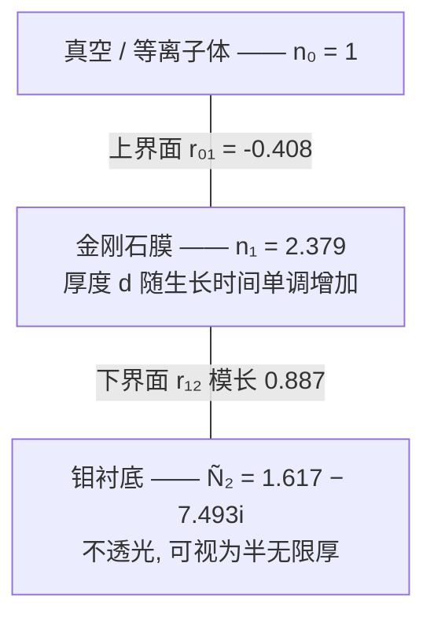
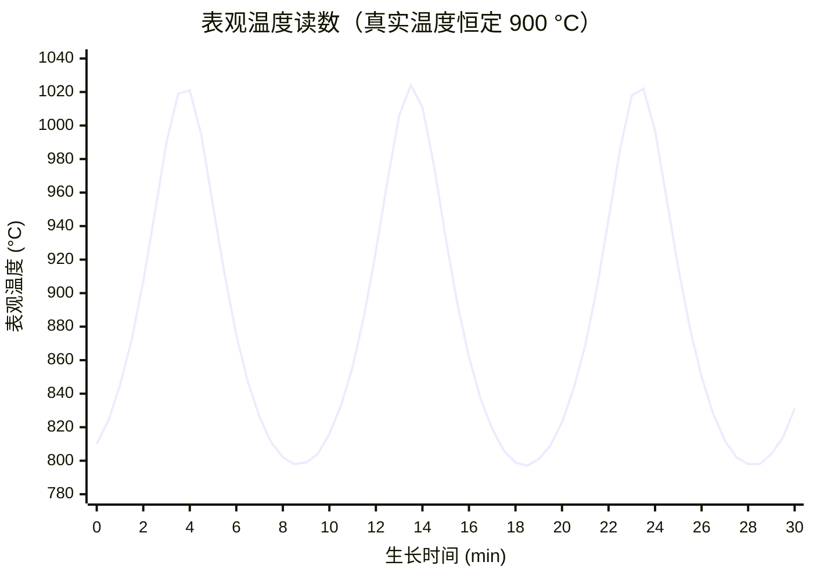
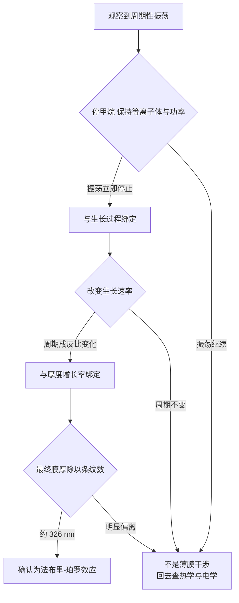
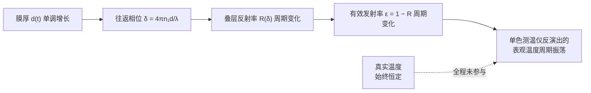

一台单点式红外测温仪，工作波长 1550 nm，对准 MPCVD 反应腔里的钼托，监视正在生长的金刚石膜。工艺参数一动不动：微波功率恒定、气流恒定、压力恒定、冷却水温恒定。

读数却在振荡。不是噪声——是干净的、周期稳定的、峰谷值上百开尔文的周期性摆动。周期是十几分钟量级，一炉长下来能数出十几个来回。

现场对这种曲线的第一反应通常是往热的方向找：等离子体球是不是在跳？水冷回路是不是在振荡？托盘接触是不是松了？这些猜测都指向同一个前提——**读数在变，是因为温度在变**。

这个前提是错的。温度大概率一直很稳。变的是**发射率**，而发射率之所以在变，是因为那层正在长厚的金刚石，对 1550 nm 的光而言，是一个厚度以每小时几百纳米的速度稳定增长的**法布里-珀罗腔**。

你架了一台仪器去测温度，结果被测物在你眼皮底下长成了一个光学元件。

---

### 本篇的验收标准

读完本篇，你应该能做到这五件事：

1. 说清楚单色辐射测温仪测的到底是什么物理量，以及为什么它必须先"知道"发射率才能给出温度。
2. 从基尔霍夫定律出发论证：一层**完全不吸收**的金刚石膜，照样能让整个叠层的发射率发生数倍的变化。这一步是全文最反直觉的地方。
3. 自己写出三层结构的反射率表达式，并解释为什么它随厚度的周期恰好是 $\lambda/2n$，而不是 $\lambda/n$ 或者 $\lambda/4n$。
4. 估算出这个效应造成的表观温度误差量级，并说明为什么它在短波长比在长波长更容易被忽视。
5. 给出至少四条可以在现场做的、能把"薄膜干涉"和"真的在变温"区分开的判据。

阅读约定：正文是主线；折叠块是追问，跳过不影响主线；文末列了所有数值的出处。

本文的范围到"机理"为止，不讨论测量方案。

---

## 1. 辐射测温到底在测什么

### 1.1 仪器唯一能拿到的东西是一个电流

把测温仪拆到只剩物理：它是一个探测器，前面一片滤波片选定工作波长，收集来自靶面某个立体角内、这个波长附近的辐射功率。它拿到的原始数据只有一个数——探测器上的光电流。

温度是**推算**出来的。推算依据是普朗克定律，黑体在波长 $\lambda$、温度 $T$ 下的谱辐亮度：

$$
B_\lambda(T) = \frac{2hc^2}{\lambda^5} \frac{1}{\exp\!\left(\dfrac{hc}{\lambda k_B T}\right) - 1}
$$

真实物体不是黑体，它辐射的是黑体的 $\varepsilon_\lambda$ 倍：

$$
L_\lambda = \varepsilon_\lambda \, B_\lambda(T)
$$

这就是全部问题的来源：**仪器测到 $L_\lambda$，想要 $T$，而方程里有两个未知数。** 唯一的出路是把 $\varepsilon_\lambda$ 当成已知量输进去。测温仪面板上那个"发射率设定"旋钮，就是这个假设的入口。

在这个高温、短波长的场合，$hc/\lambda k_B T \gg 1$，指数项远大于 1，可以用维恩近似：

$$
B_\lambda(T) \approx \frac{2hc^2}{\lambda^5} \exp\!\left(-\frac{c_2}{\lambda T}\right), \qquad c_2 = \frac{hc}{k_B} = 14388\ \mu\mathrm{m}\cdot\mathrm{K}
$$

[追问] 维恩近似在这里够不够准

维恩近似的误差来自把 $1/(e^x-1)$ 换成 $e^{-x}$，相对误差约为 $e^{-x}$。这里 $x = c_2/\lambda T$，取 $\lambda = 1.55\ \mu\mathrm{m}$、$T = 1173\ \mathrm{K}$：

$$
x = \frac{14388}{1.55 \times 1173} = 7.91, \qquad e^{-x} = 3.7 \times 10^{-4}
$$

辐亮度的相对误差 $3.7\times10^{-4}$，折算到温度上不到 0.06 K。对本文的所有结论都可以忽略。

顺带记住这个 $x \approx 8$：它就是下一节那个灵敏度因子 $\lambda T/c_2 = 1/x$ 的倒数。短波长、低温度使 $x$ 大，$x$ 大则仪器对发射率不敏感——这是选 1550 nm 而不是选 5 μm 的核心理由。

### 1.2 发射率设错了，温度错多少

设真实发射率为 $\varepsilon$，仪器面板上设定的是 $\varepsilon_{\rm set}$。仪器解方程时，把真实的辐亮度归因给了设定的发射率：

$$
\varepsilon \, B_\lambda(T) = \varepsilon_{\rm set} \, B_\lambda(T_{\rm app})
$$

代入维恩近似，两边取对数，那个碍事的 $2hc^2/\lambda^5$ 前因子直接消掉：

$$
\ln \varepsilon - \frac{c_2}{\lambda T} = \ln \varepsilon_{\rm set} - \frac{c_2}{\lambda T_{\rm app}}
$$

整理成一个漂亮的形式：

$$
\boxed{\ \frac{1}{T_{\rm app}} - \frac{1}{T} = \frac{\lambda}{c_2} \ln \frac{\varepsilon_{\rm set}}{\varepsilon}\ }
$$

这是本文后面所有数值的换算工具，值得单独盯一会儿。它说了三件事：

- 误差只取决于**发射率的比值**，不取决于绝对值。发射率从 0.10 变到 0.20，和从 0.40 变到 0.80，造成的温度误差完全一样。
- 误差在 $1/T$ 上是线性的，所以温度越高，同样的发射率偏差造成的**绝对**温度误差越大。
- 前面那个系数 $\lambda/c_2$ 是仪器设计者唯一能捏在手里的旋钮。

小偏差下线性化，可以得到更常引用的形式：

$$
\frac{\Delta T}{T} \approx \frac{\lambda T}{c_2}\, \frac{\Delta \varepsilon}{\varepsilon}
$$

**$\lambda T / c_2$ 就是这台仪器的"发射率灵敏度因子"。** 代入本文的工况：

$$
\frac{\lambda T}{c_2} = \frac{1.55 \times 1173}{14388} = 0.126
$$

也就是说，发射率错 10%，温度只错 1.26%，约 15 K。这个"缩水"效应正是选择短波长的理由：换成 2.2 μm 的仪器，因子涨到 0.179；换成 5 μm，涨到 0.408，同样的发射率误差要放大三倍多。

[追问] 那为什么不干脆选更短的波长，比如 900 nm

因为灵敏度不是唯一的约束，还有三条互相拉扯的：

1. **信号强度**。维恩尾巴上辐亮度随波长缩短而指数下降。900 nm 在 900 °C 下的辐亮度只有 1550 nm 的一小部分，信噪比会掉。
2. **等离子体干扰**。MPCVD 的氢等离子体在可见和近可见波段有很强的原子线发射（巴尔末系），这些光会直接进探测器，被当成热辐射。往长波跑可以躲开大部分。
3. **探测器和光纤**。1550 nm 是光通信波段，InGaAs 探测器、光纤、隔离器、滤波片全都是货架商品，成本和可靠性都好。

1550 nm 是这三条约束的交点。而有趣的地方就在这里：**恰恰因为选了一个金刚石完全透明、而且波长与膜厚同量级的波段，才让被测物变成了一个理想的干涉腔。** 换到 5 μm，金刚石对应的光学厚度只有几个波长，条纹稀疏得多；换到 10 μm 以上，金刚石有本征双声子吸收带，膜自己就不透明了，干涉自然消失。

---

## 2. 发射率不是材料常数

### 2.1 基尔霍夫定律：发射率就是吸收率

上一节把 $\varepsilon$ 当成一个可以查表的数。这个习惯是绝大多数现场误判的根源。

热平衡下的基尔霍夫定律说，对每个波长、每个方向、每个偏振：

$$
\varepsilon_\lambda = \alpha_\lambda
$$

**发射等于吸收。** 这不是经验规律，它是热力学第二定律的直接推论——如果某个物体在某波长上发射多于吸收，把它和黑体一起放进绝热空腔，它会自发变冷而黑体变热，热量从冷处流向热处，第二定律被违反。

对一个不透光的叠层（背面是厚金属，透射为零），能量守恒给出 $\alpha_\lambda + \rho_\lambda = 1$，于是：

$$
\varepsilon_\lambda = 1 - R_\lambda
$$

**这里要注意一个容易滑过去的前提。** 上面这一步把基尔霍夫定律用在了"金刚石膜 + 钼衬底"这个**复合体**上，这就要求整个叠层处于同一个温度——比"材料处于热平衡"更强的条件。对本文的工况它极其安全（金刚石膜内温差只有毫开量级，2.2 节的追问里有计算），但换个体系就未必，6.3 节会回到这一点。

带着这个前提，这个式子把问题的性质彻底改变了：**发射率不再是"材料的属性"，而是"结构的属性"。** $R_\lambda$ 是整个叠层的反射率，它取决于每一层的折射率**和厚度**。厚度会变，发射率就会变。

### 2.2 最反直觉的一步：不吸收的膜，也能改变发射率

到这里必然有一个疑问，而且这个疑问是对的：

> 高质量金刚石在 1550 nm 是完全透明的。透明就意味着不吸收，不吸收按基尔霍夫定律就意味着不发射。一层什么都不发射的膜，凭什么能改变整个系统的发射率？

回答之前先明确一次**层面切换**，因为接下来的推理全靠它：我们讨论的从来不是"金刚石膜的发射率"，而是"**金刚石 + 钼这个整体的发射率**"。基尔霍夫定律作用的对象是整个叠层，问"膜自己发射率是多少"在这里是一个没有意义的问题——就像问一副眼镜的视力是多少。

想清楚这一点，答案就出来了：**改变发射率的不是金刚石在发光，而是金刚石在决定钼发出的光能不能逃出去。**

1550 nm 的热辐射来自钼——那才是吸收体，也才是辐射源。金刚石膜盖在上面，扮演的角色不是光源，而是一层**光学镀膜**。它通过多光束干涉，改变了钼表面的辐射穿过界面逃逸到真空的效率。

用光学工程的语言说得更直白：这就是一层单层增透/增反膜。当膜厚正好落在"增透"条件附近，钼的辐射几乎全跑出来，叠层发射率高；当膜厚落在"增反"条件附近，辐射被反射回去，叠层发射率低。

[追问] 基尔霍夫定律用在"整个叠层"上，前提是什么

基尔霍夫定律成立的前提是**热平衡**，严格说是系统处在均匀温度下。把 $\varepsilon = 1 - R$ 用在"金刚石膜 + 钼衬底"这个复合体上，就等于断言这个复合体是等温的。

这个断言在本文的工况下极其安全，算一下就知道。设通过膜的热流密度 $q = 10^6\ \mathrm{W/m^2}$（$100\ \mathrm{W/cm^2}$，对 MPCVD 是偏高的估计），金刚石导热系数 $k \approx 2000\ \mathrm{W/(m\cdot K)}$，膜厚 $d = 10\ \mu\mathrm{m}$：

$$
\Delta T = \frac{q\,d}{k} = \frac{10^6 \times 10^{-5}}{2000} = 5 \times 10^{-3}\ \mathrm{K}
$$

**5 毫开尔文。** 金刚石那个顶尖的导热系数在这里帮了大忙：膜内温差比测量分辨率低了三个数量级，叠层可以放心当成等温体。

反过来说，这也标定出了这个近似会在什么地方失效——如果膜厚到毫米量级，或者材料换成低导热的（比如同样场合下的 SiC、蓝宝石窗口），温差就不能忽略，$\varepsilon = 1 - R$ 这一步要重新审视。

[追问] 如果膜有一点吸收呢，比如多晶膜晶界上的 sp² 碳

结论不变，而且这正是 $\varepsilon = 1 - R$ 这个写法的好处：**它不关心吸收发生在哪一层。**

只要叠层整体不透光（背面钼够厚），能量守恒就要求入射的光要么被反射、要么被吸收。吸收发生在钼里还是发生在金刚石晶界的 sp² 碳里，对 $\varepsilon = 1 - R$ 这个等式毫无影响。

有影响的是 $R$ 本身：膜内吸收会让往返一趟的光衰减，削弱多光束干涉的对比度，等价于降低腔的精细度。定量上，单程振幅衰减因子是 $\exp(-\alpha d/2)$（$\alpha$ 为吸收系数）。取一个对 CVD 多晶金刚石偏悲观的 $\alpha = 100\ \mathrm{cm^{-1}}$、$d = 10\ \mu\mathrm{m}$：

$$
\alpha d = 100 \times 10^{-3} = 0.1
$$

往返衰减不到 10%，对条纹对比度的影响是次要的。真正吃掉条纹的是**表面粗糙度**——判据七会算这笔账——而不是吸收。

---

## 3. 金刚石层作为法布里-珀罗腔

### 3.1 结构

三层，两个界面，中间那层的厚度在以每小时几百纳米到几十微米的速度单调增长。这就是一个厚度被工艺缓慢扫描的低精细度法布里-珀罗腔。

### 3.2 两个界面的反射系数

上界面，真空到金刚石，正入射的菲涅耳振幅反射系数：

$$
r_{01} = \frac{n_0 - n_1}{n_0 + n_1} = \frac{1 - 2.379}{1 + 2.379} = -0.408
$$

负号就是那个熟悉的"从光疏介质入射到光密介质，反射光有 $\pi$ 相位跃变"。强度反射率 $R_{01} = 0.167$。

下界面，金刚石到钼。钼是金属，折射率是复数 $\tilde{N}_2 = n_2 - i k_2$，1550 nm 处 $n_2 = 1.617$、$k_2 = 7.493$：

$$
r_{12} = \frac{n_1 - \tilde{N}_2}{n_1 + \tilde{N}_2}
$$

算出来 $|r_{12}| = 0.887$，强度反射率 $R_{12} = 0.787$，相位 $\arg r_{12} = 146.1°$。

**这两个数值决定了整个现象的规模。** 底面反射率接近 0.79，顶面 0.17，两者都不算小，多光束干涉的对比度会相当可观。同时注意 $r_{12}$ 的相位不是 $\pi$ 也不是 0，而是 146°——这意味着条纹的位置相对于"整数个半波长"有一个固定的偏移，后面会看到这让波形不对称。

[追问] 金属的复折射率里那个虚部到底是什么

把平面波写成 $E = E_0 \exp[i(\tilde{N} k_0 z - \omega t)]$，代入 $\tilde{N} = n - ik$：

$$
E = E_0 \exp(-k k_0 z)\exp[i(n k_0 z - \omega t)]
$$

实部 $n$ 管相位传播速度，虚部 $k$ 管振幅的指数衰减。强度的衰减系数就是吸收系数 $\alpha = 4\pi k/\lambda$。对 1550 nm 的钼，$k = 7.49$：

$$
\alpha = \frac{4\pi \times 7.49}{1.55\ \mu\mathrm{m}} = 60.7\ \mu\mathrm{m}^{-1}
$$

也就是说光在钼里走 16 nm 强度就衰减到 $1/e$。这正是"钼不透光"的定量含义，也是为什么可以把它当成半无限厚的介质，不用管钼片背面。

顺带一提，本文用的 $n$、$k$ 是室温测量值。高温下金属的电子-声子散射增强，直流电阻率上升，光学常数会漂移。这会让 $|r_{12}|$ 略有变化，从而改变条纹的对比度，但不会改变**周期**——周期只由金刚石的光程决定。第 6 节会用到这个区分。

### 3.3 多光束求和与 Airy 公式

考虑一束光从真空入射。它在膜内来回反射无穷多次，每一次往返都多走一段光程，累积一个相位。往返一趟的相位差：

$$
\delta = \frac{4\pi n_1 d \cos\theta_1}{\lambda}
$$

其中 $\theta_1$ 是膜内的折射角。把所有出射的振幅按相位加起来。这是一个公比为 $r_{10} r_{12} e^{i\delta}$ 的等比级数，其中 $r_{10} = -r_{01}$ 是从膜内打向顶面时的反射系数。求和得到叠层的总振幅反射系数：

$$
r = \frac{r_{01} + r_{12}\,e^{i\delta}}{1 + r_{01} r_{12}\,e^{i\delta}}
$$

强度反射率 $R = |r|^2$，于是叠层的有效发射率：

$$
\varepsilon_{\rm eff}(d) = 1 - \left| \frac{r_{01} + r_{12}\,e^{i\delta}}{1 + r_{01} r_{12}\,e^{i\delta}} \right|^2
$$

**这就是全文的核心结论。** 右边显式含 $d$，而 $d$ 随时间增长，所以发射率随时间振荡；而根据 1.2 节，发射率振荡直接翻译成表观温度振荡。

### 3.4 为什么周期是 $\lambda/2n$

$R$ 是 $\delta$ 的周期函数，周期 $2\pi$。要让 $\delta$ 增加 $2\pi$，需要：

$$
\frac{4\pi n_1 \cos\theta_1}{\lambda}\,\Delta d = 2\pi \quad \Longrightarrow \quad \Delta d = \frac{\lambda}{2 n_1 \cos\theta_1}
$$

正入射时：

$$
\Delta d = \frac{\lambda}{2 n_1} = \frac{1550\ \mathrm{nm}}{2 \times 2.379} = 325.8\ \mathrm{nm}
$$

**每长厚 325.8 nm，走完一个完整条纹。**

因子 2 来自"往返"——光要在膜内走一个来回，几何路程是 $2d$。折射率 $n_1$ 来自"膜内波长变短"——真空里的 1550 nm 在金刚石里只有 $1550/2.379 = 651.5$ nm。两个因子相乘就是分母的 $2n_1$。

[追问] 观测角对周期的影响有多大

测温仪很少严格垂直对准靶面，通常从侧上方斜看。周期里的 $\cos\theta_1$ 会把条纹间距拉长。但金刚石折射率高，斯涅耳定律把入射角压得很扁：

| 外部观测角 | 膜内折射角 | 条纹间距     |
| ----- | ----- | -------- |
| 0°    | 0.0°  | 325.8 nm |
| 15°   | 6.2°  | 327.8 nm |
| 30°   | 12.1° | 333.3 nm |
| 45°   | 17.3° | 341.2 nm |

**即使歪到 30°，周期也只变了 2.3%。** 用条纹周期反推生长速率时，这个系统误差通常小于生长速率本身的不确定度，可以不管。高折射率在这里意外地帮了个忙。

不过要注意另一件事：斜看时 s 和 p 偏振的菲涅耳系数分开了，两者的条纹对比度不同，叠加起来会略微降低总对比度。角度不大时可以忽略。

---

## 4. 数值算例：误差到底有多大

> **以下为算例参数，不是任何真实设备的实测数据。** 折射率、光学常数、热物性的出处见文末；工艺参数（温度、生长速率）取自公开文献的典型区间。

算例设定：$\lambda = 1550$ nm 单色测温仪，正入射，钼衬底，真实温度 900 °C（1173 K），膜完全透明且等温。

### 4.1 发射率的摆幅

把 $r_{01} = -0.408$、$|r_{12}| = 0.887$ 代进 Airy 公式，扫描厚度：

$$
\varepsilon_{\rm eff} \in [\,0.096,\ 0.437\,]
$$

**最大值是最小值的 4.6 倍。** 这不是百分之几的微扰，是一个数量级级别的摆动。

同时算一个后面要用的量——把条纹按厚度平均掉之后的**平均发射率**：

$$
\bar{\varepsilon} = 0.205
$$

这是一个操作员在长期使用中最可能标定到的值：他看到读数在振荡，就取一个中间值把仪器校准过去。

### 4.2 表观温度的摆幅

设 $\varepsilon_{\rm set} = \bar{\varepsilon} = 0.205$，用 1.2 节的公式换算：

$$
T_{\rm app} = \left( \frac{1}{T} + \frac{\lambda}{c_2}\ln\frac{\varepsilon_{\rm set}}{\varepsilon_{\rm eff}} \right)^{-1}
$$

结果：

| 量       | 数值        |
| ------- | --------- |
| 真实温度    | 900 °C    |
| 表观温度最低  | 797 °C    |
| 表观温度最高  | 1024 °C   |
| **峰峰值** | **227 K** |

温度纹丝不动，读数摆了 227 K。

这个数字大得让人不安，但它是**条纹完全清晰时的上限**——真实系统里，表面粗糙度和光斑内的厚度不均匀会把不同位置的条纹相位搅在一起，实际观测到的摆幅要小一些（判据七会算这笔账）。重要的是量级：**这个效应有能力把读数摆动到工艺窗口宽度的好几倍，它不是一个可以忽略的二阶修正。**

### 4.3 振荡的时间周期

条纹间距 325.8 nm 除以生长速率：

| 生长速率     | 振荡周期     |
| -------- | -------- |
| 0.5 μm/h | 39.1 min |
| 1 μm/h   | 19.5 min |
| 2 μm/h   | 9.8 min  |
| 5 μm/h   | 3.9 min  |
| 10 μm/h  | 2.0 min  |
| 20 μm/h  | 1.0 min  |
| 50 μm/h  | 0.4 min  |

注意这个区间：**几十秒到几十分钟。** 恰好落在人眼看曲线会觉得"这是个慢漂移"或者"这是个周期性扰动"的时间尺度上，也恰好落在温控 PID 会试图去追它的时间尺度上。如果周期是毫秒，没人会误认为是温度；如果周期是天，也不会被注意到。是这个不巧的时间尺度让它伪装得如此成功。

### 4.4 波形长什么样

取生长速率 2 μm/h（周期 9.8 min），初始厚度 3 μm，模拟 30 分钟的表观温度读数：

**注意波形不是正弦。** 峰是尖的，谷是宽而平的，读数大部分时间待在低位，然后快速冲上去再落回来。

这个不对称完全来自 $|r_{12}| = 0.887$ 这个偏大的底面反射率：底面反射越强，腔的精细度越高，$\varepsilon = 1-R$ 的极大值就越尖锐。**波形的形状本身携带了底面反射率的信息**，这一点在第 6 节还会用到。

如果这是真的温度在振荡——比如等离子体在跳、水冷在振——你没有任何理由期待它长成这个形状。热学系统的响应被热容和热阻低通滤过，波形应该是圆滑的、接近正弦或指数弛豫的。**尖峰宽谷的不对称波形，是干涉起源的第一个视觉线索。**

## 5. 排除法：这个模型给出哪些可证伪的预言

一个只能解释既有现象的模型没有价值。法布里-珀罗模型值得相信，是因为它给出一组**别的候选解释给不出**的定量预言，而这些预言都可以在现场检验。

反过来说，如果下面这些检验有一条不通过，这个模型就该被扔掉。

### 判据一：切断生长，振荡必须立刻停止

**这是最决定性的一条。** 关掉甲烷、保持氢等离子体和微波功率不变，衬底温度基本不动，但生长停止。

- 如果是薄膜干涉：厚度不再增加，$\delta$ 冻结，振荡**立即**停止，读数停在当前相位对应的那个值上（可能偏高也可能偏低，取决于停在条纹的哪个位置）。
- 如果是等离子体、气流、水冷、接触热阻引起的真实温度波动：这些机制与甲烷无关，振荡应该继续。

这条检验几乎不需要额外设备，也几乎不可能被别的机制模仿。

**但它有一个软肋，必须说清楚，否则会把人坑了。** "关掉甲烷、衬底温度基本不动"这句话不是免费的：甲烷占比虽小，它的加入会改变气体混合物的导热系数，也会改变等离子体的电子密度、进而改变微波功率的耦合效率。切换的瞬间，衬底温度**可能真的会变**，而且是几开到十几开的量级。

规避办法是看**变化的形状**，而不是看有没有变化：

- 真实的温度响应是一个**单调阶跃**——切换后温度朝一个方向漂到新的稳态，时间常数由系统热容决定（通常几十秒到几分钟）。
- 干涉的响应是**振荡本身停止**——读数冻结在切换那一刻的相位上，之后是平的。

所以正确的判读不是"读数变了没有"，而是"**周期性还在不在**"。如果切换后读数走了一小段单调曲线然后变平，那正是"温度小幅漂移 + 干涉冻结"两件事叠加的样子，判据一依然成立。如果切换后周期振荡照旧，那就不是干涉。

（顺带说明，等离子体发射光谱的变化在这里不是主要风险：1550 nm 离 CH 和 $\mathrm{C_2}$ 的特征发射带都很远。但如果换成可见波段的仪器做这个实验，这条就得先单独验证。）

### 判据二：周期必须与生长速率成反比，且比例系数已知

改变工艺（甲烷浓度、压力、功率）改变生长速率 $G$，周期必须满足：

$$
T_{\rm osc} = \frac{\lambda}{2 n_1 G}
$$

这不是一个定性的趋势，而是一个**没有自由参数**的定量预言。$\lambda$ 是仪器参数，$n_1$ 是材料常数，两者都已知。生长速率翻倍，周期必须精确减半。

### 判据三：条纹总数 × 326 nm 必须等于最终膜厚

生长结束后测膜厚（台阶仪、截面 SEM、称重换算，任选），除以整炉数到的条纹数：

$$
\frac{d_{\rm final} - d_{\rm initial}}{N_{\rm fringes}} \stackrel{?}{=} \frac{\lambda}{2n_1} = 325.8\ \mathrm{nm}
$$

**这是一个绝对标定，没有任何可调参数。** 如果对上了，机理就没有争议的余地了。

### 判据四：温度本身几乎不能移动条纹

一个常见的反驳是："温度变化也会改变折射率和厚度（热膨胀），所以温度波动也能产生条纹。"

这个反驳在物理上成立，但在数量上差了三个数量级。固定几何厚度，把一个条纹完全移过去所需的温升：

$$
\Delta T_{1\text{-fringe}} = \frac{\lambda}{2 d \left( \dfrac{dn}{dT} + n \alpha_{\rm th} \right)}
$$

取 $dn/dT \approx 1.2\times10^{-5}\ \mathrm{K^{-1}}$、热膨胀系数 $\alpha_{\rm th} \approx 4.4\times10^{-6}\ \mathrm{K^{-1}}$：

| 膜厚     | 移动一个条纹所需温升 |
| ------ | ---------- |
| 1 μm   | 34 500 K   |
| 10 μm  | 3 450 K    |
| 100 μm | 345 K      |
| 500 μm | 69 K       |

对薄膜（10 μm 量级），需要三千多开尔文才能移一个条纹——而只需要长厚 326 nm 就能移一个。**在薄膜情形下，条纹是厚度的探针，与温度实际上解耦。**

但注意最后两行：**这个判据只适用于薄膜（腔长几到几十微米）。对几百微米以上的厚样品，温度确实能移动条纹**——500 μm 只需要 69 K。这正是同质外延时必须小心的地方（籽晶片本身就是几百微米厚的腔），那里"厚度"和"温度"两条通道会混在一起，判据四失效，详见 6.1 节。

### 判据五：波形形状不对称

第 4.4 节的曲线是尖峰宽谷的。这个不对称由 $|r_{12}|$ 决定，是干涉的特征。

热学起源的波动几乎必然是圆滑的：热容 + 热阻构成低通滤波器，任何激励经过它都会被磨圆。**看到尖峰宽谷的周期波形，基本可以排除热学起源。**

**这条判据是单向的，反过来用会出错。** 尖峰宽谷可以证明是干涉，但**波形圆滑证明不了不是干涉**——只要条纹被平均（比如判据七说的表面粗糙化，光斑内各处相位散开），残余的调制自然就是平滑的、接近正弦的。

所以判据五只在条纹对比度还高的时候可用，通常是生长早期。一旦振幅已经衰减到只剩一点起伏，就别再用波形形状说事，改用判据一、二、三——那三条不依赖对比度。

### 判据六：换波长，周期必须按已知比例改变

如果手边有第二台不同波长的测温仪，同时对准同一点，两台的振荡周期比应该是：

$$
\frac{T_{\rm osc}(\lambda_a)}{T_{\rm osc}(\lambda_b)} = \frac{\lambda_a\, n(\lambda_b)}{\lambda_b\, n(\lambda_a)}
$$

而且两台的相位不同步（除非恰好差整数个条纹）。任何真实的温度波动在两台仪器上都必须**同相同周期**——这是一个极强的判别。

一个使用上的提醒：两台仪器的条纹**对比度**可能差得很远，甚至其中一台完全看不出振荡。这不构成对模型的否定，别拿它当反证——这条判据比的是**周期和相位**，不是振幅。

### 判据七：振幅随粗糙度衰减，但周期不变

多晶金刚石是柱状生长，表面粗糙度随厚度大致线性增加。光斑覆盖一片有限面积，面积内厚度不一致，各处条纹相位散开，干涉项被部分抵消。

衰减的特征尺度可以直接估出来：厚度起伏达到膜内四分之一波长

$$
\frac{\lambda}{4 n_1} = \frac{1550}{4 \times 2.379} = 163\ \mathrm{nm}
$$

时，相位就散开到足以互相抵消。数值计算给出，光斑内厚度标准差 $\sigma_d$ 达到 100 nm 时可见度已降到原来的 18%，150 nm 时基本归零。按粗糙度约为厚度 10% 估算，多晶膜长到 1–2 μm 就进入这个区间。

**所以预言是：条纹振幅随生长单调衰减，而周期严格不变。** 真实的温度波动没有理由表现出"周期锁定、振幅单调衰减"这种组合。

这条也解释了一个经验规律：多晶膜的振荡通常只在生长早期明显，纳米晶膜（表面极平滑）的振荡则能一直保持。

### 把候选逐个对掉

| 候选机制        | 被哪条判据排除                             |
| ----------- | ----------------------------------- |
| 等离子体功率纹波    | 一（停 CH₄ 后应继续）、二（周期与生长速率无关）、五（波形应圆滑） |
| 气流/压力扰动     | 一、二、七（不会周期严格锁定还单调衰减）                |
| 冷却水温振荡      | 二（周期由温控回路决定，不随工艺变）、五                |
| 热电偶/托盘接触热阻  | 一、二、五（接触变化是随机跳变，不是周期振荡）             |
| 真实的衬底温度周期波动 | 四（温度移不动条纹）、六（两台仪器应同相）               |
| 观察窗积碳/沉积    | 变化是单调的，不是周期的；且积碳会同时降低平均读数           |

表里凡是引用判据五的地方，用的都是它成立的那个方向——**观察到尖峰宽谷 ⇒ 不是热学起源**。反过来（波形圆滑 ⇒ 不是干涉）不成立，原因见判据五。真正不依赖任何前提的是判据一、二、三，拿不准的时候只用这三条。

[追问] 观察窗上的沉积会不会自己也构成一个腔

会。而且这是一个真实存在、值得单独警惕的效应：石英窗内表面沉积的碳膜或金刚石膜，同样是"薄膜长在衬底上"，同样构成法布里-珀罗腔，同样会产生周期性的透过率振荡。

区分两者的办法：

- **温度依赖**。窗口是水冷的，温度低得多，沉积速率低几个数量级，所以窗口腔的周期会比衬底腔长很多（可能是几炉才走一个条纹），表现为跨炉次的缓慢漂移而不是炉内的振荡。
- **判据一**。停甲烷后窗口沉积也停，所以这一条区分不了两者。
- **换点**。把测温仪对准腔内另一个已知恒温的参考点（如果有），窗口效应会跟着走，衬底效应不会。

在长期运行的设备上，窗口沉积造成的是**缓慢的、单调的读数漂移叠加一个极长周期的振荡**，和本文讨论的炉内振荡在时间尺度上差得很远，一般不难分开。

---

## 6. 这个模型在什么条件下失效

一个诚实的模型必须标出自己的边界。以下情形下，本文的分析不适用或需要重写：

### 6.1 同质外延：那个界面根本不存在

在单晶金刚石籽晶上做同质外延时，外延层和籽晶的折射率**完全相同**，两者之间不存在光学界面，$r_{12} = 0$。

**外延层本身不构成腔。** 这时如果仍然观察到振荡，构成腔的是"整片籽晶 + 外延层"这个整体，两个界面分别是顶面（金刚石/真空）和底面（金刚石/托盘）。后果是：

- 腔长从几微米跳到几百微米，$\delta$ 对厚度的变化率高出两个数量级，条纹变得极密。
- 如果仍能看到条纹，判据四会失效——几百微米的腔长下温度确实能移动条纹。

**所以"多晶才有条纹、单晶没有"这个经验规律是对的，但它的原因经常被说错。** 不是因为多晶"更容易干涉"，恰恰相反，是因为多晶膜与衬底之间有一个真实的折射率界面，而同质外延没有。

### 6.2 界面上长出了别的东西

金刚石在钼上形核之前，通常会先在界面生成一层碳化钼（Mo₂C）。这层中间相有自己的光学常数，把两层结构变成了三层，$r_{12}$ 要重算。

后果是条纹的**对比度和相位**改变（因为 $|r_{12}|$ 和 $\arg r_{12}$ 变了），但**周期不变**——周期只由金刚石层的光程决定。这个"对比度可能算不准、周期一定算得准"的区分，是判据二和判据三比判据五更可靠的原因。

### 6.3 叠层不再等温

$\varepsilon = 1 - R$ 依赖于基尔霍夫定律，而基尔霍夫定律要求热平衡。2.2 节算过金刚石膜内温差只有毫开量级，非常安全。但如果换成低导热的衬底体系、或者膜厚到毫米量级，这个前提要重新检查。

### 6.4 进入探测器的不全是热辐射

等离子体的辐射如果落在工作波段内并被探测器接收，它叠加在热辐射上，本文的所有换算都要加一项。1550 nm 距离氢的巴尔末线很远，$\mathrm{C}_2$ 的斯旺带也在可见区，所以这个波段相对干净——但"相对干净"不等于零，等离子体条件剧烈变化时值得复核。

---

## 7. 小结

把整条逻辑链压缩成一句话：

> **单色测温仪必须假设一个发射率；发射率按基尔霍夫定律等于 $1-R$；$R$ 是整个叠层的结构性质而不是材料常数；正在生长的金刚石膜让这个结构的一个几何参数以每小时几百纳米的速度扫过；于是发射率周期性摆动，被仪器忠实地翻译成了温度的周期性摆动。**

图里那条虚线是整件事的要害：**真实温度从头到尾没有参与。**

再往上抽一层，这是一类问题的样本，而不只是一个具体故障。任何非接触测量都建立在一个关于被测物的模型上——辐射测温假设了发射率，激光测距假设了折射率，涡流测厚假设了电导率。当被测过程**恰好在改变这个模型所依赖的那个参数**时，仪器不会报错，它会给出一个物理上完全自洽、数值上完全错误、而且看起来非常像真实物理的读数。

比仪器读数出错更危险的，是仪器读数以一种有规律、有周期、有"物理感"的方式出错。规律性会诱使人去为它编一个热学故事——而那个故事往往编得出来。真正的诊断能力，不是相信读数，也不是怀疑读数，而是理解读数背后那个模型正在发生什么变化。

---

## 参数出处

本文所有数值计算使用的参数：

| 量                    | 取值                                        | 出处                                                                                                   |
| -------------------- | ----------------------------------------- | ---------------------------------------------------------------------------------------------------- |
| 金刚石折射率 @1550 nm      | 2.379                                     | 单项 Sellmeier 式 $n^2 = 1 + B_1\lambda^2/(\lambda^2 - C_1)$，$B_1 = 4.658$、$C_1 = 112.5\ \mathrm{nm^2}$ |
| 钼复折射率 @1.54 μm       | $1.617 - 7.493i$                          | Ordal 等，*Appl. Opt.* **27**, 1203 (1988)，经 refractiveindex.info 收录                                   |
| 金刚石 $dn/dT$          | $\sim 1.2\times10^{-5}\ \mathrm{K^{-1}}$  | 由 $(1/n)(dn/dT) = 3.2$–$6.7\times10^{-6}\ \mathrm{K^{-1}}$（近红外区）换算                                   |
| 金刚石热膨胀系数 @700–800 °C | $4.3$–$4.6\times10^{-6}\ \mathrm{K^{-1}}$ | Slack & Bartram 数据                                                                                   |
| 金刚石导热系数              | $\sim 2000\ \mathrm{W/(m\cdot K)}$        | 高质量 CVD 金刚石典型值                                                                                       |
| 普朗克第二辐射常数            | $14388\ \mu\mathrm{m\cdot K}$             | CODATA                                                                                               |
| 工艺温度                 | 900 °C                                    | 算例设定                                                                                                 |
| 生长速率                 | 0.5–50 μm/h                               | MPCVD 公开文献的典型区间                                                                                      |

温度、生长速率、膜厚均为**算例设定值**，不对应任何真实设备或工艺。

计算全部用三层结构的多光束干涉模型（含 s/p 偏振分别处理与斜入射），厚度分布平均为数值积分，不使用解析近似。
