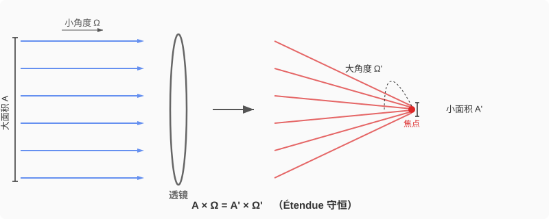
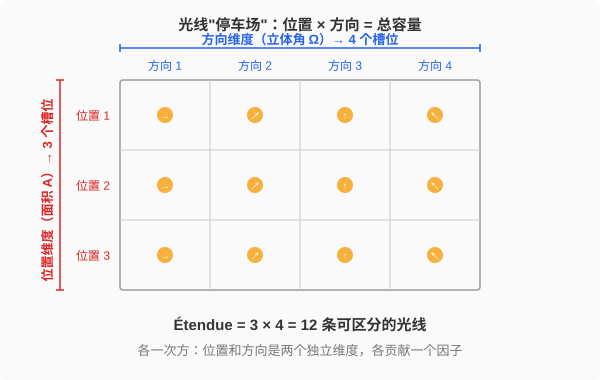

## 验收标准

读完本文，应当能够：

1. 不靠记忆，从"描述一条光线需要位置和方向两个独立信息"出发，重新推出 Étendue 的定义和守恒律
2. 向别人解释清楚：为什么 Étendue 是面积乘立体角（各一次方），而不是某种平方关系
3. 定性判断一个光学耦合问题中的 Étendue 失配方向——比如 LED 耦合单模光纤为什么效率极低
4. 说出 Étendue 守恒与热力学第二定律之间的联系
5. 回答"想要比太阳表面更亮，该怎么做？"

---

## 0. 先把这个法语词读对

Étendue 是法语，来自动词 **étendre**（展开、铺展、延伸），其阴性过去分词即为 **étendue**。作名词时，意思是"广度、范围、展幅"——一片草原的 étendue 是它的辽阔，一个声域的 étendue 是它的宽广，一束光的 étendue 是它在空间和角度上的"铺展范围"。

发音：**/e.tɑ̃.dy/**，大致拼读为 **"ay-tahn-dew"**。三个音节：

- **é**：类似英语 "ay"，不是 "ee"。开头的重音符号（accent aigu）标记这个 /e/ 音
- **ten**：法语鼻化元音 /ɑ̃/，舌头放平、气流同时从口鼻出来，近似英语 "tahn" 但不真正发 n 的尾音
- **due**：/dy/，类似英语 "dew"，但嘴唇更圆更紧

需要注意的是，末尾的 **-ue** 不是哑音。法语中阴性词尾 -e 通常不发音（如 étendu → /e.tɑ̃.dy/），但 étendu**e** 的 -ue 构成了 /y/ 音节的一部分，所以是发出来的。

光学文献中偶尔也能见到另外几个用法相近的词：

| 术语                  | 来源  | 含义                |
| ------------------- | --- | ----------------- |
| Étendue             | 法语  | 最常用，本文主角          |
| Throughput          | 英语  | 工程文献中的等价词，强调"通过量" |
| Acceptance (光学接受量)  | 英语  | 从接收端角度描述同一个量      |
| Lichtleitwert (光导值) | 德语  | 德语文献中偶见           |

不同文献对符号的选择也不统一：有用 $G$ 的，有用 $\mathcal{E}$ 的，也有用 AΩ 直接写的。本文使用 $G$。

---

## 1. 从一个不可能的实验说起

一面足够大的凸透镜，收集阳光，汇聚到一个极小的焦点上。直觉告诉我们，透镜越大、收集的光越多，焦点温度越高。

问题是：焦点温度能超过太阳表面温度（约 5800 K）吗？

答案是**不能**。不是工程上做不到，而是存在一条基本定律禁止这件事发生。无论光学系统多么精巧，被动光学元件（透镜、反射镜、光纤——任何不额外注入能量的器件）都无法把目标加热到超过光源自身的温度。

要理解为什么，需要先搞清楚一个问题：一束光的"几何尺寸"到底是什么？

## 2. 光束有两个独立的几何维度

比较两种光源：一支激光笔和一盏白炽台灯。

- **激光笔**：截面积极小，光线几乎完全平行，方向高度集中
- **白炽台灯**：照亮面积很大，光线向四面八方发散

仅凭"面积"或"角度"中的任何一个，都无法完整描述一束光的几何容量。需要**同时**指定两件事：

1. 光束的**横截面积** $A$
2. 光束的**角度扩散范围**（立体角 $\Omega$）

Étendue 就是同时刻画这两者的物理量——一束光在空间和角度上的"铺展范围"。

## 3. 定义

对于经过某个截面的一束光，Étendue 的微分形式为：

$$
dG = n^2 \, dA \, \cos\theta \, d\Omega
$$

其中：

- $n$：介质折射率
- $dA$：面积元
- $\theta$：光线方向与面法线的夹角
- $d\Omega$：立体角元

$\cos\theta$ 的出现很自然：一个面元从斜方向看过去，有效面积缩小为 $dA\cos\theta$。

对整个光束积分：

$$
G = n^2 \int_{A}\int_{\Omega} \cos\theta \, d\Omega \, dA
$$

**Étendue 守恒定律**：在理想（无吸收、无散射）光学系统中，$G$ 沿光路不变。在有散射或漫射的非理想系统中，有效 Étendue 增大（光线在方向上被"打散"，占据了更多的角度空间）。需要注意，吸收减少的是光的能量（功率），而非 Étendue 本身——Étendue 是纯几何量，与光线携带多少能量无关。

## 4. 透镜的交易：面积换角度

凸透镜聚光时发生了什么？

光束的截面积缩小了，但汇聚到焦点的光线来自各个方向——角度扩散急剧增大。

反过来，望远镜把远处天体的微弱光线收集到一个大口径镜面上：面积增大了，但角度变得更集中。

**透镜并没有凭空创造任何东西。它做的是一笔交易：面积缩小多少倍，角度就扩大多少倍。面积 × 立体角这个乘积，在交易前后守恒。**

### 用太阳做一个定量计算

这里必须区分两种情况。

**情况一：理想平行光（$\Omega_1 = 0$）。** 如果入射光是完美的数学平行光——零角度扩散——那么 Étendue 为零。Étendue 为零的光束经过透镜后仍然是零。几何光学对焦点面积不给出下限（焦点是一个数学上的点）。当然，现实中衍射会阻止焦点无限小，但这不是 Étendue 的功劳。

**情况二：太阳光（$\Omega_1 > 0$）。** 太阳不是点光源，而是一个角直径约 0.53° 的圆盘。太阳的半角 $\theta_s \approx 0.27° \approx 4.65 \times 10^{-3}$ rad，对应的立体角为：

$$
\Omega_{\text{sun}} = \pi\sin^2\theta_s \approx 6.8 \times 10^{-5} \text{ sr}
$$

这个值很小，但不为零。

设透镜半径为 $R$，焦距为 $f$。入射端：

$$
G = A_{\text{lens}} \times \Omega_{\text{sun}} = \pi R^2 \times \pi \sin^2\theta_s
$$

焦点处，光线从半角 $\theta_{\max} \approx \arctan(R/f)$ 的锥体汇聚而来，出射立体角为 $\Omega_{\text{out}} = \pi\sin^2\theta_{\max}$。Étendue 守恒要求：

$$
A_{\text{img}} = \frac{G}{\Omega_{\text{out}}} = \frac{\pi R^2 \cdot \pi\sin^2\theta_s}{\pi\sin^2\theta_{\max}}
$$

像斑半径约为 $r_{\text{img}} \approx f\theta_s$。对于一个 $f = 100$ mm 的透镜，像斑半径约 $0.47$ mm——这不是工程瑕疵，而是太阳角直径通过 Étendue 守恒施加的几何下限。

## 5. 为什么是各一次方？

这是一个值得停下来认真讨论的问题。

动能是 $\frac{1}{2}mv^2$——质量乘速度的**平方**。Étendue 是面积乘立体角——各**一次方**。为什么不是面积乘立体角的平方，或者面积的平方乘立体角？

答案藏在一个最基本的事实里：**一条光线穿过一个面，需要且仅需要两类独立信息来锁定它——位置在哪，方向朝哪。**

### 停车场类比

行代表位置的选项数，列代表方向的选项数。总共能停多少辆车（能容纳多少条可区分的光线）？行数 × 列数。各一次方。

不是行数 × 列数²——列凭什么要算两遍？行和列是两个**独立的维度**，各自贡献一个因子，仅此而已。

Étendue 就是这个"停车场"的总容量：面积决定了位置有多少个可区分的槽位，立体角决定了方向有多少个可区分的槽位。两者独立，所以相乘，各一次方。

### 那动能为什么是平方？

动能和 Étendue 回答的是**完全不同类型的问题**。

Étendue 在**数格子**——相互独立的两个维度各有多少个槽位，总数就是两者的乘积。这是一个**容量**。

动能在**算累积的功**——把一个物体从静止加速到速度 $v$，需要花多少力气。关键在于：速度越大，同样增加一点速度所需的加速距离越长（因为物体在加速过程中已经在高速移动了）。力 × 距离 = 功，而这个距离随速度增长，所以总功和速度不是线性关系，而是平方关系。

|          | Étendue          | 动能                 |
| -------- | ---------------- | ------------------ |
| 物理含义     | 一束光能容纳多少条可区分的光线  | 加速一个物体累积做了多少功      |
| 数学本质     | 独立维度的**乘积**（数格子） | 沿路径的**积分**（累积量）    |
| 为什么是这个幂次 | 位置和方向各贡献一个独立维度   | 速度越大，每多一点速度需要越远的距离 |

一个是在数独立选项的组合数，一个是在算沿路径的累积效应。完全不同的数学结构，碰巧都写成"某某乘某某"的形式。

## 6. 太阳、透镜与热力学第二定律

现在回到开头的问题：为什么不能用透镜把东西加热到比太阳更热？

要回答这个问题，先需要引入一个辐射度量学中的关键概念。

### 辐射亮度：光的"密度"

日常说一盏灯"亮"，可能指两件不同的事：一是它照射到桌面上的总功率大（这叫**辐射照度**，irradiance，单位 W/m²）；二是直视光源时感觉刺眼（这叫**辐射亮度**，radiance）。

辐射亮度 $L$ 的定义是：**每单位面积、每单位立体角的辐射功率。** 单位是 W/(m²·sr)。用公式写就是：

$$
L = \frac{d^2 \Phi}{dA\cos\theta \, d\Omega}
$$

其中 $\Phi$ 是辐射通量（总功率）。

为什么要除以面积**和**立体角？因为它刻画的是光在几何上的"密度"——不仅要看每单位面积传递了多少功率，还要看这些功率集中在多窄的角度范围内。一支激光笔的总功率只有几毫瓦，但因为角度极其集中，辐射亮度极高；太阳的总功率巨大，但光线向 $4\pi$ 立体角发散，所以每个方向上的辐射亮度是有限的。

这个量的分母恰好就是 Étendue 的微分形式 $dA\cos\theta\,d\Omega$。所以辐射亮度和 Étendue 有一个极其简洁的关系：

> **辐射亮度 = 辐射功率 / Étendue**

### 亮度守恒

在理想光学系统中，两件事同时成立：Étendue 守恒（几何约束）和能量守恒（没有吸收损耗）。功率不变、Étendue 不变，二者的商——辐射亮度——自然也不变。

更严格地说，在存在折射率变化的系统中，守恒的是**基本辐射亮度** $L/n^2$，其中 $n$ 是介质折射率。对于空气中的透镜系统（ $n \approx 1$ ），辐射亮度本身守恒。

这就意味着：**焦点处的辐射亮度不可能超过太阳表面的辐射亮度。**

### 温度上限

对于一个理想化的黑体接收器（完全吸收入射辐射并重新辐射以达到热平衡），其平衡温度由它接收到的辐射亮度决定。既然被动光学系统无法提升辐射亮度，焦点处黑体的平衡温度就不可能超过光源（太阳表面）的温度。

如果能超过，就意味着一个被动光学系统（不做功、不消耗能量）把热量从低温物体传递到了高温物体——**这违反热力学第二定律。**

所以 Étendue 守恒不是一条孤立的光学规则。结合能量守恒，它直接关联到热力学第二定律的约束。

## 7. 那如果确实需要比太阳更亮呢？

上一节的结论有一个关键限定词：**被动光学系统**。透镜、反射镜、光纤都是被动元件——它们不向光束注入能量，只做几何变换。Étendue 守恒禁止的是在这类变换下提升亮度。

但如果允许向系统注入能量，这条限制就不适用了。事实上，人类早已制造出远比太阳表面明亮的光源：

**激光。** 这是最直接的例子。激光的工作原理是受激辐射——通过泵浦源（闪光灯、电流、另一台激光）向增益介质注入能量，使光子在谐振腔中反复被放大。激光之所以亮度惊人，恰恰是因为它从源头就产生了极小 Étendue 的光：面积小（谐振腔模式截面）、角度小（高度平行），而功率由泵浦源供给，不受被动光学的限制。一台普通工业光纤激光器的辐射亮度可以比太阳表面高出 10 个数量级以上。

**同步辐射光源。** 当电子以接近光速在弯转磁场中运动时，会沿切线方向发出极其集中的辐射。相对论效应把辐射角度压缩到 $\sim 1/\gamma$（$\gamma$ 是洛伦兹因子，可达数千至数万），产生极低 Étendue、极高亮度的光。同步辐射光源是材料科学和结构生物学中不可或缺的工具。

**非线性光学过程。** 倍频（二次谐波产生）、参量放大等过程可以在改变光的频率和相位匹配条件的同时，通过非线性介质中的能量转换实现亮度提升。这些过程需要外部泵浦光提供能量。

共同点很清楚：**每一种超越太阳亮度的方法，都涉及向系统注入能量。** 被动光学系统做的是几何变换（面积换角度），Étendue 守恒；主动光源做的是能量注入，Étendue 不是约束。

这也是 Étendue 守恒的实用价值所在：它精确地告诉工程师，"用透镜改善"这条路的尽头在哪里，从而避免在原理上不可行的方向上浪费精力。需要更高亮度？不要找更好的透镜，要换光源。

## 8. 工程实例：LED 为什么耦合不进单模光纤

Étendue 失配在光纤通信中是一个核心工程约束。

| 参数      | 典型 LED           | 单模光纤 (SMF-28)    |
| ------- | ---------------- | ---------------- |
| 发光/纤芯面积 | ~300 μm × 300 μm | 模场直径 ~9 μm       |
| 角度扩散    | 接近朗伯体（半球发射）      | NA ≈ 0.12，半角 ~7° |
| Étendue | **大**            | **极小**           |

LED 的 Étendue 比单模光纤的 Étendue 大几个数量级。

Étendue 守恒意味着：**无论在 LED 和光纤之间放置什么透镜组合，都不可能把一个大 Étendue 的光束无损地塞进一个小 Étendue 的通道。**

具体而言：

- 如果用透镜把光斑缩小到匹配纤芯的 9 μm，光线的角度扩散将远超光纤的 NA，超出部分无法被光纤导引，直接泄漏
- 如果用光学系统把角度压缩到光纤 NA 以内，光斑面积将远大于纤芯截面，照不进去的部分浪费掉

**不可能同时满足面积和角度的匹配。** 能耦合进去的功率比例大致为：

$$
\eta \sim \frac{G_{\text{fiber}}}{G_{\text{LED}}} \ll 1
$$

> **注**：严格来说，单模光纤支持一个空间模式，其 Étendue 在波动光学意义下约为 $\lambda^2$ 量级。上文使用模场直径和 NA 来估算 Étendue 是工程近似，但失配的数量级结论不变。

这是单模光纤通信使用**激光**而非 LED 的核心原因之一（此外还有调制带宽和光谱线宽等因素）。激光具有高空间相干性，Étendue 极小，可以和单模光纤良好匹配。LED 本质上是一个大 Étendue 光源，和小 Étendue 通道之间存在不可调和的几何失配。

这不是工程上"还不够精密"的问题，而是 Étendue 守恒定律划定的物理边界。

<strong>[追问] 更深一层：Liouville 定理与相空间</strong>

对于学过分析力学的读者，Étendue 守恒有一个更深的来源。

在哈密顿力学中，**Liouville 定理**指出：一组粒子在相空间（广义坐标 + 共轭动量）中的体积，在哈密顿演化下守恒。

光线的"相空间"是什么？一条光线穿过一个面时，由位置 $(x, y)$ 和方向动量 $(p_x, p_y) = n(\sin\theta_x, \sin\theta_y)$ 确定。四个变量，四维相空间。

一束光是这个相空间中的一"团"点。这团点的四维体积是：

$$
G = \int dx \, dy \, dp_x \, dp_y = \int n^2 \, dA \, \cos\theta \, d\Omega
$$

这恰好就是 Étendue 的定义。

所以：

> **Étendue 守恒 = 光学相空间体积守恒 = 几何光学中的 Liouville 定理**

Liouville 定理和热力学第二定律之间的关系是微妙的。Liouville 定理保证的是**精细相空间体积**（fine-grained phase space volume）守恒，对应的精细熵不变。而热力学中的熵增——即第二定律——来自**粗粒化**（coarse-graining）：当观察手段无法分辨相空间中的精细结构时，有效的可用相空间体积增大，粗粒化熵增加。

Étendue 在非理想光学系统（散射、漫射）中只增不减，对应的正是这种粗粒化过程：散射把原本集中的光线方向"打散"，精细相空间体积没变，但工程上可用的有效 Étendue 增大了。

因此更准确的表述是：**Étendue 守恒与热力学第二定律是深刻类比，二者通过 Liouville 定理联系在一起，但并非严格同一命题。** Étendue 的不可减小性类似于熵的不可减小性，但机制上分别对应于相空间体积守恒（理想情况）和粗粒化下的有效体积增大（非理想情况）。

这也解释了为什么 Étendue 是各一次方：相空间的每个维度——每个广义坐标和每个共轭动量——恰好贡献一个因子。位置和动量一一配对，配对结构是 1:1 而非 1:2，所以 $dA$ 和 $d\Omega$ 各出现一次方。

## 9. 结语

Étendue 守恒律的全部内容可以压缩成一句话：

> **一束光可以被重新塑形——面积缩小则角度增大，角度压缩则面积扩大——但面积与立体角的乘积，在被动光学系统中只增不减。**

这条定律之所以容易被低估，是因为它太"朴素"了——不涉及波动光学，不涉及量子效应，纯粹是几何的。但正因为如此，它的适用范围极其广泛：从望远镜设计到光纤耦合，从太阳能聚光到 LED 照明，从投影仪亮度到激光加工，几乎所有涉及"把光从一个地方搬到另一个地方"的工程问题，第一个要检查的约束就是 Étendue。

它也是一个认识论上的提醒：物理定律常常以"不可能"的形式出现——不可能制造永动机、不可能超越光速、不可能用被动光学超越光源的亮度。这些否定性的陈述看似消极，实际上是最强有力的工程判据：它们划定了所有可能方案的边界，让工程师不必浪费时间在原理上不可行的方向上，而把精力集中在真正能突破的路径里——比如，换一个光源。

---

*如需引用或转载，请注明出处。*
