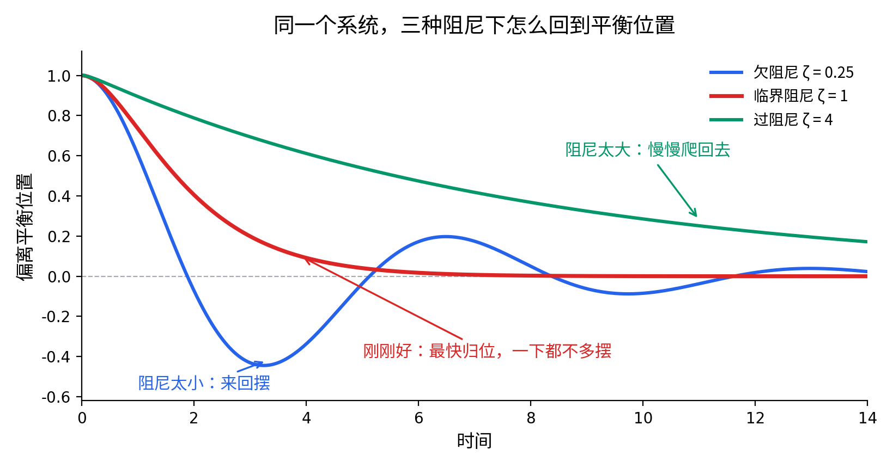
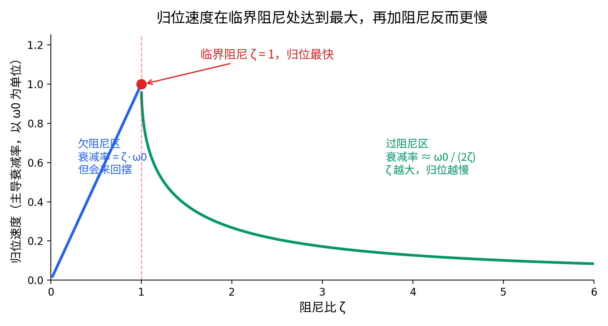

> 这是《从高中物理到光纤布拉格光栅传感器》系列的番外篇，接着第 0 章 0.3 节。不读主线也能独立看完。

## 一个每天都能碰到、但方向反直觉的现象

减震器坏了的车，过一个减速带之后车身会晃好几下才停——这个大家都知道，阻尼不够。

但反过来的情况就没那么直觉了：**阻尼加得太大，车身回位反而会变慢。** 不是"稳"，是"迟钝"——压下去之后慢吞吞地往回爬，下一个坎来了还没恢复到位。

也就是说，"阻尼越大越稳"是个错觉。存在一个**最优点**，两边都不如它。这个最优点有个名字，叫**临界阻尼**。

这篇文章要做的，就是把这个最优点算出来，并且解释清楚那个反直觉的部分——为什么过了这个点之后，你越用力刹车，它反而回得越慢。

---

## 先把方程摆出来

任何一个"有回复力、又有阻尼"的系统——弹簧挂重物、带内阻的 LC 电路、悬架、门自动闭合器——都满足同一个方程：

$$
m\ddot y = -ky - b\dot y
$$

回复力 $-ky$（胡克定律，偏离越多拉回来的力越大），阻尼力 $-b\dot y$（永远和速度反向，是刹车式的力，不断抽走能量）。

两边除以 $m$，写成标准形式：

$$
\ddot y + 2\gamma\dot y + \omega_0^2 y = 0
$$

其中 $\omega_0=\sqrt{k/m}$ 是**无阻尼时的固有频率**（系统"想"以多快的节奏振荡），$2\gamma=b/m$ 描述阻尼强度。

### 一个符号翻译：物理系的 γ 和工程系的 ζ

物理教材爱用 $\gamma$，工程教材（振动、控制、机械）几乎全用**阻尼比** $\zeta$（zeta）。两者的关系很简单：

$$
\zeta \equiv \frac{\gamma}{\omega_0}
$$

$\zeta$ 是个**无量纲数**，这是它在工程上更好用的原因——不管系统是一辆车、一扇门还是一个电路，$\zeta=0.7$ 的含义完全一样。三个分界点：

| $\zeta$ | 名称 | 行为 |
| --- | --- | --- |
| $\zeta<1$ | 欠阻尼 | 会来回摆，摆幅越来越小 |
| $\zeta=1$ | **临界阻尼** | 不摆，而且归位最快 |
| $\zeta>1$ | 过阻尼 | 不摆，但归位更慢 |

后面同时用两套符号，看到 $\zeta$ 就默念"$\gamma/\omega_0$"。

---

## 解一遍：三种情况从哪来

按标准套路，设试探解 $y=e^{\lambda t}$（允许 $\lambda$ 是复数）。求导两次代进去，消掉不为零的 $e^{\lambda t}$，微分方程直接退化成一个代数方程：

$$
\lambda^2+2\gamma\lambda+\omega_0^2=0
$$

求根公式：

$$
\lambda = -\gamma\pm\sqrt{\gamma^2-\omega_0^2} = \omega_0\left(-\zeta\pm\sqrt{\zeta^2-1}\right)
$$

**三种情况，全部由根号里的正负决定**：

**欠阻尼（$\zeta<1$）**：根号内为负，开出虚数，$\lambda=-\gamma\pm i\omega_1$，其中 $\omega_1=\omega_0\sqrt{1-\zeta^2}$。代回去：

$$
y(t)=e^{-\gamma t}\left[A\cos(\omega_1t)+B\sin(\omega_1t)\right]
$$

一个振幅按 $e^{-\gamma t}$ 衰减的余弦。$\lambda$ 的**实部管衰减，虚部管振荡**——而且 $\omega_1<\omega_0$，阻尼把振荡拖慢了一点点。

**临界阻尼（$\zeta=1$）**：根号为零，$\lambda=-\gamma$ 是**重根**。这里有个坑：一个二阶方程物理上对应两个初始条件（初始位置、初始速度），数学上需要两个独立解才能凑出通解，一个不够用。重根时第二个独立解要多带一个 $t$ 因子：

$$
y(t)=(A+Bt)\,e^{-\omega_0 t}
$$

**过阻尼（$\zeta>1$）**：根号内为正，$\lambda$ 是两个不同的负实数根，解是两个纯指数衰减的叠加，没有振荡。

---

## 核心：为什么阻尼越大，反而越慢

到这里为止都是标准教材内容。真正有意思的是下面这一步。

过阻尼有两个根：

$$
\lambda_\pm = \omega_0\left(-\zeta\pm\sqrt{\zeta^2-1}\right)
$$

两个都是负数，都对应指数衰减。但**长时间之后，系统的行为完全由衰减更慢的那个根决定**——衰减快的那一项早就掉到可以忽略了，剩下的是那个"拖后腿"的。

衰减更慢的是绝对值更小的 $\lambda_+$。把它在 $\zeta\gg1$ 时展开：

$$
\sqrt{\zeta^2-1}=\zeta\sqrt{1-\frac{1}{\zeta^2}}\approx\zeta\left(1-\frac{1}{2\zeta^2}\right)=\zeta-\frac{1}{2\zeta}
$$

代回去：

$$
\lambda_+ = \omega_0\left(-\zeta+\sqrt{\zeta^2-1}\right)\approx -\frac{\omega_0}{2\zeta}
$$

**看清楚这个结果：$\zeta$ 在分母上。**

主导的衰减率是 $\omega_0/(2\zeta)$，对应的时间常数是

$$
\tau \approx \frac{2\zeta}{\omega_0}
$$

$\zeta$ 翻一倍，归位时间就翻一倍。**阻尼加得越大，回位越慢，而且是成正比地慢。** 这不是打比方，是算出来的。

### 物理上怎么理解

阻尼力的作用是抵抗**运动**，不分方向。它既阻止系统冲过头（这是好事，消除振荡），也阻止系统往回走（这是坏事，拖慢归位）。

$\zeta$ 很小时，前一个作用还不够，系统冲过头，来回摆；$\zeta$ 很大时，后一个作用占了上风，系统被自己的阻尼粘住，像在糖浆里往回爬。

中间必然存在一个平衡点。

### 这个平衡点在哪

把"主导衰减率"作为 $\zeta$ 的函数画出来：

- $\zeta<1$：衰减率 $=\gamma=\zeta\omega_0$，随 $\zeta$ **线性增大**
- $\zeta>1$：衰减率 $=\omega_0(\zeta-\sqrt{\zeta^2-1})$，随 $\zeta$ **单调减小**

两段在 $\zeta=1$ 处接上，都等于 $\omega_0$。

**这是一个尖峰。$\zeta=1$ 就是"不振荡的前提下归位最快"的那个点，两边都比它慢。**

（注意左半边的"快"是有代价的：欠阻尼虽然包络衰减快，但它会来回穿越平衡位置。如果你的判据是"进入某个误差带之后不再出来"，那么欠阻尼要额外等好几个摆动周期。所以"最快归位"这个说法，严格讲是"不允许超调的前提下最快"。）

---

## 工程上为什么处处是它

理解了这个尖峰，很多设计选择就都能读懂了：

**门自动闭合器**。欠阻尼的门会撞上门框再弹回来，反复几次；过阻尼的门要慢慢挪半分钟才关上。往临界附近调，门轻轻贴合，一次到位。

**指针式仪表**（动圈式电表、老式万用表）。指针欠阻尼会在读数附近来回摆，你得等它停；过阻尼则要等好几秒才爬到位。表头里通常靠电磁阻尼（线圈在磁场里运动产生的涡流）把 $\zeta$ 调到临界附近，指针"一步到位"。

**汽车悬架**。这里值得注意：实际调校往往**故意略低于临界阻尼**（即略微欠阻尼），因为完全的临界阻尼虽然归位最快，但初期太"硬"，路面冲击直接传到车身，舒适性差。这是一个典型的多目标权衡——归位速度不是唯一指标。运动型车的阻尼比通常调得更接近 1，舒适取向的调得更低，这就是"底盘调校"里最基本的那一维。

**伺服定位系统**（机床、机械臂、云台、硬盘磁头）。控制里说的"超调"和"整定时间"，本质上就是这条曲线的两端：$\zeta$ 太小超调大，太大整定时间长。PID 里那个微分项 D，做的正是"人为增加阻尼"这件事。

**建筑与桥梁的阻尼器**。这里目标不同——地震和风振是持续激励，不是一次性冲击，追求的是耗散能量而不是"最快归位"，所以往往并不追求临界阻尼。**判据变了，最优点就变了**，这一点值得留意，别把临界阻尼当成万能答案。

---

## 一句话带走

- 阻尼比 $\zeta=\gamma/\omega_0$ 是无量纲的，$\zeta<1$ 摆、$=1$ 临界、$>1$ 过阻尼。
- 过阻尼时归位速度 $\approx\omega_0/(2\zeta)$，$\zeta$ 在分母上——**阻尼越大，归位越慢**。
- 归位速度在 $\zeta=1$ 处是个尖峰，两边都更慢。
- "最快归位"的完整表述是"**不允许超调的前提下**最快"。判据一变（比如改成耗散能量），最优点就不在 $\zeta=1$ 了。

## 自测

1. 一个系统 $\omega_0=10\ \mathrm{rad/s}$，$\zeta=5$。估算它的归位时间常数大约是多少？
2. 如果把 $\zeta$ 从 5 加到 10，归位是变快还是变慢？变化多少倍？
3. 为什么临界阻尼的通解要多带一个 $t$ 因子，写成 $(A+Bt)e^{-\omega_0t}$？

参考答案

1. 近似式：$\tau\approx 2\zeta/\omega_0 = 2\times5/10 = 1$ 秒。拿精确式验一下：$\lambda_+=\omega_0\left(-\zeta+\sqrt{\zeta^2-1}\right)=10\times(-5+\sqrt{24})=10\times(-5+4.899)=-1.01$，所以 $\tau=1/1.01\approx0.99$ 秒。近似式在 $\zeta=5$ 时已经相当准了。
2. **变慢，大约慢一倍**（$\tau\propto\zeta$）。这正是本文的核心反直觉点。
3. 因为特征方程 $(\lambda+\omega_0)^2=0$ 是重根，只给出一个解、一个待定常数；而二阶方程物理上对应两个初始条件（初始位置和初始速度），需要两个独立解才能凑出满足任意初始条件的通解。$t\,e^{-\omega_0t}$ 就是那个补上来的第二个独立解。

---

## 回到主线

在 FBG 这个系列里，阻尼振子出现的位置是第 0 章 0.3 节，作用是演示"设 $e^{\lambda t}$ → 微分方程变代数方程 → 解出 $\lambda$，实部是衰减、虚部是振荡"这个套路。这个套路后面会原样再用两次：推平面波解，以及第 3 阶段解光纤模式方程。

至于阻尼本身，FBG 里其实用不到——所以它被挪到了这篇番外。
