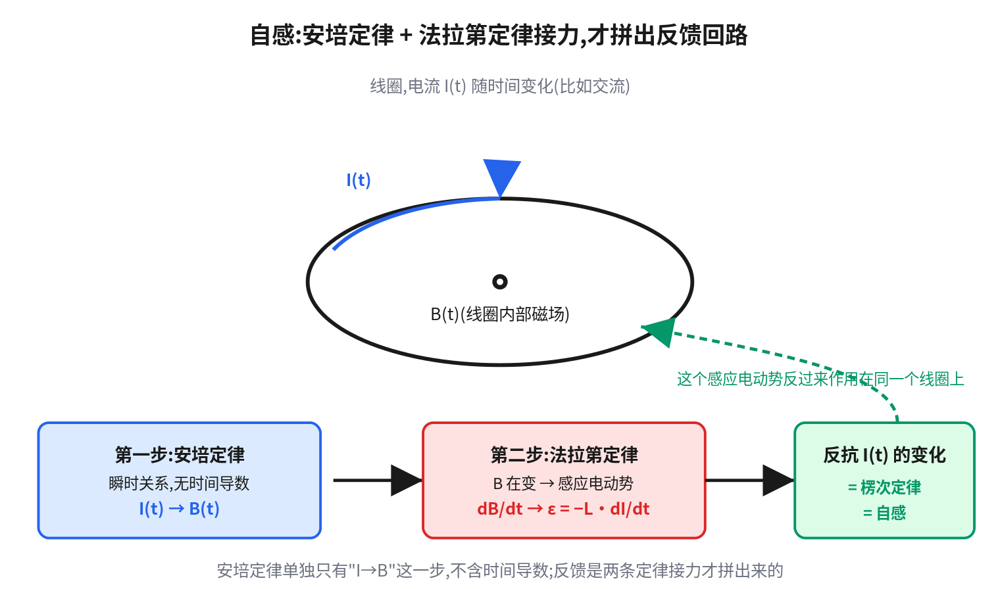
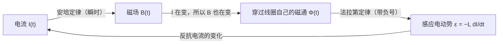
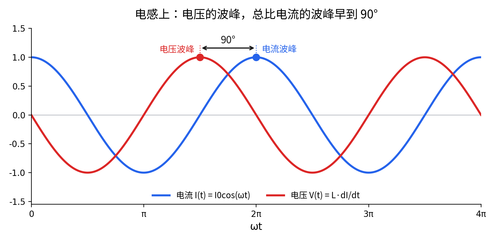
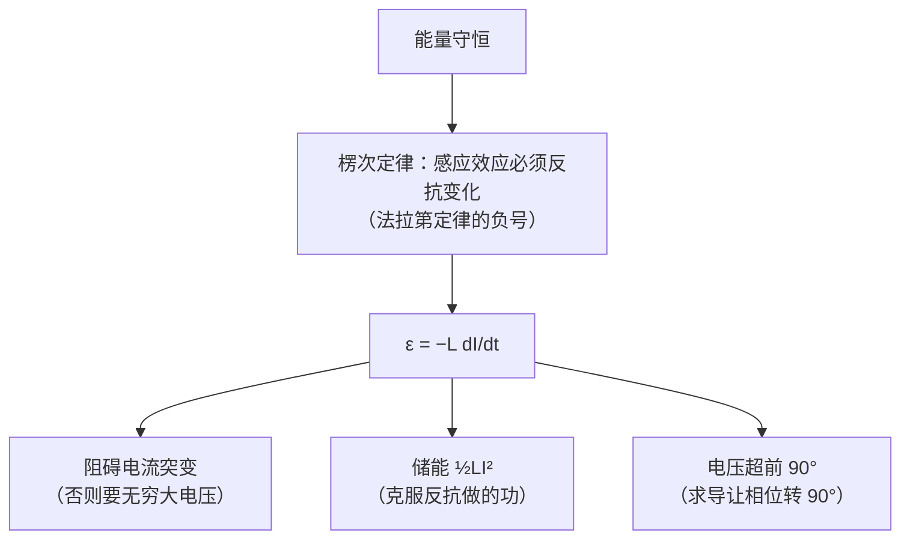

> 这是《从高中物理到光纤布拉格光栅传感器》系列的番外篇，接着第 1 章 1.1 节。不读主线也能独立看完。

## 电路课上，电感有三条互不相干的"性质"

翻开任何一本电路基础教材，电感元件那一章大致会给你这么三条：

1. **阻碍电流突变**——电感里的电流不能瞬间改变。
2. **储存磁场能量** $\frac12LI^2$。
3. **电压超前电流 90°**——正弦稳态下，电感两端的电压波形比电流波形早四分之一个周期。

这三条通常被分成三节讲，中间隔着一堆公式。学完之后大概率是三条各背各的。

但它们其实是**同一件事的三个侧面**，而且源头是一个东西：**法拉第定律前面那个负号。**

这篇文章要做的，就是从那个负号出发，把三条一条一条推出来。

---

## 源头：两条定律接力

先澄清一件容易理解偏的事。安培定律

$$
\nabla\times\vec B=\mu_0\vec J
$$

**本身不含任何时间导数**。给定此刻的电流，此刻的磁场就唯一确定了——这个方程不记忆过去、不预测未来，它描述的是任意瞬间的一个代数关系。不管电流是恒定直流还是随时间狂变的交流，这一点都成立。

所以，如果只看安培定律，电流对自己是**没有**任何反馈的。

但真实电路里，电感明明会"顶回来"。那个反馈从哪来？

**答案是：它不是安培定律给的，是安培定律和法拉第定律接力拼出来的。**

**第一步（安培定律，瞬时）**：线圈里的电流 $I(t)$ 产生此刻的磁场 $B(t)$。

**第二步（法拉第定律）**：因为 $I(t)$ 在变，$B(t)$ 也在变；而这个变化的磁场穿过的，正是**产生它的那个线圈自己**。于是在同一个线圈里感应出一个电动势：

$$
\varepsilon = -\frac{d\Phi}{dt} = -L\frac{dI}{dt}
$$

这里 $L$ 就是**自感系数**，定义为「单位电流能在自己身上勾出多少磁通」$\Phi=LI$，完全由线圈的几何形状（匝数、截面积、长度、有没有铁芯）决定，跟电流大小无关。

**关键在那个负号。** 它是法拉第定律带来的，物理内容就是楞次定律：感应电动势永远**反抗**引起它的变化。电流想增大，它就往回拉；电流想减小，它就往前顶。

三条性质，全部从这一行长出来。

---

## 性质一：为什么电流不能突变

直接看式子：

$$
\varepsilon = -L\frac{dI}{dt}
$$

要让电流在**零时间内**跳变，需要 $dI/dt\to\infty$，那就需要**无穷大的电压**。电源给不出无穷大电压，所以电流跳不了。

这不是一条独立的"规则"，只是上面那个负号加上"电压有限"这个事实的直接推论。

### 一个每天都能看到的推论

**拔插头会打火花。** 这是这条性质最直观的证据。

想象一个感性负载（电机、继电器线圈、变压器、日光灯镇流器）正在通电，电流是 $I_0$。现在你把插头拔了，或者开关一断——**开关想在毫秒量级把电流从 $I_0$ 强行压到 0**，$dI/dt$ 是一个极大的负数。

电感立刻用一个极大的正电压去"顶"，试图维持电流。这个电压可以远远超过电源电压，高到足以**击穿开关触点之间那层空气**——于是你看到一道电弧。

电流在电感眼里必须连续，你不给它导线走，它就从空气里烧一条路出来。

（这也是为什么继电器、电机驱动电路里一定要并一个**续流二极管**：给电流一条合法的回路，让它慢慢衰减，而不是去击穿开关。这个元件存在的全部理由，就是上面那个负号。）

---

## 性质二：能量 ½LI² 从哪来

既然感应电动势在反抗电流增大，那么**要把电流从 0 建立到 $I$，外部电源必须克服这个反抗做功**。做的功去哪了？存进了磁场。

算一下。电源为了维持电流上升，必须提供的电压恰好抵消感应电动势，也就是 $V=L\,dI/dt$。瞬时功率：

$$
P = VI = L\,I\,\frac{dI}{dt}
$$

从电流为 0 积到电流为 $I$：

$$
W=\int_0^{t} L\,I\frac{dI}{dt}\,dt=\int_0^{I} L\,I\,dI=\frac12 LI^2
$$

**$\frac12LI^2$ 不是一个需要单独记忆的公式，是"克服楞次定律的反抗"这件事的账单。**

而且这个能量是**可以拿回来的**：电流下降时，感应电动势反过来推着电流走，电感变成电源，把存的能量还给电路。（还回来的过程如果被开关粗暴打断，就变成上一节那道电弧——那份能量得找个地方去。）

对比一下电容的 $\frac12CV^2$：结构一模一样，只是把"电流建立要克服感应电动势"换成了"电荷堆积要克服已有的电压"。两者是对偶的。

---

## 性质三：电压超前电流 90°

这一条看起来最像"死记硬背"，其实是三条里最容易算的。

正弦稳态下设电流 $I(t)=I_0\cos(\omega t)$。电感两端的电压就是要抵消感应电动势的那个电压：

$$
V(t)=L\frac{dI}{dt}=-\omega L\,I_0\sin(\omega t)=\omega L\,I_0\cos\!\left(\omega t+\frac{\pi}{2}\right)
$$

**电压的相位比电流多了 $+\pi/2$，也就是 90°。**

### 用复指数算，一步就出来

上面那步还得动一次三角函数。换成复指数写法，连这一步都省了。设 $I=I_0e^{i\omega t}$：

$$
V = L\frac{dI}{dt}=L\cdot i\omega\, I_0e^{i\omega t}=i\omega L\cdot I
$$

于是电感的**阻抗**是：

$$
Z_L = \frac{V}{I}=i\omega L
$$

这一个式子同时装下了两件事：

- **模长** $|Z_L|=\omega L$：频率越高，电感越"堵"。这也符合直觉——频率越高 $dI/dt$ 越大，反抗越强。这就是扼流圈能滤掉高频的原因。
- **辐角** $\arg(Z_L)=+90°$：乘 $i$ 在复平面上就是逆时针转 90°，所以电压相位比电流超前 90°。

**这正是复指数在电路分析里真正省的功夫**：微分方程变成了代数乘法，相位关系直接写在虚数单位上，不用再去背"电感超前、电容滞后"。

（顺带记一下对偶：电容 $Z_C=1/(i\omega C)=-i/(\omega C)$，辐角是 $-90°$，电压**滞后**电流 90°。电感电容的一切区别，在这一层就是 $i$ 和 $1/i$ 的区别。）

---

## 为什么负号必须是负号

最后回到源头。如果法拉第定律那个负号是**正号**，会发生什么？

感应电动势会变成**助推**电流变化而不是反抗：电流稍微增大一点，感应电动势推着它增得更大，再感应出更强的电动势……一个微小的扰动会自我放大，电流和磁场能量凭空指数增长。

**这直接违反能量守恒。** 所以这个负号不是约定，也不是数学上的选择——它是被能量守恒钉死的。

顺着这条线往回看，电感元件的三条性质其实是同一件事：

---

## 一句话带走

- 安培定律本身是**瞬时**的，不含自我反馈；电感的反馈是安培定律和法拉第定律**接力**拼出来的。
- $\varepsilon=-L\,dI/dt$ 这一行是全部源头，那个负号是楞次定律，背后是能量守恒。
- 三条性质是它的三个推论：电流不能突变（要无穷大电压）、储能 $\frac12LI^2$（克服反抗做的功）、电压超前 90°（求导让相位转 90°）。
- 复指数写法把它压缩成一个 $Z_L=i\omega L$：模长管"堵多少"，辐角管"超前多少"。

## 自测

1. 一个 10 mH 的电感，通过 2 A 电流，储存多少能量？
2. 同一个电感，在 50 Hz 和 50 kHz 下的阻抗模长分别是多少？相差多少倍？
3. 为什么继电器线圈两端要并一个续流二极管？

参考答案

1. $W=\frac12LI^2=\frac12\times0.01\times2^2=0.02$ J＝20 mJ。
2. $|Z_L|=\omega L=2\pi f L$。50 Hz：$2\pi\times50\times0.01\approx3.14\ \Omega$；50 kHz：$2\pi\times50000\times0.01\approx3140\ \Omega$。相差 **1000 倍**，正比于频率。
3. 因为开关断开时，线圈里的电流被强行切断，$dI/dt$ 极大，电感会产生极高的反向电压去维持电流，足以击穿触点间的空气产生电弧，烧蚀触点、干扰电路。续流二极管给这个电流一条合法的回路，让它平缓衰减、把 $\frac12LI^2$ 慢慢耗掉，而不是去击穿别的东西。

---

## 回到主线

在 FBG 这个系列里，这段内容出现的位置是第 1 章 1.1 节，当时是为了澄清一句话：说 $\mu_0\vec J$ 这一项"单向、不含反馈"，指的是**这个方程本身**不含时间导数，不是说电流对自己没有反馈。

那一节真正关心的是**符号的来源**：法拉第定律的负号被能量守恒钉死，安培-麦克斯韦定律位移电流项的正号被电荷守恒钉死。这两个符号相反，恰好保证了 $k^2>0$——也就是光能够传播。自感只是同一个负号在电路里的一次露面。
