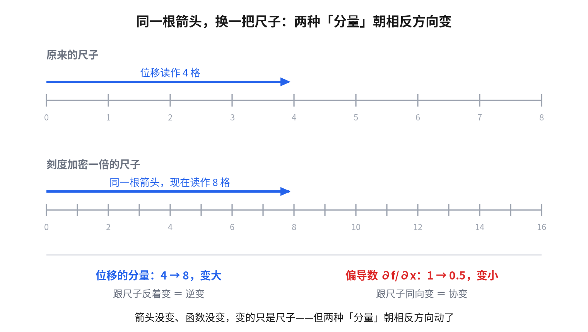

> 这是《从高中物理到光纤布拉格光栅传感器》系列的番外篇，接着第 0 章 0.1 节。不读主线也能独立看完。

## 一个说不通的地方

直角坐标下，梯度是这样的：

$$
\nabla f=\left(\frac{\partial f}{\partial x},\ \frac{\partial f}{\partial y},\ \frac{\partial f}{\partial z}\right)
$$

干净利落：对三个坐标各求一次偏导，拼成一个矢量。

但换到柱坐标，中间那一项前面凭空多了个 $1/\rho$：

$$
\nabla f = \frac{\partial f}{\partial \rho}\hat\rho + \frac{1}{\rho}\frac{\partial f}{\partial \varphi}\hat\varphi + \frac{\partial f}{\partial z}\hat z
$$

球坐标更过分，多了两个因子：

$$
\nabla f = \frac{\partial f}{\partial r}\hat r + \frac{1}{r}\frac{\partial f}{\partial \theta}\hat\theta + \frac{1}{r\sin\theta}\frac{\partial f}{\partial \varphi}\hat\varphi
$$

而在一个**斜的**坐标系里（三个轴不互相垂直），情况更糟：梯度的某一个分量会变成好几个方向偏导数的**线性组合**，得动用矩阵。

**同一个梯度，同一个物理事实，为什么换个坐标系写法就变了这么多？** 到底是梯度变了，还是我们对"分量"这个词的理解出了问题？

答案是后者。而且一旦想清楚，上面所有的缩放因子都能一眼看出来源。

---

## 先看清楚：「分量」这个词有两种含义

这是全文的核心，用一个极简的例子就能说清。

考虑一维。原来的尺子，单位是"米"。现在换一把刻度**加密一倍**的尺子（单位改成"半米"），也就是做坐标变换 $x'=2x$。

**注意：物理世界什么都没变。** 箭头还是那根箭头，函数还是那个函数，变的只是我们用来描述它们的尺子。

**看位移。** 一根长 4 米的箭头，原来读作"4 格"，现在读作"8 格"。**坐标尺加密，读数变大**——数值和尺子的密度**反着变**。这种分量叫**逆变**（contravariant）。位移、速度、力，所有"能画成箭头"的东西，分量都是逆变的。

**看偏导数。** 假设 $f$ 沿 $x$ 每米增长 1，那么 $\partial f/\partial x=1$。换尺子之后，"每格"只有半米了，所以每格只增长 0.5，即 $\partial f/\partial x'=0.5$。**坐标尺加密，读数变小**——数值和尺子的密度**同向变**。这种分量叫**协变**（covariant）。

**结论**：位移的分量和偏导数的分量，在换尺子时**朝相反方向变**。它们根本不是同一类对象。

那三个偏导数拼起来的东西，天生是**协变**的；而"梯度"作为一个能画箭头、能跟别的矢量做点乘的对象，应该是**逆变**的。

**所以「$\nabla f$ 就是三个偏导数拼起来」这句话，本来就不是恒等式，它是一个只在特定坐标系下成立的巧合。**

---

## 那直角坐标为什么就对了

因为在直角坐标下，协变和逆变**碰巧数值相同**。

原因是它的基矢量同时满足两个条件：

- **正交**：$\hat x\cdot\hat y=0$ 等等，三个方向互不干扰；
- **归一**：$|\hat x|=|\hat y|=|\hat z|=1$，每格就是一米。

第二条让"每格"和"每米"是同一件事，协变和逆变的数值就分不出来了。第一条让各分量互不串门。两条一起，才让"三个偏导拼起来 = 梯度"这个式子成立。

**换句话说，直角坐标是一把横平竖直、刻度均匀的标准直尺，量出来的数直接就是答案。** 其他坐标系是歪的、或者刻度不均匀的尺子，读出的数字得先换算。

那张换算表，就叫**度规**。

---

## 度规：一张「怎么量距离」的表

度规 $g_{ij}$ 的定义只有一件事：**告诉你在这个坐标系里，坐标差了一点点，实际走了多远。**

$$
ds^2=\sum_{i,j} g_{ij}\,dx^i dx^j
$$

看几个具体例子，一下就明白了。

**直角坐标**：$ds^2=dx^2+dy^2+dz^2$，所以

$$
g=\begin{pmatrix}1&0&0\\0&1&0\\0&0&1\end{pmatrix}
$$

单位矩阵。这就是"标准直尺"在数学上的样子。

**柱坐标** $(\rho,\varphi,z)$：沿 $\varphi$ 方向转过 $d\varphi$ 弧度，实际走过的弧长是 $\rho\,d\varphi$，所以

$$
ds^2=d\rho^2+\rho^2 d\varphi^2+dz^2
\qquad\Longrightarrow\qquad
g=\mathrm{diag}(1,\ \rho^2,\ 1)
$$

**球坐标** $(r,\theta,\varphi)$：

$$
ds^2=dr^2+r^2d\theta^2+r^2\sin^2\theta\,d\varphi^2
\qquad\Longrightarrow\qquad
g=\mathrm{diag}(1,\ r^2,\ r^2\sin^2\theta)
$$

### 现在，那些缩放因子一眼就出来了

把度规对角元开根号，得到的东西叫**拉梅系数**（Lamé coefficients）：

$$
h_i \equiv \sqrt{g_{ii}}
$$

它的物理含义就一句话：**第 $i$ 个坐标每变化 1 个单位，实际走过 $h_i$ 米。**

| 坐标系 | $h_1$ | $h_2$ | $h_3$ |
| --- | --- | --- | --- |
| 直角 $(x,y,z)$ | 1 | 1 | 1 |
| 柱 $(\rho,\varphi,z)$ | 1 | $\rho$ | 1 |
| 球 $(r,\theta,\varphi)$ | 1 | $r$ | $r\sin\theta$ |

于是**正交曲线坐标下的梯度，有一个统一的公式**：

$$
\nabla f=\sum_i \frac{1}{h_i}\frac{\partial f}{\partial q^i}\,\hat e_i
$$

代进去核对一下：柱坐标 $h_2=\rho$，$\hat\varphi$ 分量前面就是 $1/\rho$；球坐标 $h_2=r$、$h_3=r\sin\theta$，前面就是 $1/r$ 和 $1/(r\sin\theta)$。

**全部对上，而且不用再背。** 那些看起来莫名其妙的缩放因子，就是"把每坐标单位换算成每米"的汇率，汇率表就是拉梅系数，拉梅系数就是度规对角元开根号。

### 顺带把散度和旋度也拿下

同一套拉梅系数，还能直接写出散度和旋度的通用形式：

$$
\nabla\cdot\vec A=\frac{1}{h_1h_2h_3}\left[\frac{\partial}{\partial q^1}(h_2h_3A_1)+\frac{\partial}{\partial q^2}(h_3h_1A_2)+\frac{\partial}{\partial q^3}(h_1h_2A_3)\right]
$$

$$
(\nabla\times\vec A)_1=\frac{1}{h_2h_3}\left[\frac{\partial (h_3A_3)}{\partial q^2}-\frac{\partial (h_2A_2)}{\partial q^3}\right]
$$

（另外两个分量按 $1\to2\to3\to1$ 循环轮换。）

$h_1h_2h_3$ 就是体积元的换算因子——柱坐标下是 $\rho$，正是 $dV=\rho\,d\rho\,d\varphi\,dz$ 里那个 $\rho$；球坐标下是 $r^2\sin\theta$，正是 $dV=r^2\sin\theta\,dr\,d\theta\,d\varphi$。**积分换元时那些"雅可比行列式"，和梯度里的缩放因子，是同一张汇率表的两种用法。**

---

## 斜坐标：分量之间开始串门

上面所有例子，度规都是**对角**矩阵。这不是巧合——它等价于说三个坐标方向互相**正交**。

正交带来的好处是：每个分量只被自己方向的一个数缩放，不会混进别的方向。所以修正只是"除以 $h_i$"这么简单。

如果坐标系连正交都不满足（比如两个轴夹 60° 的斜坐标），度规就会出现**非对角项** $g_{12}\ne0$。这时候：

- 一个分量会变成好几个方向偏导数的**线性组合**，必须做矩阵乘法；
- 协变分量和逆变分量之间的换算，要靠 $g_{ij}$ 和它的逆 $g^{ij}$ 来回"升降指标"——广义相对论里到处都是的那套记号，处理的正是这件事；
- "分量数值"和"物理长度"彻底脱钩，必须严格区分。

好消息是：**工程和应用物理里，几乎永远用不到斜坐标。** 直角、柱、球（以及椭圆柱、抛物、双极等等）全都是正交曲线坐标，度规对角，拉梅系数就够用了。真正需要非对角度规的地方，基本只有广义相对论和一部分连续介质力学。

---

## 一句话带走

- **「分量」有两种**：逆变（跟坐标尺反着变，位移、速度）和协变（跟坐标尺同向变，偏导数）。
- 「三个偏导拼起来就是梯度」**只在直角坐标下成立**，因为那里基矢量正交且归一，协变和逆变数值碰巧相同。
- **度规就是「怎么量距离」的表**；它的对角元开根号是**拉梅系数** $h_i$，含义是「这个坐标每变 1 个单位，实际走多少米」。
- 正交曲线坐标下有统一公式 $\nabla f=\sum_i \frac{1}{h_i}\frac{\partial f}{\partial q^i}\hat e_i$——柱坐标的 $1/\rho$、球坐标的 $1/(r\sin\theta)$ 全从这里来，不用背。
- 只有**非正交**坐标才需要真正的矩阵/张量运算，工程上基本遇不到。

## 自测

1. 球坐标的拉梅系数是 $(1,\ r,\ r\sin\theta)$。为什么 $h_3$ 里有一个 $\sin\theta$？用地球仪想一想。
2. 用通用公式写出柱坐标下的散度 $\nabla\cdot\vec A$。
3. 为什么"体积元换元的雅可比因子"和"梯度里的缩放因子"是同一套东西？

参考答案

1. $\varphi$ 是经度。在**赤道**上（$\theta=90°$，$\sin\theta=1$）转过 1 弧度，实际走 $r$ 米；越靠近**极点**（$\theta\to0$），同样转 1 弧度走过的实际距离越短，趋于 0。$\sin\theta$ 就是这个"纬度圈半径随纬度收缩"的因子——纬度圈的半径是 $r\sin\theta$，不是 $r$。
2. 代入 $h_1=1,h_2=\rho,h_3=1$，$h_1h_2h_3=\rho$：

$$
\nabla\cdot\vec A=\frac{1}{\rho}\left[\frac{\partial(\rho A_\rho)}{\partial\rho}+\frac{\partial A_\varphi}{\partial\varphi}+\frac{\partial(\rho A_z)}{\partial z}\right]=\frac{1}{\rho}\frac{\partial(\rho A_\rho)}{\partial\rho}+\frac{1}{\rho}\frac{\partial A_\varphi}{\partial\varphi}+\frac{\partial A_z}{\partial z}
$$

3. 因为两者问的是同一个问题：**「一个坐标单位对应多少物理长度」**。梯度需要它把"每坐标单位的变化率"换算成"每米的变化率"（除以 $h_i$）；体积元需要它把"坐标立方体的坐标体积"换算成"真实体积"（乘 $h_1h_2h_3$）。一个除、一个乘，用的是同一张汇率表。

---

## 回到主线

在 FBG 这个系列里，这个话题出现在第 0 章 0.1 节，当时只需要一个结论：**柱坐标下梯度的 $\hat\varphi$ 分量前面有个 $1/\rho$**——因为光纤是圆柱，第 3 阶段解光纤模式方程就在柱坐标下做。

那一节没有展开度规，是因为整个系列全程只用直角坐标和柱坐标，都是正交的，拉梅系数就够用，永远不会遇到需要动矩阵的斜坐标。这篇番外把欠的账还上。
