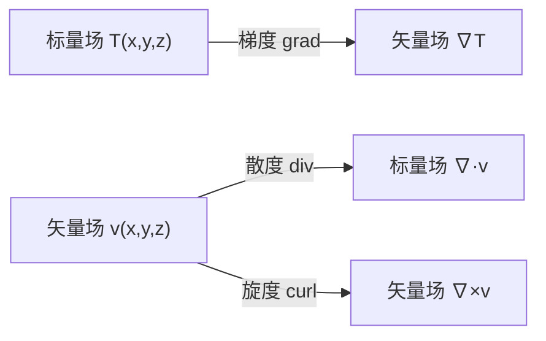
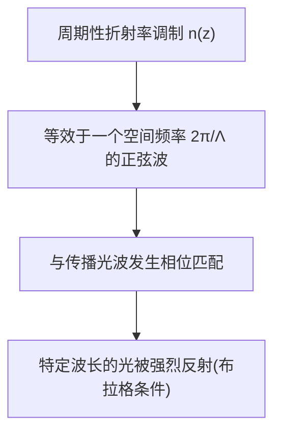

写本系列文章的初衷是看FBG光纤传感方向的论文实在太痛苦了，理论与背景章节里充满了堆砌的公式与跳跃的思维，当然了，这不能怪论文作者，只能说我作为一个外行，水平确实有点低，再叠加隔行如隔山，确实很难。相信这不是我一个人的问题与痛苦。所以本文干脆从最基础的水平出发，也就是高中物理以及一些简单的高等数学，结合一些光学常识，逐步提升深入程度，旨在帮助从事FBG的技术人员（包括我自己），只需要看这一个系列的文章就能实现理论的入门与全貌概览，后续的深入学习再去翻阅各种不同的参考书与经典论文（不必过早地陷入上下文切换中去）。

鉴于我本人确实非专业出身，不对的地方也请各位读者指出我来修正，愿意请客表示感谢。

本系列文章的大致思路是数学预备->电磁学->光学->光纤波导->耦合模。

本系列文章均有**Claude.ai**的贡献。准确说，都是Professeure Cluadette的贡献，我只不过把内容全部走了一遍，题目全部做了一遍，该踩的能踩的坑都踩了一遍，不清楚的地方提前问了一遍，我简直就是一个研究生助教，把老板的讲义拿来整理一下就厚着脸皮说也算是我的了。

---

# 第 0 阶段:数学预备

本章目标:不追求数学上的严谨证明,只追求"看得懂电磁学和波动方程时不被符号绊倒"，包括矢量分析、复数、常微分方程、傅里叶级数与偏微分方程入门。

---

## 0.1 矢量分析:梯度、散度、旋度

### 为什么要学这个

麦克斯韦方程组和后面的推导中大量用到这三个算符。不理解它们的**物理图像**，麦克斯韦方程组就永远是四行抽象符号，只能进行机械推导，而无法建立物理直觉。

### 梯度(gradient)

梯度作用在一个**标量场**上(比如温度分布 $T(x,y,z)$),输出一个**矢量场**,方向指向该点数值增长最快的方向,大小是增长速率。

$$
\nabla T = \left( \frac{\partial T}{\partial x}, \frac{\partial T}{\partial y}, \frac{\partial T}{\partial z} \right)
$$

直觉:~~站在山坡上,梯度就是"最陡爬升方向"这个箭头~~ 

建议不要这样想，否则三维空间就不好想象了；想象三维空间的温度场，任意一点都有自己的温度，那么梯度就是该点出发，指向周边最高温度点的方向，想象梯度矢量是一个空间里可以四处指向的风向标即可。

#### 梯度到底是什么:一个跟坐标系无关的几何量

一个容易被忽略、但很关键的问题:为什么"仅仅对三个坐标求偏导"拼出来的东西,就能代表这一点在**所有方向**上的变化信息?是不是巧合,还是跟坐标系的选择有关?

答案是:梯度的**真正定义**根本不提坐标系,它是这样一句话——对任意方向的单位矢量 $\hat n$,沿这个方向的方向导数满足

$$
\frac{\partial f}{\partial n} = \nabla f \cdot \hat n
$$

也就是说,梯度是这样一个矢量:拿它跟任意方向做点乘,就能读出"沿这个方向变化多快"。这是纯几何的定义——山的最陡爬升方向是山本身的客观属性,跟怎么画地图(选什么坐标系)完全无关,坐标系只是描述工具。

**那为什么直角坐标系下,仅仅三个偏导拼起来就恰好是这个矢量?** 因为直角坐标系的三个基矢量 $\hat x,\hat y,\hat z$ 满足两个条件:互相**正交**、每个的长度都**归一**(长度为 1)。在这种"标准尺子"下,可以证明 $(\partial f/\partial x,\partial f/\partial y,\partial f/\partial z)$ 恰好满足上面那条"点乘等于方向导数"的定义——这不是巧合,是因为正交归一基做点乘时,各分量互不"串门"(点乘 $x$ 方向只挑出 $x$ 分量,其余贡献为零),链式法则也刚好和这个结构对上。

**如果坐标系不正交,直接对坐标求偏导拼成矢量,一般就不对了。** 原因分两层:第一,$\partial f/\partial x$ 这组数天然属于"协变"对象(数学上叫对偶空间的东西),不是能直接画箭头的那种矢量;第二,要把它变回"能画箭头、能点乘"的真正矢量,需要用一个叫**度规**的换算系数做修正——度规就是"这个坐标系里怎样正确测距离和夹角"的系数表。只有当度规恰好是单位矩阵(即正交归一,直角坐标就是这种情况),偏导数拼起来才直接等于梯度分量。

打比方:直角坐标是一把横平竖直、刻度均匀的标准直尺,量出来的数直接就是答案;非正交坐标系是一把歪的、刻度不均匀的尺子,读出的数字得先按"换算表"(度规)修正,才是真实的物理量。

**球坐标、柱坐标的具体例子(正交,但不归一)**

球坐标 $(r,\theta,\varphi)$ 三个方向仍然互相垂直,但基矢量长度不一样(比如沿 $\theta$ 方向转一点点,走过的实际弧长跟 $r$ 有关),梯度公式因此多出缩放因子:

$$
\nabla f = \frac{\partial f}{\partial r}\hat r + \frac{1}{r}\frac{\partial f}{\partial \theta}\hat\theta + \frac{1}{r\sin\theta}\frac{\partial f}{\partial \varphi}\hat\varphi
$$

柱坐标 $(\rho,\varphi,z)$ 更简单一点,只有一个缩放因子:

$$
\nabla f = \frac{\partial f}{\partial \rho}\hat\rho + \frac{1}{\rho}\frac{\partial f}{\partial \varphi}\hat\varphi + \frac{\partial f}{\partial z}\hat z
$$

这个 $1/\rho$ 的来源可以自己推:偏导数 $\partial f/\partial\varphi$ 算出来的是"$f$ 对**坐标角度**的变化率",单位是"每弧度变化多少",但梯度分量要求的是"每米(沿 $\hat\varphi$ 方向的实际物理距离)变化多少"。两者靠弧长微元 $ds=\rho\,d\varphi$ 换算:

$$
\frac{\partial f}{\partial s_\varphi} = \frac{\partial f}{\partial \varphi}\cdot\frac{d\varphi}{ds} = \frac{1}{\rho}\frac{\partial f}{\partial \varphi}
$$

物理图像:想象地球仪上沿经度方向转过 1 度,赤道上走的实际距离和靠近极点走的实际距离不一样——"转过 1 个坐标单位对应多少物理距离"这件事本身跟观察者站在哪里(哪个坐标值)有关,这就是缩放因子依赖其他坐标的原因。注意这里**没有交叉项**:因为坐标系仍然正交,每个分量只被自己方向的缩放因子修正,不会混进别的方向偏导数的数值。如果坐标连正交都不满足(斜坐标),度规矩阵才会出现非对角项,那时候某个分量才会变成好几个方向偏导数的线性组合,真正需要矩阵/张量运算,不再是简单缩放。

### 散度(divergence)

散度作用在一个**矢量场**上(比如水流速度场 $\vec{v}$),输出一个**标量**,衡量该点是"源"还是"汇"——通俗说就是这一点周围东西是在往外冒还是往里收。

$$
\nabla \cdot \vec{v} = \frac{\partial v_x}{\partial x} + \frac{\partial v_y}{\partial y} + \frac{\partial v_z}{\partial z}
$$

直觉:如果散度大于零,这一点像个水龙头在往外喷水;小于零,像个下水道在往里吸水。

**电磁学里的用途预告**:高斯定理 $\nabla \cdot \vec{E} = \rho/\varepsilon_0$ 说的就是"电场的散度等于电荷密度"——电荷就是电场线的源头。

#### 类比:基尔霍夫电流定律的连续版本

基尔霍夫电流定律(KCL)说:一个节点,流进去的电流总和等于流出来的总和(除非节点本身在生/吃电荷)。散度定理说的是同一件事的连续版本,把"离散节点"换成"连续空间里任意一小块区域":

$$
\int_V (\nabla\cdot\vec v)\,dV = \oint_S \vec v\cdot d\vec A
$$

左边是这块区域的"总散度",右边是穿过边界的"净流量"。区域内部没有源没有汇,净流出就是 0,散度处处为 0——这就是"连续版 KCL"。散度不为零的地方,就是这一点在往外冒(源)或往里吸(汇)东西,对应电路里那个在注入/抽取电流、破坏普通节点守恒的节点本身。

#### 一个点的散度到底是什么意思

单独"一个点"没有体积,直接谈"净流量"没有意义。散度的定义是通过极限过程,把"区域"收缩到"点"上:

$$
\nabla\cdot\vec v\Big|_{\text{某点}} = \lim_{V\to0}\frac{1}{V}\oint_S \vec v\cdot d\vec A
$$

即:先取一个包住该点的小区域,算"净流量除以体积",让区域收缩到只剩这个点,看比值趋于多少。这跟**密度**的定义方式完全一样——单独一个点没有质量,但密度=质量/体积在体积趋于零的极限下是良好定义的点函数。散度就是"净流量的密度",跟质量密度是同一种数学结构。

#### 为什么只用三个方向的偏导就够了

散度公式是通过给这一点套一个微小**长方体**、算六个面(±x, ±y, ±z 三对面)的净流量、除以体积取极限得到的。这六个面合起来已经是一个完整封闭曲面,覆盖了所有方向——不是只测了 x、y、z 三个特定方向,而是矢量场 $\vec v$ 对六个面法向的投影加总,已经完整重构了"净流出"这件事。之所以三对面就够,还是因为坐标轴互相**正交**:垂直于 $x$ 轴的面,法向量纯粹沿 $x$,点乘时只挑出 $v_x$,不会有 $v_y,v_z$ 混进来。如果坐标不正交,长方体变成斜的平行六面体,某个面的法向量不再纯粹对应一个分量,公式就不能简单写成三项相加,需要度规修正——跟梯度那里的道理完全一样。

#### 散度处处为零,矢量场就一定是常矢量场吗?——不是

一个容易掉进去的过度推论。反例:旋转场(想象水绕原点匀速打转)

$$
\vec v = (-y,\ x,\ 0)
$$

这明显不是常矢量场(方向随位置转),但

$$
\nabla\cdot\vec v = \frac{\partial(-y)}{\partial x}+\frac{\partial x}{\partial y}+\frac{\partial 0}{\partial z} = 0+0+0=0
$$

处处为零。物理图像:漩涡里任取一小块区域,水流方向在转,但"转进来多少、就有多少从另一侧转出去",没有任何一点在膨胀或收缩,所以散度为零,尽管场本身完全不是常数。

**更本质的论证方式**(连续性方程):对于**不可压缩流体**在刚性管道里流动,只要任意一段的流入总量等于流出总量,依据

$$
\frac{\partial\rho}{\partial t}+\nabla\cdot(\rho\vec v)=0
$$

不可压缩($\rho$ 是常数)加稳态($\partial\rho/\partial t=0$)直接推出 $\nabla\cdot\vec v=0$ 处处成立,跟管道内部流场具体怎么拐弯、怎么打漩涡完全无关。想象这个场景比前面的那个反例更 general,说明"散度为零"这件事对应的是一整类物理系统(不可压缩、稳态),而不是某个特例。

**正确结论**:散度处处为零意味着这个场局部体积不胀不缩、无源无汇,但**不代表**场是常数——场完全可以像漩涡一样到处转、到处变方向,只要不"胀"或"缩"就行。这也是引出旋度的伏笔:像漩涡这种"到处转但不胀缩"的场,正是旋度专门用来量化的东西。

补充一句，散度为0其实是很弱的条件，很难说明更多的信息。

#### 计算练习:库仑场的散度

验证点电荷的库仑场 $\vec E=\dfrac{kq}{r^2}\hat r$(其中 $k=1/4\pi\varepsilon_0$,$r=\sqrt{x^2+y^2+z^2}$)在 $r\neq0$ 处散度为零。写成分量:

$$
E_x = kqx(x^2+y^2+z^2)^{-3/2},\quad E_y = kqy(x^2+y^2+z^2)^{-3/2},\quad E_z = kqz(x^2+y^2+z^2)^{-3/2}
$$

对 $E_x$ 用乘法法则+链式法则:

$$
\frac{\partial E_x}{\partial x} = kq\,r^{-3} + kqx\cdot\left(-\frac32\right)r^{-5}\cdot2x = kq\,r^{-3}-3kq\,x^2r^{-5}
$$

$y,z$ 分量同理(轮换 $x\to y\to z$),三项相加:

$$
\nabla\cdot\vec E = 3kq\,r^{-3}-3kq(x^2+y^2+z^2)r^{-5} = 3kq\,r^{-3}-3kq\,r^2\cdot r^{-5}=3kq\,r^{-3}-3kq\,r^{-3}=0
$$

关键的一步是把 $x^2+y^2+z^2$ 换回 $r^2$,让看起来次数很高的 $r^{-5}$ 项和 $r^{-3}$ 项同阶抵消。这个"$r\neq0$ 处处散度为零"是高斯定律微分形式的直接体现:只有电荷所在的点才是源。

### 旋度(curl)

旋度也作用在矢量场上,输出另一个**矢量场**,衡量该点周围有多"打转"。

$$
\nabla \times \vec{v} = \left( \frac{\partial v_z}{\partial y} - \frac{\partial v_y}{\partial z},\ \frac{\partial v_x}{\partial z} - \frac{\partial v_z}{\partial x},\ \frac{\partial v_y}{\partial x} - \frac{\partial v_x}{\partial y} \right)
$$

直觉:把一个小风车插在流体里,风车会不会转、朝哪个方向转,就是旋度。记忆规律(不用行列式):第三个分量($z$ 方向)只由 $v_x,v_y$ 对 $x,y$ 的偏导构成,模式是"$\dfrac{\partial(\text{第二个})}{\partial(\text{第一个})}-\dfrac{\partial(\text{第一个})}{\partial(\text{第二个})}$";另外两个分量把 $x\to y\to z\to x$ 循环轮换一下就行。

**电磁学里的用途预告**:法拉第定律 $\nabla \times \vec{E} = -\partial \vec{B}/\partial t$ 说的是"变化的磁场会产生打转的电场"。

#### 叉乘复习:循环口诀,不用行列式

旋度和叉乘密切相关,先复习叉乘的分量公式:

$$
\vec a\times\vec b = (a_2b_3-a_3b_2,\ a_3b_1-a_1b_3,\ a_1b_2-a_2b_1)
$$

记忆技巧:**每个分量跳过自己的下标,把另外两个按循环顺序 $(x\to y\to z\to x)$ 交叉相乘再相减**。比如第一个分量(下标 1,对应 $x$)跳过自己,用下标 2、3 交叉:$a_2b_3-a_3b_2$。

**右手定则容易踩的坑**:判断 $\hat x\times\hat y$ 时,如果不小心把坐标系画成**左手系**,方向会判反(正确答案是 $\hat x\times\hat y=\hat z$,不是 $-\hat z$)。避免踩坑的办法是固定画图习惯:**$x$ 朝右、$y$ 朝上、$z$ 朝着自己**(伸出屏幕这一侧),这是物理里默认的右手系画法。循环口诀:$\hat x\times\hat y=\hat z$,$\hat y\times\hat z=\hat x$,$\hat z\times\hat x=\hat y$——按 $x\to y\to z\to x$ 顺序排是正的,反过来顺序就是负的。

如果喜欢矩阵化的记法,也可以写成行列式

$$
\vec a\times\vec b=\begin{vmatrix}\hat x&\hat y&\hat z\\a_1&a_2&a_3\\b_1&b_2&b_3\end{vmatrix} 
$$

按第一行展开就是上面的公式,但循环口诀已经够用,不喜欢行列式记号的话完全可以跳过这个写法。

#### 旋度的环流定义(跟散度的构造逻辑完全类似)

散度是"穿过封闭曲面的净流量密度"的极限;旋度是"绕封闭小圈的净环流密度"的极限:

$$
(\nabla\times\vec v)\cdot\hat n = \lim_{A\to0}\frac{1}{A}\oint_C \vec v\cdot d\vec l
$$

翻译:在这一点附近,垂直于某方向 $\hat n$ 摆一个微小的圈(风车转轴沿着 $\hat n$),沿圈走一圈把水流"顺着走的分量"加总(环流),除以圈的面积,取极限——这就是旋度在 $\hat n$ 方向的分量。哪个方向的圈环流最大,风车转轴就趋向摆在那个方向。**散度问"是不是在往外冒",旋度问"是不是在打转"——两件完全独立的事。**

#### 两种生成旋度的物理机制

**机制一:整体打转(漩涡)。** $\vec v=(-y,x,0)$:

$$
(\nabla\times\vec v)_z = \frac{\partial v_y}{\partial x}-\frac{\partial v_x}{\partial y}=\frac{\partial x}{\partial x}-\frac{\partial(-y)}{\partial y}=1-(-1)=2
$$

其余分量为零,$\nabla\times\vec v=(0,0,2)$,指向 $+z$。按右手定则,大拇指指 $+z$ 时四指弯曲方向是"从 $+z$ 往下看,逆时针"——跟直接描点判断出的转向一致,但这次不用描点,直接算出来了。

**机制二:剪切拖拽(河流/边界层)。** 想象水从左往右流,靠近河岸摩擦力大流速慢,河中间流速快——插一个风车在靠河岸处,两侧受力不均会被拖着转起来。简化成 $\vec v=(y,0,0)$(流速随离河岸距离 $y$ 增大):

$$
(\nabla\times\vec v)_z = \frac{\partial v_y}{\partial x}-\frac{\partial v_x}{\partial y}=0-1=-1
$$

不为零,方向跟"漩涡"例子相反(顺时针),符合直觉——这两种拉扯方式本来就相反。这种由速度剖面不均匀导致的转动,专门叫**剪切生成的涡量(shear-induced vorticity)**,是真实流体力学(河流、大气边界层)里最常见的旋度来源之一,跟"整体打转"是两种不同的物理起因,但都会被同一个旋度公式测出来。

**用对称性推广到第三个方向。** $\vec v=(0,0,x)$(沿 $z$ 方向流动,流速随 $x$ 变化,是"剪切拖拽"换了个方向的版本):

$$
(\nabla\times\vec v)_y = \frac{\partial v_x}{\partial z}-\frac{\partial v_z}{\partial x}=0-1=-1
$$

$\nabla\times\vec v=(0,-1,0)$,指向 $-y$。这和 $\vec v=(y,0,0)$ 那个例子本质是同一个物理现象,只是把"流动方向"和"变化方向"的标签从 $(x,y)$ 换成了 $(z,x)$——因为直角坐标系里 $x,y,z$ 三个方向本来就是对称、可以循环替换的($x\to y\to z\to x$),旋度公式的三个分量结构完全一样,只是角色轮换了一遍,不是三个不同的东西。

### 三者关系图

### 两个定理

**散度定理**:一个封闭曲面内部的"总散度"等于穿过这个曲面的"总通量"。

$$
\int_V (\nabla \cdot \vec{v})\, dV = \oint_S \vec{v} \cdot d\vec{A}
$$

**"内部抵消,只剩边界"的机制**:把体积 $V$ 切成无数小方块,每个小方块的净流出=散度×小方块体积。相邻小方块共享的内部界面,一方的"流出"恰好等于另一方的"流入",两两抵消,只剩最外层没有邻居可抵消的边界 $S$ 留下来。

**具体验证**:$\vec v=(x,y,z)$(散度是 3),取半径 $R$ 的球作 $V$。左边 $\displaystyle\int_V 3\,dV=3\cdot\frac43\pi R^3=4\pi R^3$。右边:球面上 $\vec v=(x,y,z)$ 就是那一点的位置矢量,长度 $R$,方向正好是外法线 $\hat r$,所以 $\vec v\cdot\hat n=R$ 处处一样,$\oint_S\vec v\cdot d\vec A=R\cdot4\pi R^2=4\pi R^3$。两边相等。

**斯托克斯定理**:一个曲面上的"总旋度"等于沿着这个曲面边界绕一圈的"总环流"。

$$
\int_S (\nabla \times \vec{v}) \cdot d\vec{A} = \oint_C \vec{v} \cdot d\vec{l}
$$

**同样的抵消机制,换成边**:把曲面 $S$ 切成微小网格,每个小格子的贡献=旋度×小格子面积。相邻格子共享一条边,一个沿这条边"顺时针"走,相邻格子沿同一条边"逆时针"走,方向相反、贡献抵消,只剩最外层没有邻居可抵消的边界曲线 $C$ 留下。

**具体验证**:$\vec v=(-y,x,0)$(旋度 $(0,0,2)$),取 $S$ 为 xy 平面半径 $R$ 的圆盘,边界 $C$ 是半径 $R$ 的圆。左边 $\displaystyle\int_S(0,0,2)\cdot(0,0,1)\,dA=2\pi R^2$。右边沿圆周积分 $\vec v\cdot d\vec l$ 算出来也是 $2\pi R^2$。两边相等,而且这个"2"正好是之前算出的旋度 $z$ 分量,这不是巧合——旋度定义里"除以面积取极限"就是为了保证跟环流之间有这种干净的比例关系。

**和麦克斯韦方程组的关系**:第 1 阶段电磁学要学的麦克斯韦方程组有两种写法——**微分形式**(比如 $\nabla\cdot\vec E=\rho/\varepsilon_0$,$\nabla\times\vec E=-\partial\vec B/\partial t$)描述"每一点"的局部规律,**积分形式**(比如高斯定律 $\oint\vec E\cdot d\vec A=Q_内/\varepsilon_0$,法拉第定律 $\oint\vec E\cdot d\vec l=-d\Phi_B/dt$)描述"一整块区域/一整圈边界"的整体规律。这两套写法完全等价,靠的就是散度定理和斯托克斯定理来回转换。

### 自测

1. 写出球对称电场 $\vec{E} = E_0 \hat{r}$ 在球外的散度(应该是 0,因为球外没有电荷)。
2. 用文字描述:如果一个矢量场处处旋度为零,这意味着什么?(提示:这样的场叫"无旋场",可以写成某个标量的梯度)
3. 如果一个矢量场处处旋度为零,根据斯托克斯定理,沿任意一条封闭曲线走一圈的环流应该是多少?
4. 反过来想:如果某个矢量场沿**某一条**封闭曲线环流不为零,能不能推出"这个场处处旋度都不为零"?(提示:斯托克斯定理左边是对整个曲面积分,不是只看一个点,不为零只能说明总和不为零,不能说明处处非零)
5. 常矢量场(比如 $\vec v=(1,2,3)$,处处不变)的散度和旋度分别是多少?为什么?(提示:不胀不缩、也不打转)
6. 柱坐标下,梯度公式 $\hat\varphi$ 分量前面的因子是 $1/\rho$,能否用"弧长微元"的物理图像解释这个因子的来源?

---

## 0.2 复数与复指数

### 为什么要学这个

波动现象(电磁波、光波)几乎全部用复指数 $e^{i(kx - \omega t)}$ 来表示,不是因为物理上真的有"虚数波",而是复指数运算比三角函数运算简单得多,最后取实部就是物理答案。

### 基本形式

$$
z = a + ib = r e^{i\theta}
$$

其中 $r = \sqrt{a^2+b^2}$ 是模,$\theta = \arctan(b/a)$ 是幅角。

### 欧拉公式(整个波动光学的基石)

$$
e^{i\theta} = \cos\theta + i\sin\theta
$$

这意味着一个振荡的物理量,比如电场随时间振荡 $E(t) = E_0 \cos(\omega t)$,可以写成:

$$
E(t) = \mathrm{Re}\left[ E_0\, e^{i\omega t} \right]
$$

**为什么要绕这么一圈**:因为复指数做微分、积分、乘法都极其简单(指数相加减就行),而正弦余弦做这些运算要不断用三角恒等式,非常繁琐。物理学家和工程师全程用复指数计算,只在最后一步取实部得到"真实"的物理量。

### 一个关键例子:阻尼振荡,以及两层"复数"不要混

如果频率本身是复数 $\omega = \omega_0 + i\gamma$,代入:

$$
e^{i\omega t} = e^{i\omega_0 t} \cdot e^{-\gamma t}
$$

虚部 $\gamma$ 自动变成了指数衰减包络。**这个技巧后面在光纤中"有损耗的传播模式"会直接用到**——传播常数 $\beta$ 变成复数,虚部就代表衰减。

**这里其实叠了两层"用到复数"的地方,容易搞混,值得拆开说清楚:**

**第一层**:$E(t)=\mathrm{Re}[E_0e^{i\omega t}]$ 里,如果 $\omega$ 本身是**实数**,这层复数纯粹是计算工具——真实的物理量 $E(t)$ 是实数,复指数只是算微分、乘法时图省事的中间步骤,最后取实部,中间引入的虚部对应"没有物理意义、算完就丢掉"的辅助信息。

**第二层**:如果进一步让 $\omega=\omega_0+i\gamma$ **本身**变成复数,情况不同了:

$$
E(t)=\mathrm{Re}\left[E_0e^{i(\omega_0+i\gamma)t}\right]=E_0e^{-\gamma t}\cos(\omega_0 t)
$$

这次 $\gamma$ **没有被丢掉**——它变成了最终这个实数答案里明明白白的衰减包络 $e^{-\gamma t}$。区分"振荡量本身借用复数运算"(第一层,虚部最后丢弃)和"频率参数本身允许复数化"(第二层,虚部编码进最终实数答案里的物理效应),是这一节真正的要点,比记住欧拉公式本身更重要。

**为什么要"打包"成一个复数,而不是把振幅和振荡分开写**:如果坚持把 $E_0e^{-\gamma t}$(振幅)和 $\cos(\omega_0t)$(振荡)分开处理，也是没问题的，但是后面代入微分方程求导时要用**乘积法则**,会产生交叉项,很繁琐。但如果直接设试探解为一个复指数 $y=Ae^{i\omega t}$(允许 $\omega$ 是复数),求导只是乘一个 $i\omega$,原来的微分方程会直接退化成一个关于 $\omega$ 的**代数方程**(下一节 0.3 阻尼振子会亲手走一遍这个过程)。解出来的复数,实部虚部自动分别对应振荡频率和衰减率——不是人为拆开贴标签,是方程解出来必然长这样。这是复数打包在计算上真正省的功夫。

**"实部管什么、虚部管什么"不能死记,要看指数的具体写法**——这是个容易踩的坑:

- 物理里常用的 $e^{i\omega t}$ 写法:$\omega$ 的实部管振荡,虚部管衰减(如上面的推导)。
- 信号与系统里的拉普拉斯变量写法 $e^{st}$(注意指数前**没有**额外的 $i$):$s$ 的实部管衰减/增长,虚部管振荡。

两种写法差一个代换 $s=i\omega$,几何上相当于把这个复数在复平面里**转了 90°**(乘 $i$ = 逆时针转90°),这正是为什么"实部虚部各自对应什么"在两套约定里会对调。**唯一不依赖具体约定、永远成立的判据**:把指数 $e^{zt}$ 展开写成 $e^{\mathrm{Re}(z)\,t}\cdot e^{i\,\mathrm{Im}(z)\,t}$——纯实数指数那部分($\mathrm{Re}(z)$)永远管振幅怎么变(衰减/增长),乘了 $i$ 转成相位的那部分($\mathrm{Im}(z)$)永远管相位怎么转(振荡)。看指数展开本身,而不是记哪个字母对应什么。

### 自测

1. 把 $z = 3 + 4i$ 写成 $re^{i\theta}$ 形式(提示:模长用勾股定理,幅角 $\theta=\arctan(b/a)$)。
2. 证明 $\cos\theta = \dfrac{e^{i\theta}+e^{-i\theta}}{2}$(直接用欧拉公式代入两边)。
3. 如果光纤的传播常数写成 $\beta=\beta_0+i\alpha$,类比这一节的阻尼振荡,$\beta_0$ 和 $\alpha$ 分别对应什么物理意义?

---

## 0.3 常微分方程:物理里最常见的两种ODE，以及阻尼振子实例推导

### 一阶线性常微分方程(指数增长/衰减)

$$
\frac{dy}{dx} = -ky
$$

解是:

$$
y(x) = y_0\, e^{-kx}
$$

这个形式贯穿整个物理:放射性衰变、电容放电、光在介质中被吸收衰减,全部是这个方程。

### 二阶常系数常微分方程(振荡的通用方程)

$$
\frac{d^2y}{dx^2} + \omega_0^2 y = 0
$$

解是:

$$
y(x) = A\cos(\omega_0 x) + B\sin(\omega_0 x) = C\, e^{i\omega_0 x} + D\, e^{-i\omega_0 x}
$$

**这是整个波动理论的心脏方程**。弹簧振子、LC 电路、电磁波的空间分布、光纤中的模式分布——只要物理系统满足"回复力正比于偏离量",最后都会化简到这个方程,解都是这个形式。

**判断方程是振荡型还是指数增长/衰减型,看符号,不用先解出来再看**:把方程写成 $y''=(\text{某个系数})\times y$ 的形式——如果这个系数**和 $y$ 同号**(比如 $y''=4y$,系数是正的),说明"加速度和位移方向相同",偏离越多推力越往外推,是发散/衰减型,没有振荡;如果系数**和 $y$ 反号**(比如 $y''=-9y$),说明"加速度和位移方向相反"——这正是回复力的定义(胡克定律 $F=-ky$ 的翻版),是振荡型。

### 亲手推一遍:阻尼振子的特征方程

**物理情境**:带阻尼的弹簧振子(或者带内阻的 LC 电路)。牛顿第二定律给出:

$$
m\ddot y = -ky - b\dot y
$$

两边除以 $m$,写成标准形式:

$$
\ddot y + 2\gamma\dot y + \omega_0^2 y = 0
$$

其中 $\omega_0^2=k/m$(无阻尼时的固有频率),$2\gamma=b/m$(阻尼系数,前面的 2 只是习惯写法,方便后面开根号好看)。

**物理直觉先行**:阻尼力 $-b\dot y$ 永远和速度方向相反,是"刹车"式的力,不断抽走能量。直觉上,解应该是"振荡 + 振幅不断变小"——一个衰减的余弦。下面不猜,直接解出来验证。

**求解过程**:设试探解 $y=e^{\lambda t}$($\lambda$ 允许是复数),求导 $\dot y=\lambda e^{\lambda t}$,$\ddot y=\lambda^2e^{\lambda t}$,代入方程,两边消掉不为零的 $e^{\lambda t}$,微分方程变成了关于 $\lambda$ 的**代数方程**(这正是 0.2 节说的"复指数是 $d/dt$ 的本征函数"带来的好处):

$$
\lambda^2+2\gamma\lambda+\omega_0^2=0
$$

一元二次方程求根公式:

$$
\lambda = -\gamma\pm\sqrt{\gamma^2-\omega_0^2}
$$

**三种情况**,由根号里的正负决定:

**欠阻尼($\gamma<\omega_0$)**:根号内为负,写成 $\sqrt{\gamma^2-\omega_0^2}=i\sqrt{\omega_0^2-\gamma^2}=i\omega_1$(令 $\omega_1=\sqrt{\omega_0^2-\gamma^2}$,是阻尼系统实际的振荡频率,比 $\omega_0$ 略慢,因为阻尼拖慢了振荡)。于是 $\lambda=-\gamma\pm i\omega_1$,代回 $y=e^{\lambda t}$:

$$
y=e^{(-\gamma\pm i\omega_1)t}=e^{-\gamma t}\cdot e^{\pm i\omega_1t}
$$

$\lambda$ 的实部($-\gamma$)负责衰减,虚部($\pm\omega_1$)负责振荡——上一节讲的规律又出现了一次,这次是从方程里自己"长"出来的,不是凑的。取实数解组合:

$$
y(t)=e^{-\gamma t}\left[A\cos(\omega_1t)+B\sin(\omega_1t)\right]
$$

一个振幅按 $e^{-\gamma t}$ 衰减的余弦波,正是最初的物理直觉。

**临界阻尼($\gamma=\omega_0$)**:根号为零,$\lambda=-\gamma$ 是**重根**(特征方程 $(\lambda+\gamma)^2=0$ 只给出一个解)。这里有个容易踩的坑:一个二阶微分方程物理上对应两个初始条件(初始位置、初始速度),数学上需要**两个独立的解**才能凑出满足任意初始条件的通解。如果只有 $y=Ae^{-\gamma t}$ 这一个解,只有一个待定常数,不够用。重根情况下,第二个独立解是 $y_2=t\cdot e^{-\gamma t}$(需要额外技巧证明,记住"重根时通解多一个 $t$ 因子"这个规律即可),所以临界阻尼的通解是:

$$
y(t)=(A+Bt)e^{-\gamma t}
$$

物理上,临界阻尼是"不发生振荡的前提下,回到平衡位置速度最快"的那个临界点——门自动闭合器、指针式仪表的阻尼、汽车减震器,很多实际设计都尽量往临界阻尼调,要的就是"最快归位、不多余摆动"。

**过阻尼($\gamma>\omega_0$)**:根号内为正,$\lambda$ 是两个不同的实数根,解是两个纯指数衰减的叠加,没有振荡(阻尼太强,还没来得及振荡就已经衰减完了)。虽然也不振荡,但因为两个衰减速率里较慢的那个"拖后腿",整体归零反而比临界阻尼慢。

**三种情况小结**:

| 情况                     | $\lambda$                    | 行为      |
| ---------------------- | ---------------------------- | ------- |
| 欠阻尼 $\gamma<\omega_0$  | 复数 $-\gamma\pm i\omega_1$    | 衰减振荡    |
| 临界阻尼 $\gamma=\omega_0$ | 实数重根 $-\gamma$(通解多一个 $t$ 因子) | 最快无振荡归位 |
| 过阻尼 $\gamma>\omega_0$  | 两个不同实数根                      | 较慢的纯衰减  |

**这条求解路径值得记住的骨架**(以后遇到任何线性常系数微分方程都适用,不用死记不同方程对应什么解的形状):

$$
\text{微分方程} \;\to\; \text{设试探解 } e^{\lambda t} \;\to\; \text{代入变成关于 }\lambda\text{ 的代数方程(特征方程)}
 \\ \;\to\; \text{解出 }\lambda\text{(可能是复数)} \;\to\; \text{实部虚部自动分别是衰减率和振荡频率}
$$

### 自测

1. 一个方程 $y'' - 4y = 0$(注意符号是负的耦合项),解是振荡的还是指数增长/衰减的?写出通解。
2. 判断:$y'' + 9y = 0$ 的解里,角频率 $\omega_0$ 是多少?
3. 如果阻尼特别大($\gamma\gg\omega_0$),过阻尼的两个根 $\lambda_{1,2}=-\gamma\pm\sqrt{\gamma^2-\omega_0^2}$ 里,哪一个衰减得更快?长时间之后,解主要由哪一个根决定?

---

## 0.4 傅里叶级数:把任意波形拆成正弦波的叠加

### 核心思想

任何一个周期为 $T$ 的函数 $f(x)$,都可以写成一系列不同频率正弦波的叠加:

$$
f(x) = a_0 + \sum_{n=1}^{\infty} \left[ a_n \cos\left(\frac{2\pi n x}{T}\right) + b_n \sin\left(\frac{2\pi n x}{T}\right) \right]
$$

### 为什么这个重要

FBG(光纤布拉格光栅)的物理本质,就是光纤纤芯折射率沿长度方向做**周期性微扰**:

$$
n(z) = n_0 + \delta n \cos\left(\frac{2\pi z}{\Lambda}\right)
$$

其中 $\Lambda$ 是光栅周期。这个折射率的周期性调制,会和沿光纤传播的光波发生**共振耦合**——只有满足特定波长条件(布拉格条件)的光才会被强烈反射。这正是傅里叶思想的直接物理体现:一个周期性结构,天然地对应一个特定的"频率选择性"。

第 4 阶段推耦合模方程时,将会看到这个直觉被严格地写成数学。

### 布拉格条件的直觉版本(提前预览)

FBG 为什么只反射特定波长的光?可以用"相干叠加"的图像直接看出来:光纤里每一小段折射率的周期性起伏,都会对入射光产生一次很微弱的反射。如果这些**无数次微弱反射**要叠加成一个可观测的强反射,必须满足——每次反射贡献的波,在回程路上积累的相位都恰好对得上(同相位叠加,越加越强);如果对不上,不同位置反射回来的波会正负抵消,加起来接近于零。

"相位对得上"这个条件翻译成距离,就是相邻两个反射点之间的往返光程差,要正好等于一个波长(在介质里,即 $\lambda/n_{eff}$)。反射点的间距就是光栅周期 $\Lambda$,往返走了 $2\Lambda$,于是条件是:

$$
2\Lambda \approx \frac{\lambda_B}{n_{eff}} \quad\Longrightarrow\quad \lambda_B = 2n_{eff}\Lambda
$$

这就是**布拉格条件**的雏形(后面会给出严格推导)。它直接说明:**波长和周期成正比**——光栅周期 $\Lambda$ 越小(栅格越密,对应空间频率 $2\pi/\Lambda$ 越大),被强烈反射的波长 $\lambda_B$ 也越短。（这个直觉推导隐含了"弱耦合/小折射率调制"的前提（即 δn 远小于 n₀），不能简单套用到其他特殊情况上去）这个比例关系不需要死记公式,从"相干叠加要求间距和半波长匹配"这个图像就能直接看出来:光栅间距变小,自然只有波长也跟着变短的光,才能保证每次反射的相位还对得上。

### 自测

1. 一个方波信号,傅里叶级数展开后只包含哪些次谐波(奇次还是偶次)?(不要求推导,记住结论即可:方波只有奇次谐波)
2. 光栅周期 $\Lambda$ 越小,对应的"空间频率"是越大还是越小?
3. 接着上一题:$\Lambda$ 变小,直觉上被"选中"反射的光波长会变长还是变短?能不能用"相干叠加"的图像自己说一遍理由,不查公式?

---

## 0.5 偏微分方程入门:一维波动方程

### 方程形式

$$
\frac{\partial^2 u}{\partial x^2} = \frac{1}{v^2} \frac{\partial^2 u}{\partial t^2}
$$

这是**整个电磁波、光波理论的出发点**。$u$ 可以是电场分量、弦的位移,任何满足这个方程的量都以速度 $v$ 传播。

### 通解的物理含义

$$
u(x,t) = f(x - vt) + g(x + vt)
$$

$f(x-vt)$ 是一个**形状不变、向右以速度 $v$ 移动**的波;$g(x+vt)$ 是向左移动的波。任何波动方程的解,都可以看成是这两种行波的叠加。

### 复指数形式的平面波解

代入尝试解 $u(x,t) = A\, e^{i(kx - \omega t)}$,可以验证它满足波动方程,前提是:

$$
\omega = v k
$$

这个 $\omega$ 和 $k$ 之间的关系式叫**色散关系**。在真空中它是线性的(上式);但在波导、光纤这类结构中,色散关系会变得复杂——这正是"模式"概念出现的地方,也是第 3 阶段的核心内容。

### 相速度:先有定义,再谈公式

$v_p=\omega/k$ 这个式子如果不知道物理含义,只是一个空洞的代数比值。定义要从行波图像里直接抠出来:回忆 $u=A\cos(kx-\omega t)$,**波峰**是相位 $kx-\omega t$ 等于某个固定值(比如0)的那些点。追踪"波峰这个点"随时间怎么移动:

$$
kx-\omega t=0 \;\Longrightarrow\; x=\frac{\omega}{k}t
$$

波峰所在位置 $x$ 随时间线性增长,增长速率是 $\omega/k$。**相速度就是波峰(或任意一个固定相位点)在空间中移动的速度**——盯着水面上一个浪尖看它跑多快,就是相速度。这不是先射箭再画靶,而是"追踪波形上同一个点"这个物理动作直接算出来的结果。

(提醒一句:这里的"相"和统计力学"相空间"里的"相"是同一个词根的不同重载用法——"相"泛指"周期性过程走到了哪一步",波动力学里指波形走到了哪个相位,统计力学里"相空间"指系统状态在(位置,动量)坐标里的哪一点,是两套完全不同的坐标系统,只是共享了这个词根,中英文都有这个歧义,不是翻译问题。)

### 色散 vs 衰减——两个容易被混为一谈的独立效应,一定要分清楚

0.2、0.3 两节讲的是**复频率** $\omega=\omega_0+i\gamma$——这时候 $\omega,k$ 里至少有一个被允许变成复数,虚部编码的是"随时间/空间衰减多快",这件事跟能量损耗有关。

这一节讲的**色散关系** $\omega(k)$ 是完全不同的场景:这里的 $\omega,k$ 通常都是**普通实数**,讨论的是"给定频率的波,跑得多快"(相速度 $v_p=\omega/k$),**不涉及任何能量损耗**。两者只是字母都爱用 $\omega$,物理内容完全独立,不能套用同一套"实部管振荡、虚部管衰减"的框架去理解色散关系——色散关系里根本没有虚部这回事。

区分两者的具体图像:

- **色散**(不同频率跑得不一样快,不丢能量):想象一群起跑速度天生不同的跑者同时出发,跑一段时间后队伍被拉开、拉散,但**没有人摔倒或者力气耗尽**——每个人还是按自己的速度稳定地跑,只是彼此的相对位置变了。波包(很多频率叠加成的一个"脉冲")传播久了会被拉宽变形,这就是色散的效果,总能量不丢失,只是波形被拉散了(光纤通信里"色散导致码间串扰"说的就是这件事，但是本文色散是相速度层面的直觉铺垫，光纤通信里精确算码间串扰要用群速度对波长的展开（群速度色散），不能简单直接套用)。
- **衰减**(振幅变小,频率不变,真的丢能量):想象敲一下音叉,它嗡嗡响,但声音越来越小,最后消失。**音调(频率)基本不变**,变的是**响度(振幅)**——每振动一次都有能量因为摩擦/辐射被真的耗散掉。这是复频率虚部 $\gamma$ 描述的东西,按 $e^{-\gamma t}$ 往下掉,跟波跑多快毫无关系。

**相速度和波长的关系没有一个普遍规律**,完全取决于介质具体给出的色散关系,不能套"长波一定慢/短波一定快"这种想当然的直觉,举两个真实的反例互相印证:

- **真空中的光**:$\omega=ck$(线性),$v_p=\omega/k=c$,是常数,跟波长**无关**——真空无色散,白光穿过真空不会被拉散。
- **深水中的水波**:$\omega=\sqrt{gk}$,$v_p=\sqrt{g/k}$——$k$ 越大(波长越短)$v_p$ 反而越小,是**长波跑得快**(远洋大浪比近海碎浪先到岸边,就是这个原因)。
- **$\omega\propto k^2$ 这种关系**:$v_p\propto k$,是**短波跑得快**,和深水水波正好相反。

每次遇到新介质(包括后面光纤波导),都要老老实实去看具体的色散关系 $\omega(k)$,不能预设"波长和速度"该怎么搭配。

### 自测

1. 验证:把 $u = A e^{i(kx-\omega t)}$ 代入波动方程,确认得到 $\omega = vk$(提示:对 $x$ 求两次导得到 $-k^2 u$,对 $t$ 求两次导得到 $-\omega^2 u$,代入原方程整理)。
2. 直觉判断:如果 $\omega$ 和 $k$ 不是线性关系(比如 $\omega \propto k^2$),不同频率的波传播速度会不会相同?这种现象叫什么?(提示:色散)
3. 用相速度的定义(追踪固定相位点)重新推一遍:$\omega\propto k^2$ 时,$v_p$ 随 $k$ 怎么变化?这和"色散"还是"衰减"这个概念对应?

---

## 本章小结:现在应该拥有的工具箱

| 工具          | 在后续阶段的用途                       |
| ----------- | ------------------------------ |
| 梯度、散度、旋度    | 读懂麦克斯韦方程组的微分形式(第 1 阶段)         |
| 散度定理、斯托克斯定理 | 麦克斯韦方程组积分形式与微分形式互换(第 1 阶段)     |
| 复指数、欧拉公式    | 表示所有波动量,处理传播常数的实部/虚部(第 1、3 阶段) |
| 二阶常系数 ODE   | 波导模式方程的本征值问题(第 3 阶段)           |
| 傅里叶级数       | 理解周期性折射率调制为何导致波长选择性反射(第 4 阶段)  |
| 一维波动方程      | 电磁波、光波传播的出发点,色散关系的概念(第 1、3 阶段) |

**建议**:不需要把每个自测题都做对才能往下走,但如果某一节的自测完全没有头绪,说明需要多停留几天。这一章是地基,地基上多花的时间,后面都会还回来的。
