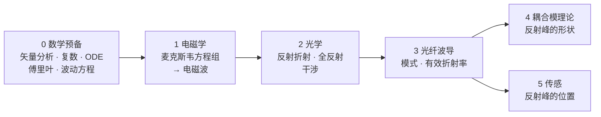
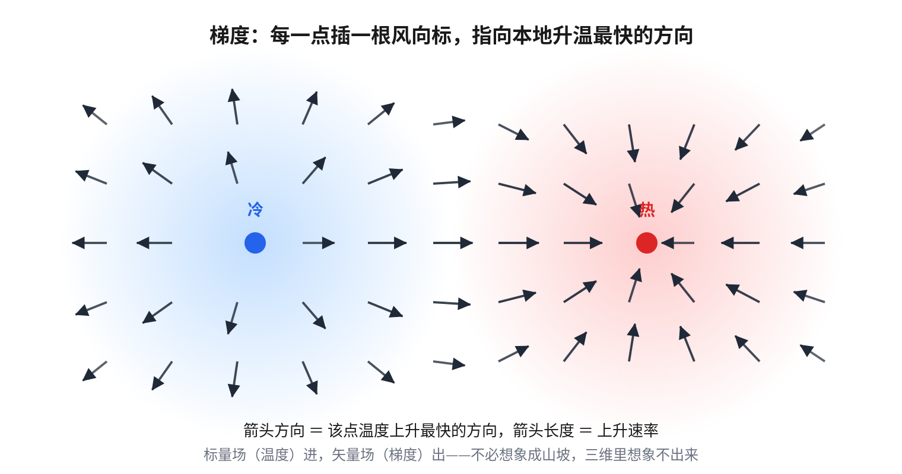
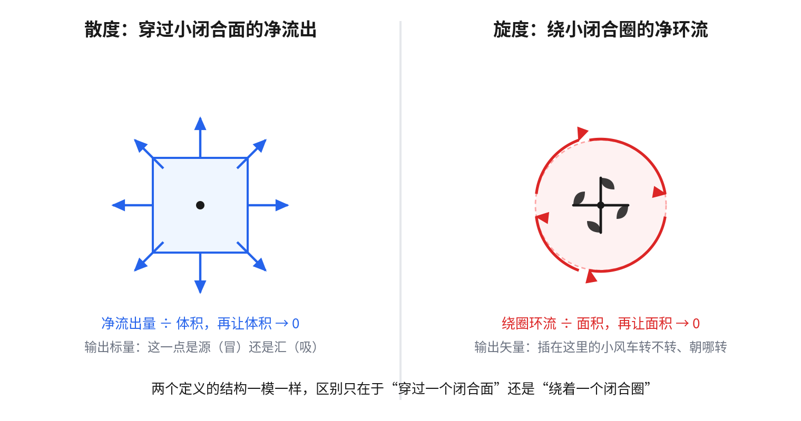
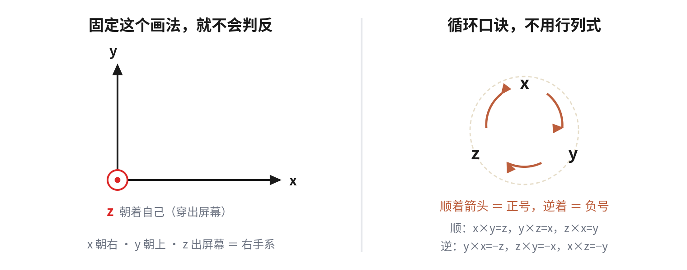
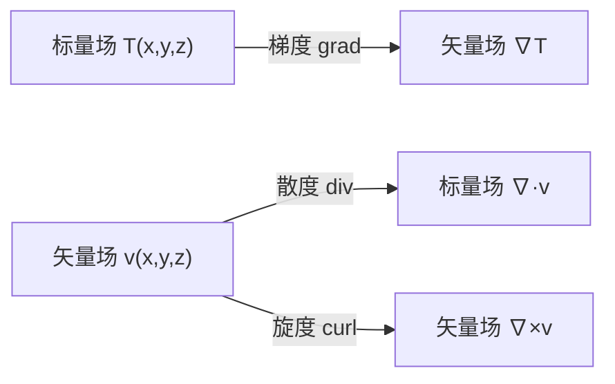
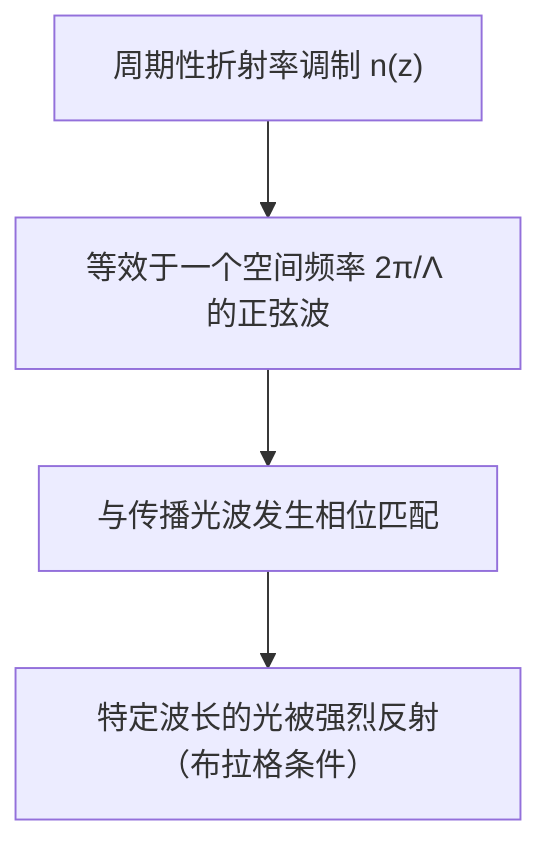
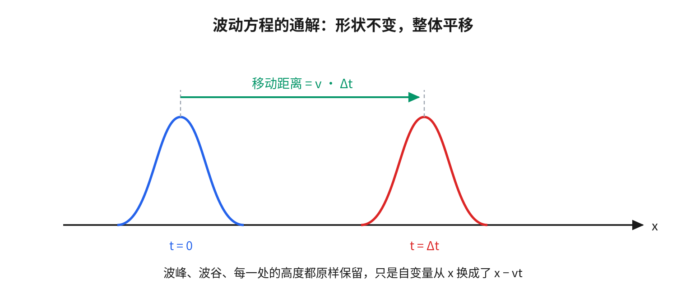
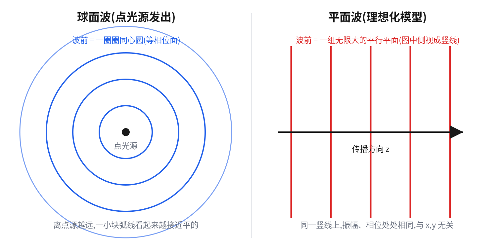

写这个系列的初衷，是看 FBG 光纤传感方向的论文实在太痛苦了。理论与背景章节里充满堆砌的公式和跳跃的推导——这不能怪论文作者，隔行如隔山，我作为一个外行水平确实有限。相信这不是我一个人的痛苦。

所以本系列干脆从最低的起点出发：高中物理，加一点高等数学，加一些光学常识，逐步往上垒。目标是让从事 FBG 的技术人员（首先是我自己）只看这一个系列，就能完成理论入门和全貌概览，不必过早陷进十几本参考书之间来回切换的上下文地狱。

我确实非专业出身，不对的地方请读者指出，我会修正，愿意请客表示感谢。

## 这个系列要去哪

先把终点摆出来，不然中间每一章都不知道自己在哪里迷茫以及为了什么而痛苦学习。

FBG 传感器的全部物理，可以压缩成一句话：**在光纤上刻一段周期性的折射率起伏，它会变成一面有选择性的镜子，只把某一个特定波长的光反射回来；这个波长会随着温度和拉伸而移动，测这个移动，就是传感。**

对应到论文里，就是两条公式。第一条对应了第一句话，决定反射峰**在哪**：

$$
\lambda_B = 2\, n_{\text{eff}}\, \Lambda
$$

第二条对应了第二句话，决定它**怎么动**：

$$
\frac{\Delta\lambda_B}{\lambda_B} = (1-p_e)\,\varepsilon + (\alpha_F + \xi)\,\Delta T
$$

**这个系列的终点，就是把这两条公式里的每一个符号讲清楚，并且推出来。** 换个说法：FBG 传感的全部内容，就是**一个反射峰的形状和位置**——耦合模理论管形状，弹光效应和热光效应管位置。

```mermaid
graph LR
    A["0 数学预备<br/>矢量分析 · 复数 · ODE<br/>傅里叶 · 波动方程"] --> B["1 电磁学<br/>麦克斯韦方程组<br/>→ 电磁波"]
    B --> C["2 光学<br/>反射折射 · 全反射<br/>干涉"]
    C --> D["3 光纤波导<br/>模式 · 有效折射率"]
    D --> E["4 耦合模理论<br/>反射峰的形状"]
    D --> F["5 传感<br/>反射峰的位置"]
```

### 本篇的验收标准

读完本篇，你应该能做到这三件事。做不到，说明这一章还没过：

1. 把 $\nabla\cdot\vec E=\rho/\varepsilon_0$ 和 $\nabla\times\vec E=-\partial\vec B/\partial t$ 这两行，逐字翻译成中文的物理陈述——不是背诵，是解释。
2. 看到 $e^{i(kz-\omega t)}$，能说出 $k$、$\omega$ 各是什么，以及如果它们变成复数意味着什么。
3. 不查公式，用「相干叠加」这一个图像，自己讲出 $\lambda_B \propto \Lambda$ 这个正比关系是怎么来的。

### 怎么读这篇

**正文是主线**，一口气读下来就是完整的逻辑链。中间会遇到这样的折叠块：

[追问] 长这样的东西

这里面装的是我当时学到这儿卡住、追问出来的东西。不影响主线，但对「为什么是这样而不是那样」这类疑问有用。想看就点开，已经清晰或者不感兴趣赶时间可以完全跳过。

文末还有一节「补充阅读」，放的是更远一点、这个系列后面用不上、但我不舍得扔的内容，也请按需取用。

本系列文章均有 **Claude.ai** 的贡献。准确说，都是 Professeure Claudette 的贡献，我只不过把内容全部走了一遍，题目全部做了一遍，该踩的能踩的坑都踩了一遍，不清楚的地方提前问了一遍——我简直就是一个研究生助教，把老板的讲义拿来整理（即便是简单的整理也不都是我做的）一下就厚着脸皮说也算是我的了。

---

## 0.1 矢量分析：梯度、散度、旋度

### 先看一眼要读懂什么

下一章开头会直接摆出这四行：

$$
\nabla \cdot \vec E=\frac{\rho}{\varepsilon_0},\qquad
\nabla \cdot \vec B=0,\qquad
\nabla \times \vec E=-\frac{\partial \vec B}{\partial t},\qquad
\nabla \times \vec B=\mu_0\vec J+\mu_0\varepsilon_0\frac{\partial \vec E}{\partial t}
$$

如果 $\nabla\cdot$ 和 $\nabla\times$ 对你只是两个符号，这四行就永远是四行抽象符号，只能机械推导，建立不了任何物理直觉。这一节要做的，就是把这两个符号连同它们的兄弟 $\nabla$（梯度），翻译解释成和加减乘除一样直观清晰的物理直觉。

### 梯度

梯度作用在**标量场**上（比如空间里的温度分布 $T(x,y,z)$），输出一个**矢量场**：

$$
\nabla T = \left( \frac{\partial T}{\partial x}, \frac{\partial T}{\partial y}, \frac{\partial T}{\partial z} \right)
$$

它的方向是这一点**升温最快的方向**，长度是升温的速率。

课本常用的图像是「站在山坡上，梯度是最陡爬升方向」。这个说法本身没错，但图像只在二维好用——三维的温度场里没有山坡可站。换个想象：**空间里每一点插一根风向标，指向该点升温最快的方向，长度代表升得多快。** 整个空间插满这样的风向标，就是梯度场。

这里有个措辞上的坑值得标出来：梯度指的是**方向导数最大的方向**，不是「指向附近最热的那个点」。这两件事在温度分布简单的时候看起来一样，但后者依赖你把「附近」取多大，而且在温度的驻点附近会直接失效。梯度是纯局部的量，它的严格定义根本不提坐标系：

$$
\frac{\partial f}{\partial n} = \nabla f \cdot \hat n
$$

翻译：梯度是这样一个矢量——拿它跟任意方向的单位矢量 $\hat n$ 做点乘，得到的就是沿这个方向的变化率。「哪个方向升得最快」是这个场本身的客观属性，跟你用什么坐标系去描述它无关，坐标系只是描述工具。

**柱坐标下的梯度**（第 3 阶段推光纤模式时会直接用到，因为光纤是个圆柱，用柱坐标 $(\rho,\varphi,z)$ 最省事）：

$$
\nabla f = \frac{\partial f}{\partial \rho}\hat\rho + \frac{1}{\rho}\frac{\partial f}{\partial \varphi}\hat\varphi + \frac{\partial f}{\partial z}\hat z
$$

多出来的 $1/\rho$ 不是凑的，可以自己推：$\partial f/\partial\varphi$ 算出来的是「$f$ 对**坐标角度**的变化率」，单位是「每弧度变多少」；但梯度的分量要的是「每米变多少」。两者靠弧长微元 $ds=\rho\,d\varphi$ 换算：

$$
\frac{\partial f}{\partial s_\varphi} = \frac{\partial f}{\partial \varphi}\cdot\frac{d\varphi}{ds} = \frac{1}{\rho}\frac{\partial f}{\partial \varphi}
$$

物理图像：地球仪上沿经度方向转过 1 度，在赤道走的实际距离和在极地附近走的实际距离完全不同——「转过一个坐标单位对应多少物理距离」这件事本身依赖你站在哪里，这就是缩放因子里出现 $\rho$ 的原因。

[追问] 凭什么只对三个坐标求偏导，拼出来的东西就能代表所有方向的变化？

因为直角坐标系的三个基矢量 $\hat x,\hat y,\hat z$ 同时满足两个条件：互相**正交**、长度都**归一**。在这种「标准尺子」下做点乘，各分量互不串门（点乘 $\hat x$ 只挑出 $x$ 分量，其余贡献为零），链式法则的结构刚好和「点乘等于方向导数」这条定义对上，所以三个偏导拼起来恰好就是梯度。

柱坐标三个方向仍然互相正交，但 $\hat\varphi$ 方向的基矢量长度跟 $\rho$ 有关（正交但不归一），所以出现了缩放因子。关键是：因为**还正交**，每个分量只被自己方向的因子修正，不会混进别的方向的偏导数，仍然是简单缩放。

如果坐标系连正交都不满足（斜坐标），偏导数拼起来一般就不是梯度了，需要一张叫**度规**的换算表来修正，那时候才真的需要矩阵/张量运算。这个系列全程只用直角坐标和柱坐标，不会遇到这种情况——想看细节的话，~~[番外三：为什么偏导数拼起来不一定是矢量](/blog/gradient-and-metric/)。~~

### 散度

散度作用在**矢量场**上（比如水流速度场 $\vec v$），输出一个**标量**：

$$
\nabla \cdot \vec{v} = \frac{\partial v_x}{\partial x} + \frac{\partial v_y}{\partial y} + \frac{\partial v_z}{\partial z}
$$

它衡量这一点是「源」还是「汇」：大于零，这点像个水龙头往外喷水；小于零，像个下水道往里吸水。

**但这个公式不是定义，定义是一个极限过程：**

$$
\nabla\cdot\vec v\Big|_{P} = \lim_{V\to0}\frac{1}{V}\oint_S \vec v\cdot d\vec A
$$

在 $P$ 点外面套一个小闭合面，算穿过它的净流出量，除以体积，让体积收缩到这一点。这跟**密度**的定义方式一模一样——单独一个点没有质量，但「质量除以体积」在体积趋零的极限下是良好定义的点函数。**散度就是净流出量的密度。**

理解这个极限定义比记住那三项偏导重要得多，因为下一章推光纤纤芯-包层分界面上的边界条件时，用的就是这个「套一个面、再把它压扁」的手法。

**电磁学里的预告**：高斯定理 $\nabla\cdot\vec E=\rho/\varepsilon_0$ 说的就是「电场的散度等于电荷密度」——电荷就是电场线的源头。

[追问] 散度其实就是基尔霍夫电流定律的连续版本

基尔霍夫电流定律（KCL）说：一个节点，流进去的电流总和等于流出来的总和——除非这个节点本身在生产或者吞噬电荷。

散度说的是同一件事的**连续版本**，把「离散的节点」换成「连续空间里任意一小块区域」：

$$
\int_V (\nabla\cdot\vec v)\,dV = \oint_S \vec v\cdot d\vec A
$$

左边是这块区域的「总散度」，右边是穿过边界的「净流量」。区域内部没有源也没有汇，净流出就是 0，散度处处为 0——这就是连续版的 KCL。

反过来，散度不为零的地方，就是这一点在往外冒（源）或者往里吸（汇），对应电路里那个正在注入或抽取电流、破坏普通节点守恒的节点本身。

这个类比值得留着：后面 1.1 节讲位移电流时，整个论证的骨架就是「电荷守恒 → 总电流处处无源无汇」，本质上还是这条 KCL 在三维空间里的推广。

[追问] 只对 x、y、z 三个方向求偏导，会不会漏掉别的方向？

不会，而且关键在于：**那三项偏导根本不是「只测了三个方向」。**

散度公式是这样来的：给这一点套一个微小**长方体**，算六个面（$\pm x,\pm y,\pm z$ 三对面）的净流量，除以体积，取极限。这六个面合起来已经是一个**完整的封闭曲面**，覆盖了所有方向——算的是矢量场 $\vec v$ 对这六个面法向的投影加总，已经完整地重构了「净流出」这件事，不存在漏掉的方向。

那为什么三对面就够？还是因为坐标轴互相**正交**：垂直于 $x$ 轴的那个面，法向量纯粹沿 $x$，点乘时只挑出 $v_x$，$v_y,v_z$ 混不进来。

如果坐标不正交，长方体会变成斜的平行六面体，某个面的法向量不再纯粹对应一个分量，公式就不能简单写成三项相加，需要度规修正——跟梯度那里踩的是同一个坑。

### 旋度

旋度也作用在矢量场上，输出另一个**矢量场**：

$$
\nabla \times \vec{v} = \left( \frac{\partial v_z}{\partial y} - \frac{\partial v_y}{\partial z},\ \frac{\partial v_x}{\partial z} - \frac{\partial v_z}{\partial x},\ \frac{\partial v_y}{\partial x} - \frac{\partial v_x}{\partial y} \right)
$$

直觉：把一个小风车插在流体里，它会不会转、朝哪个方向转，就是旋度。

同样地，公式不是定义，**定义也是一个极限过程，而且和散度的结构完全平行**：

$$
(\nabla\times\vec v)\cdot\hat n = \lim_{A\to0}\frac{1}{A}\oint_C \vec v\cdot d\vec l
$$

在这一点附近，垂直于某个方向 $\hat n$ 摆一个微小的圈（风车转轴沿着 $\hat n$），沿圈走一周把水流「顺着走的分量」加总（这叫**环流**），除以圈的面积，取极限——得到的就是旋度在 $\hat n$ 方向的分量。哪个方向的圈环流最大，风车转轴就摆在那个方向。

**这两个定义值得放在一起盯着看：结构一模一样，区别只在于「穿过一个闭合面」还是「绕着一个闭合圈」。散度问的是「是不是在往外冒」，旋度问的是「是不是在打转」——两件完全独立的事。**

记忆规律（不必用行列式）：第三个分量（$z$ 方向）只由 $v_x,v_y$ 对 $x,y$ 的偏导构成，模式是 $\dfrac{\partial(\text{第二个})}{\partial(\text{第一个})}-\dfrac{\partial(\text{第一个})}{\partial(\text{第二个})}$；另外两个分量把 $x\to y\to z\to x$ 循环轮换一下就行。

叉乘的分量公式同理：

$$
\vec a\times\vec b = (a_2b_3-a_3b_2,\ a_3b_1-a_1b_3,\ a_1b_2-a_2b_1)
$$

**每个分量跳过自己的下标，把另外两个按 $x\to y\to z\to x$ 的循环顺序交叉相乘再相减。** 比如第一个分量（下标 1）跳过自己，用下标 2、3 交叉：$a_2b_3-a_3b_2$。

判方向最容易踩的坑，是不小心把坐标系画成了左手系，结果整体差一个负号。避免的办法是把画图习惯固定下来：

**电磁学里的预告**：法拉第定律 $\nabla\times\vec E=-\partial\vec B/\partial t$ 说的是「变化的磁场会产生打转的电场」。

[追问] 两种完全不同的物理机制，都会被同一个旋度公式测出来

**机制一：整体打转（漩涡）。** $\vec v=(-y,x,0)$：

$$
(\nabla\times\vec v)_z = \frac{\partial v_y}{\partial x}-\frac{\partial v_x}{\partial y}=\frac{\partial x}{\partial x}-\frac{\partial(-y)}{\partial y}=1-(-1)=2
$$

其余分量为零，$\nabla\times\vec v=(0,0,2)$，指向 $+z$。按右手定则，大拇指指 $+z$ 时四指弯曲方向是「从 $+z$ 往下看，逆时针」——跟描点判断出的转向一致，但这次不用描点，直接算出来了。

**机制二：剪切拖拽（河流、边界层）。** 水从左往右流，靠近河岸摩擦大流速慢，河中间流速快。插一个风车在靠岸处，两侧受力不均，会被拖着转起来。简化成 $\vec v=(y,0,0)$：

$$
(\nabla\times\vec v)_z = \frac{\partial v_y}{\partial x}-\frac{\partial v_x}{\partial y}=0-1=-1
$$

不为零，而且方向跟漩涡那个例子相反（顺时针），符合直觉——这两种拉扯方式本来就相反。这种由速度剖面不均匀导致的转动，专门叫**剪切生成的涡量**，是真实流体力学里最常见的旋度来源之一。

两件起因完全不同的事，被同一个公式量化，这正是旋度这个概念的价值所在。

[追问] 散度处处为零，是不是就说明这个场是常矢量场？

不是，这是个容易掉进去的过度推论。反例就是刚才那个旋转场 $\vec v=(-y,x,0)$：

$$
\nabla\cdot\vec v = \frac{\partial(-y)}{\partial x}+\frac{\partial x}{\partial y}+\frac{\partial 0}{\partial z} = 0
$$

处处为零，但它显然不是常矢量场（方向随位置一直在转）。物理图像：漩涡里任取一小块，水流方向在转，但「转进来多少就有多少从另一侧转出去」，没有任何一点在膨胀或收缩。

**更本质的论证**（连续性方程）：对不可压缩流体在刚性管道里稳态流动，

$$
\frac{\partial\rho}{\partial t}+\nabla\cdot(\rho\vec v)=0
$$

不可压缩（$\rho$ 是常数）加稳态（$\partial\rho/\partial t=0$），直接推出 $\nabla\cdot\vec v=0$ 处处成立，跟管道内部流场具体怎么拐弯、怎么打漩涡完全无关。这说明「散度为零」对应的是一整类物理系统，而不是某个特例。

**结论**：散度处处为零是个**很弱**的条件，它只说明场局部不胀不缩、无源无汇，完全不妨碍场到处转、到处变方向。这也正是引出旋度的伏笔——「到处转但不胀缩」这件事，散度测不出来，得靠旋度。

[练习] 手算库仑场的散度

验证点电荷的库仑场 $\vec E=\dfrac{kq}{r^2}\hat r$（$k=1/4\pi\varepsilon_0$，$r=\sqrt{x^2+y^2+z^2}$）在 $r\neq0$ 处散度为零。写成分量：

$$
E_x = kqx(x^2+y^2+z^2)^{-3/2}
$$

$y,z$ 分量把 $x$ 换掉即可。对 $E_x$ 用乘法法则加链式法则：

$$
\frac{\partial E_x}{\partial x} = kq\,r^{-3} + kqx\cdot\left(-\frac32\right)r^{-5}\cdot2x = kq\,r^{-3}-3kq\,x^2r^{-5}
$$

三项相加：

$$
\nabla\cdot\vec E = 3kq\,r^{-3}-3kq(x^2+y^2+z^2)r^{-5} = 3kq\,r^{-3}-3kq\,r^{-3}=0
$$

关键的一步是把 $x^2+y^2+z^2$ 换回 $r^2$，让看起来次数很高的 $r^{-5}$ 项和 $r^{-3}$ 项同阶抵消。这个「$r\neq0$ 处处散度为零」正是高斯定律微分形式的直接体现：只有电荷所在的那一点才是源。

### 三者关系

```mermaid
graph LR
    A["标量场 T(x,y,z)"] -->|梯度 grad| B["矢量场 ∇T"]
    C["矢量场 v(x,y,z)"] -->|散度 div| D["标量场 ∇·v"]
    C -->|旋度 curl| E["矢量场 ∇×v"]
```

### 两个定理：把「每一点」和「一整块」接起来

**散度定理**：一个封闭曲面内部的「总散度」等于穿过这个曲面的「总通量」。

$$
\int_V (\nabla \cdot \vec{v})\, dV = \oint_S \vec{v} \cdot d\vec{A}
$$

**斯托克斯定理**：一个曲面上的「总旋度」等于沿着这个曲面边界绕一圈的「总环流」。

$$
\int_S (\nabla \times \vec{v}) \cdot d\vec{A} = \oint_C \vec{v} \cdot d\vec{l}
$$

**这两条定理背后是同一个机制：内部两两抵消，只剩边界。**

散度定理这边：把体积 $V$ 切成无数小方块，每块的净流出 = 散度 × 体积。相邻两块共享的内部界面上，一方的「流出」恰好等于另一方的「流入」，两两抵消，只剩最外层没有邻居可抵消的边界 $S$。

斯托克斯定理这边：把曲面 $S$ 切成微小网格，每格的贡献 = 旋度 × 面积。相邻两格共享一条边，一个沿这条边顺时针走、另一个逆时针走，方向相反、贡献抵消，只剩最外层的边界曲线 $C$。

**为什么这两条定理对本系列特别重要**：麦克斯韦方程组有**微分形式**（描述每一点的局部规律）和**积分形式**（描述一整块区域、一整圈边界的整体规律）两种写法，完全等价，靠的就是这两条定理来回转换。而下一章推纤芯-包层分界面上的边界条件时，微分形式会在分界面上失效（介质突变，导数没定义），必须退回积分形式——那一步用的就是这两条定理。

**散度定理具体验证**：取 $\vec v=(x,y,z)$（散度是 3），$V$ 是半径 $R$ 的球。左边 $\int_V 3\,dV=3\cdot\frac43\pi R^3=4\pi R^3$。右边：球面上 $\vec v$ 就是那一点的位置矢量，长度 $R$，方向正好是外法线 $\hat r$，所以 $\vec v\cdot\hat n=R$ 处处一样，$\oint_S\vec v\cdot d\vec A=R\cdot4\pi R^2=4\pi R^3$。两边相等。

**斯托克斯定理具体验证**：取 $\vec v=(-y,x,0)$（旋度 $(0,0,2)$），$S$ 是 $xy$ 平面上半径 $R$ 的圆盘。左边 $\int_S(0,0,2)\cdot(0,0,1)\,dA=2\pi R^2$；右边沿圆周积分 $\oint\vec v\cdot d\vec l$ 算出来也是 $2\pi R^2$。两边相等，而且这个「2」正好是前面算出的旋度 $z$ 分量——这不是巧合，旋度定义里「除以面积再取极限」就是为了保证跟环流之间有这种干净的比例关系。

### 一句话总结

- **梯度**：标量场进，矢量场出，指向升得最快的方向。
- **散度**：矢量场进，标量出，是「净流出量的密度」，问的是冒不冒。
- **旋度**：矢量场进，矢量出，是「绕圈环流的密度」，问的是转不转。
- **两条定理**：是「每一点的局部规律」和「一整块的整体规律」之间的翻译器，下一章推边界条件全靠它们。

### 自测

1. 写出球对称电场 $\vec E=E_0\hat r$ 在球外的散度。
2. 如果一个矢量场处处旋度为零，根据斯托克斯定理，沿任意一条封闭曲线走一圈的环流应该是多少？
3. 反过来想：如果某个矢量场沿**某一条**封闭曲线的环流不为零，能不能推出「这个场处处旋度都不为零」？
4. 常矢量场（比如 $\vec v=(1,2,3)$，处处不变）的散度和旋度分别是多少？为什么？
5. 柱坐标下梯度公式 $\hat\varphi$ 分量前面的 $1/\rho$，能不能用弧长微元的物理图像自己讲一遍来源？

参考答案

1. 0。球外没有电荷，没有源。（注意这是「球外」，球面上和球内是另一回事。）
2. 0。斯托克斯定理右边的环流等于左边曲面上的总旋度，旋度处处为零，积分自然为零。这样的场叫**无旋场**，可以写成某个标量的梯度。
3. **不能。** 斯托克斯定理左边是对整个曲面积分，环流不为零只能说明旋度在这块曲面上的**总和**不为零，完全可能是「一部分区域旋度为正、一部分为零」。从积分不为零推不出被积函数处处不为零，这是个常见的逻辑跳跃。
4. 都是 0。所有偏导数都为零，公式里每一项都是零。物理上：常矢量场既不胀不缩（散度零），也不打转（旋度零）——所有地方水流方向、大小完全一样，套个小盒子进来多少出去多少，插个风车两边受力相同不会转。
5. 见正文：$\partial f/\partial\varphi$ 的单位是「每弧度」，梯度分量要的是「每米」，靠 $ds=\rho\,d\varphi$ 换算，所以要除以 $\rho$。

---

## 0.2 复数与复指数

### 先看一眼要读懂什么

论文里所有的波都写成 $e^{i(\beta z-\omega t)}$，而且传播常数 $\beta$ 经常是复数。这一节要解决两个问题：物理量明明是实数，为什么全程用复数算？以及，当参数本身变成复数的时候，虚部代表什么物理意义？

### 欧拉公式，以及复指数到底省了什么

$$
e^{i\theta} = \cos\theta + i\sin\theta
$$

一个随时间振荡的物理量 $E(t)=E_0\cos(\omega t)$，可以写成：

$$
E(t) = \mathrm{Re}\left[ E_0\, e^{i\omega t} \right]
$$

**为什么要绕这一圈**：因为复指数是求导算符的**本征函数**——对 $e^{\lambda t}$ 求导，结果还是它自己，只是前面多乘一个常数：

$$
\frac{d}{dt}e^{\lambda t} = \lambda\, e^{\lambda t}
$$

「求导等于乘一个数」这件事威力极大：它能把微分方程直接降级成代数方程（下一节会亲手走一遍这个过程）。正弦余弦没有这个性质，求导会在 $\sin$ 和 $\cos$ 之间来回跳，做几次就要不停套三角恒等式，非常繁琐。所以物理学家和工程师全程用复指数计算，只在最后一步取实部，拿回真实的物理量。

顺带说一句，这里的「本征函数」和第 3 阶段光纤模式的「本征值问题」是同一个词、同一套思想：某个算符作用上去，形状不变，只差一个常数因子。现在先记住这个词。

### 两层「用到复数」，不要混

这是这一节真正的要点，比记住欧拉公式重要。

**第一层：复数是纯粹的计算工具。** 在 $E(t)=\mathrm{Re}[E_0e^{i\omega t}]$ 里，如果 $\omega$ 本身是**实数**，那么真实的物理量 $E(t)$ 是实数，复指数只是算微分、算乘法时图省事的中间步骤。中间引入的虚部没有物理意义，算完就丢掉。

**第二层：参数本身允许是复数，虚部编码真实的物理。** 如果让 $\omega=\omega_0+i\gamma$ 本身变成复数：

$$
E(t)=\mathrm{Re}\left[E_0e^{i(\omega_0+i\gamma)t}\right]=E_0e^{-\gamma t}\cos(\omega_0 t)
$$

这次 $\gamma$ **没有被丢掉**——它变成了最终这个实数答案里明明白白的衰减包络 $e^{-\gamma t}$。

**为什么必须分清这两层**：第 3 阶段光纤里有损耗的传播模式、第 4 阶段 FBG 阻带内的场，传播常数 $\beta$ 都会变成复数。那时候虚部是要**留在答案里**的，代表衰减率，不是可以丢掉的中间产物。看到复数先问一句「这是第一层还是第二层」，能省掉很多困惑。

### 一个必须澄清的坑：实部虚部各管什么，看写法

- **$e^{i\omega t}$（物理惯例）**：$\omega$ 的实部管振荡，虚部管衰减。
- **$e^{st}$（拉普拉斯变量，注意指数前没有 $i$）**：$s$ 的实部管衰减，虚部管振荡。

两套约定差一个代换 $s=i\omega$，几何上相当于把这个复数在复平面里转了 90°，这就是「实部虚部各对应什么」在两套约定里会对调的原因。

**唯一不依赖约定、永远成立的判据**：把指数展开写成

$$
e^{zt}=e^{\mathrm{Re}(z)\,t}\cdot e^{i\,\mathrm{Im}(z)\,t}
$$

纯实数指数那部分（$\mathrm{Re}(z)$）永远管**振幅**怎么变（衰减或增长），乘了 $i$ 转成相位的那部分（$\mathrm{Im}(z)$）永远管**相位**怎么转（振荡）。看指数的展开式，不要去记哪个字母对应什么。

[追问] 为什么要「打包」成一个复数，而不是振幅和振荡分开写？

坚持把 $E_0e^{-\gamma t}$（振幅）和 $\cos(\omega_0 t)$（振荡）分开处理，物理上没有任何问题。但代入微分方程求导时，要用**乘积法则**，会产生交叉项，非常繁琐。

而如果直接设试探解为一个复指数 $y=Ae^{i\omega t}$（允许 $\omega$ 是复数），求导只是乘一个 $i\omega$，微分方程会直接退化成一个关于 $\omega$ 的**代数方程**。解出来的复数，实部虚部自动分别对应衰减率和振荡频率——不是人为拆开贴标签，是方程解出来必然长这样。

这就是复数打包在计算上真正省的功夫。下一节的阻尼振子会完整演示一遍。

### 一句话总结

- 复指数是求导的本征函数，「求导 = 乘一个常数」，这是它唯一的、也是全部的价值——保证正确的前提下简化计算。
- 参数是实数时，复数只是中间工具，最后取实部丢掉虚部。
- 参数本身是复数时，虚部是要留在答案里的物理——这是后面光纤损耗和 FBG 阻带的数学形式。
- 实部虚部各管什么，看指数展开式后的实指数还是虚指数，别死记字母。

### 自测

1. 把 $z=3+4i$ 写成 $re^{i\theta}$ 的形式。
2. 证明 $\cos\theta=\dfrac{e^{i\theta}+e^{-i\theta}}{2}$。
3. 如果光纤的传播常数写成 $\beta=\beta_0+i\alpha$，这属于上面说的第一层还是第二层？$\beta_0$ 和 $\alpha$ 分别对应什么物理意义？

参考答案

1. $r=\sqrt{3^2+4^2}=5$，$\theta=\arctan(4/3)\approx0.927$ 弧度（约 53.13°），所以 $z=5e^{i0.927}$。
2. 用欧拉公式：$e^{i\theta}=\cos\theta+i\sin\theta$，$e^{-i\theta}=\cos\theta-i\sin\theta$，两式相加虚部抵消，得 $2\cos\theta$，再除以 2 即可。
3. **第二层。** 波沿 $z$ 传播写成 $e^{i\beta z}=e^{i\beta_0 z}\cdot e^{-\alpha z}$：$\beta_0$ 是空间上的振荡速率（决定波长），$\alpha$ 是沿传播方向的衰减率（每走一米振幅掉多少）。$\alpha$ 不能丢，它就是光纤损耗。注意这里的展开完全套用了上面那条「唯一不依赖约定的判据」，只是把 $t$ 换成了 $z$。

---

## 0.3 常微分方程：一个套路打天下

### 先看一眼要读懂什么

这一节的内容可以压缩成一句话：**物理里绝大多数线性常系数方程，解法都是同一个套路——设 $e^{\lambda t}$ 代进去，微分方程变成代数方程，解出 $\lambda$，实部虚部自动分别是衰减率和振荡频率。** 这一节把这个套路完整走一遍。第 3 阶段解光纤模式方程，用的是同一个套路。

### 两种最常见的形式

**一阶（指数增长/衰减）**：

$$
\frac{dy}{dx} = -ky \qquad\Longrightarrow\qquad y(x) = y_0\, e^{-kx}
$$

放射性衰变、电容放电、光在介质中被吸收，全部是这个方程。

**二阶（振荡）**：

$$
\frac{d^2y}{dx^2} + \omega_0^2 y = 0 \qquad\Longrightarrow\qquad 

\\ y(x) = A\cos(\omega_0 x) + B\sin(\omega_0 x) \\ = C e^{i\omega_0 x} + D e^{-i\omega_0 x}
$$

**这是整个波动理论的心脏方程。** 弹簧振子、LC 电路、电磁波的空间分布、光纤中的模式分布——只要物理系统满足「回复力正比于偏离量」，最后都会化简到这个方程。

**看符号就能判类型，不用先解出来**：把方程写成 $y''=(\text{某个系数})\times y$——

- 系数为**正**（比如 $y''=4y$）：加速度和位移同向，越偏越往外推，是指数增长/衰减型，不振荡。
- 系数为**负**（比如 $y''=-9y$）：加速度和位移反向，这正是回复力的定义（胡克定律 $F=-kx$ 的翻版），是振荡型。

下一章推出电磁波动方程之后，会用这条判据来回答「为什么光能传播而不是原地爆炸」。

### 亲手走一遍：阻尼振子

**物理情境**：带阻尼的弹簧振子（或者带内阻的 LC 电路）。牛顿第二定律给出 $m\ddot y=-ky-b\dot y$，两边除以 $m$ 写成标准形式：

$$
\ddot y + 2\gamma\dot y + \omega_0^2 y = 0
$$

其中 $\omega_0^2=k/m$ 是无阻尼时的固有频率，$2\gamma=b/m$ 是阻尼系数（前面那个 2 只是习惯写法，为了后面开根号好看）。

**物理直觉先行**：阻尼力 $-b\dot y$ 永远和速度方向相反，是刹车式的力，不断抽走能量。直觉上解应该是「振荡 + 振幅不断变小」。下面不猜，直接解出来验证。

**套路第一步**：设试探解 $y=e^{\lambda t}$（$\lambda$ 允许是复数）。求导 $\dot y=\lambda e^{\lambda t}$，$\ddot y=\lambda^2e^{\lambda t}$，代入方程，两边消掉不为零的 $e^{\lambda t}$：

$$
\lambda^2+2\gamma\lambda+\omega_0^2=0
$$

**微分方程变成了代数方程——这就是上一节说的「复指数是求导的本征函数」带来的全部好处。**

**套路第二步**：求根公式。

$$
\lambda = -\gamma\pm\sqrt{\gamma^2-\omega_0^2}
$$

**套路第三步**：看根号里的正负。以物理上最常见的**欠阻尼**（$\gamma<\omega_0$）为例，根号内为负：

$$
\sqrt{\gamma^2-\omega_0^2}=i\sqrt{\omega_0^2-\gamma^2}\equiv i\omega_1
$$

于是 $\lambda=-\gamma\pm i\omega_1$，代回 $y=e^{\lambda t}$：

$$
y=e^{(-\gamma\pm i\omega_1)t}=e^{-\gamma t}\cdot e^{\pm i\omega_1t}
$$

取实数解的组合：

$$
y(t)=e^{-\gamma t}\left[A\cos(\omega_1t)+B\sin(\omega_1t)\right]
$$

一个振幅按 $e^{-\gamma t}$ 衰减的余弦波，正是最初的物理直觉。而且 $\omega_1=\sqrt{\omega_0^2-\gamma^2}<\omega_0$：阻尼把振荡拖慢了一点，这也是解自己长出来的，不是我们塞进去的。

**注意 $\lambda$ 的实部（$-\gamma$）负责衰减、虚部（$\pm\omega_1$）负责振荡——上一节讲的规律又出现了一次，而且这次不是我们凑的，是方程自己解出来的。**

三种情况的完整分类：

| 情况                     | $\lambda$                    | 行为      |
| ---------------------- | ---------------------------- | ------- |
| 欠阻尼 $\gamma<\omega_0$  | 复数 $-\gamma\pm i\omega_1$    | 衰减振荡    |
| 临界阻尼 $\gamma=\omega_0$ | 实数重根 $-\gamma$（通解多一个 $t$ 因子） | 最快无振荡归位 |
| 过阻尼 $\gamma>\omega_0$  | 两个不同实数根                      | 较慢的纯衰减  |

（过阻尼虽然也不振荡，但两个衰减速率里较慢的那个会拖后腿，整体归零反而比临界阻尼慢。）

**这条求解路径的骨架值得记住**，以后遇到任何线性常系数方程都适用，不用死记不同方程对应什么解的形状：

$$
\text{微分方程}\ \to\ \text{设试探解 } e^{\lambda t}\ \to\ \text{变成关于 }\lambda\text{ 的代数方程}\ \to\ \\ \text{解出 }\lambda\ \to\ \text{实部虚部分别是衰减率和振荡频率}
$$

[追问] 临界阻尼为什么通解要多一个 t 因子？

因为特征方程 $(\lambda+\gamma)^2=0$ 是重根，只给出**一个**解 $y=Ae^{-\gamma t}$，只有一个待定常数。

但一个二阶微分方程在物理上对应**两个**初始条件（初始位置、初始速度），数学上需要**两个独立的解**才能凑出满足任意初始条件的通解。一个不够用。

重根情况下，第二个独立解是 $y_2=t\cdot e^{-\gamma t}$（严格证明需要额外技巧，这里记住「重根时通解多一个 $t$ 因子」这条规律即可），所以通解是：

$$
y(t)=(A+Bt)e^{-\gamma t}
$$

这个「解的个数必须等于方程阶数」的要求，后面第 3 阶段解波导模式方程时会再次出现，值得现在就建立起意识。

至于临界阻尼在工程上到底意味着什么（汽车减震器、门自动闭合器、指针式仪表都往这儿调），以及「阻尼越大越稳」为什么是个错觉，见~~[番外一：临界阻尼](/blog/critical-damping/)。~~

### 一句话带走

- 一个套路：设 $e^{\lambda t}$ → 代入 → 代数方程 → 解 $\lambda$ → 实部是衰减、虚部是振荡。
- 看 $y''$ 前面系数的符号，不用解就知道是振荡型还是指数型。
- 这个套路后面还会用两次：下一章的平面波解，第 3 阶段的波导模式。

### 自测

1. $y''-4y=0$，解是振荡的还是指数增长/衰减的？写出通解。
2. $y''+9y=0$ 的解里，角频率 $\omega_0$ 是多少？
3. 如果阻尼特别大（$\gamma\gg\omega_0$），过阻尼的两个根 $\lambda_{1,2}=-\gamma\pm\sqrt{\gamma^2-\omega_0^2}$ 里，哪一个衰减得更快？长时间之后，解主要由哪一个根决定？

参考答案

1. 写成 $y''=4y$，系数为正，是**指数增长/衰减型**，不振荡。特征方程 $\lambda^2=4$，$\lambda=\pm2$，通解 $y=Ae^{2x}+Be^{-2x}$。
2. 写成 $y''=-9y$，系数为负，是振荡型。对比 $y''+\omega_0^2y=0$ 得 $\omega_0^2=9$，$\omega_0=3$。
3. $\lambda_-=-\gamma-\sqrt{\cdots}$ 绝对值更大，**衰减更快**。长时间之后它早就趋于零了，解主要由**衰减更慢**的 $\lambda_+=-\gamma+\sqrt{\cdots}$ 决定。这就是正文里说的「较慢的那个拖后腿」——也解释了为什么阻尼加得越大，反而回位越慢。

---

## 0.4 傅里叶级数，以及 FBG 的第一个结论

### 先看一眼要读懂什么

这一节要给出整个系列**第一个真正属于 FBG 的结论**：$\lambda_B\propto\Lambda$。而且不用任何耦合模理论，只靠「相干叠加」这一个图像就能推出来。

### 傅里叶级数

任何一个周期为 $T$ 的函数 $f(x)$，都可以写成一系列不同频率正弦波的叠加：

$$
f(x) = a_0 + \sum_{n=1}^{\infty} \left[ a_n \cos\left(\frac{2\pi n x}{T}\right) + b_n \sin\left(\frac{2\pi n x}{T}\right) \right]
$$

核心思想一句话：**任何周期性的东西，本质上都是一堆正弦波的叠加。** 反过来说，一个周期性的结构，天然地对应一个特定的空间频率，也就天然地对应一种「频率选择性」。

### 这对 FBG 为什么是核心

FBG 的物理本质，就是光纤纤芯的折射率沿长度方向做**周期性微扰**：

$$
n(z) = n_0 + \delta n \cos\left(\frac{2\pi z}{\Lambda}\right)
$$

**符号提醒**：大写 $\Lambda$（光栅周期，单位是米）和小写 $\lambda$（波长）是两个完全不同的量，字母长得像但不是一回事。以后见到大写 $\Lambda$ 先默念一句「这是光栅周期」。

**$\cos(2\pi z/\Lambda)$ 为什么这么写**：$\cos$ 天生以 $2\pi$ 弧度为周期。想要一个以 $\Lambda$ 米为周期的余弦，就在自变量前面乘一个换算因子 $2\pi/\Lambda$——当 $z\to z+\Lambda$，自变量增加 $2\pi$，余弦绕回原值，周期正是 $\Lambda$。这个「用 $2\pi/\text{周期}$ 把物理长度换算成弧度」的手法，下一节讲波数 $k$ 时会原样再用一次。

```mermaid
graph TD
    A["周期性折射率调制 n(z)"] --> B["等效于一个空间频率 2π/Λ 的正弦波"]
    B --> C["与传播光波发生相位匹配"]
    C --> D["特定波长的光被强烈反射（布拉格条件）"]
```

### 布拉格条件：只靠相干叠加就能推出来

FBG 为什么只反射特定波长的光？

光纤里每一小段折射率的起伏，都会对入射光产生一次**极其微弱**的反射。这些无数次微弱反射要叠加成一个可观测的强反射，必须满足一个条件：每一次反射贡献的波，在回程路上积累的相位都恰好对得上（同相位叠加，越加越强）。如果对不上，不同位置反射回来的波会正负抵消，加起来接近于零。

「相位对得上」这个条件翻译成距离，就是相邻两个反射点之间的**往返**光程差正好等于一个波长。介质里的波长是 $\lambda/n_0$，反射点的间距是光栅周期 $\Lambda$，往返走了 $2\Lambda$，于是：

$$
2\Lambda = \frac{\lambda_B}{n_0} \qquad\Longrightarrow\qquad \lambda_B = 2 n_0 \Lambda
$$

这就是**布拉格条件**（下一章 1.6 节会给出一个更正规的推导，结论完全一样）。它直接说明：**反射波长和光栅周期成正比**——光栅刻得越密（$\Lambda$ 越小），被强烈反射的波长 $\lambda_B$ 就越短。

这个比例关系完全不需要死记。从「相干叠加要求反射点间距和波长匹配」这个图像，随时可以当场推一遍。

有两点必须说清楚，否则以后对不上论文：

- **论文里写的是 $n_{\text{eff}}$（有效折射率），不是 $n_0$。** 差别在于：光在光纤里不是在一块均匀介质里直线跑，而是以「模式」的形式被约束着走，它实际感受到的等效折射率介于纤芯和包层之间。这个概念要到第 3 阶段才能定义，现在先用 $n_0$，到时候原地替换即可，**公式的结构一个字都不用改**。
- **这个推导隐含了「弱调制」的前提**（$\delta n \ll n_0$）：每一次反射都极其微弱，弱到可以忽略多次来回反射。FBG 恰好满足这个前提（$\delta n$ 通常在 $10^{-4}$ 量级），但换个场景（比如强反射的多层介质膜）就不能直接套这个论证。

### 一句话总结

- 周期性结构 ⟷ 特定空间频率 ⟷ 特定的波长选择性，这条对应关系就是傅里叶思想在 FBG 上的全部体现。
- $\lambda_B=2n_0\Lambda$ 不需要背，从相干叠加的图像随时能推。
- 论文里的 $n_{\text{eff}}$ 是同一个位置上的量，第 3 阶段替换即可。

### 自测

1. 一个方波信号，傅里叶级数展开后只包含奇次谐波还是偶次谐波？
2. 光栅周期 $\Lambda$ 越小，对应的空间频率是越大还是越小？
3. 接上题：$\Lambda$ 变小，被「选中」反射的波长会变长还是变短？不查公式，用相干叠加的图像自己说一遍理由。

参考答案

1. **只有奇次谐波。**（这一条记住结论即可，推导不在本系列范围内。）
2. **越大。** 空间频率是 $2\pi/\Lambda$，周期在分母上。
3. **变短。** 相干叠加要求「相邻反射点的往返光程差 = 介质中的一个波长」。反射点靠得更近了（$\Lambda$ 变小），往返距离 $2\Lambda$ 变小，那么能对上的波长自然也得跟着变小，否则相位就错开了。

---

## 0.5 波动方程、平面波与色散关系

### 先看一眼要读懂什么

下一章会从麦克斯韦方程组推出一个方程，然后说一句「这正是波动方程」。这一节先把波动方程本身、它的解长什么样、以及「色散关系」这个词全部准备好，下一章直接对号入座就行。

### 一维波动方程

$$
\frac{\partial^2 u}{\partial x^2} = \frac{1}{v^2} \frac{\partial^2 u}{\partial t^2}
$$

**这是整个电磁波、光波理论的出发点。** $u$ 可以是电场分量、可以是弦的位移——任何满足这个方程的量，都以速度 $v$ 传播。

### 通解：两个方向的行波

$$
u(x,t) = f(x - vt) + g(x + vt)
$$

$f(x-vt)$ 是一个**形状不变、以速度 $v$ 向右移动**的波，$g(x+vt)$ 是向左移动的波。$f$ 和 $g$ 可以是任意形状。

**系数 $1/v^2$ 不是规定的，是被「解要具有 $f(x-vt)$ 这种平移形状」反过来逼出来的。** 令 $s=x-vt$：

$$
\frac{\partial u}{\partial x}=f'(s),\quad \frac{\partial^2u}{\partial x^2}=f''(s);\qquad
\frac{\partial u}{\partial t}=-vf'(s),\quad \frac{\partial^2u}{\partial t^2}=v^2f''(s)
$$

两个二阶导数都能用同一个 $f''(s)$ 表示，联立就得到 $\partial^2u/\partial x^2=(1/v^2)\,\partial^2u/\partial t^2$。

**所以：只要方程长成这个样子，直接从系数的位置就能读出波速。** 下一章推出电磁波动方程之后，就是靠这一句话直接读出 $v=c/n$ 的——这是本节最有实操价值的一条。

### 什么是平面波

**波前**：某一时刻，波场里相位相同的点连成的曲面。

如果这个波前是一个**无限大的平面**，而且波沿传播方向移动时，同一个波前上的振幅、相位处处相同（只在垂直于这个平面的方向上变化），就叫**平面波**。

平面波不是唯一的形状。最常见的对比是**球面波**——一个点光源向四面八方发光，某一时刻相位相同的点连起来是一圈圈以点源为中心的同心球面。手电筒、灯泡这类点光源发出的光，严格来说都是球面波。除此之外还有柱面波、高斯光束等等，形状可以有无穷多种，平面波只是其中最简单的一种。

**那电磁波是平面波吗——不是，但这是一个极有用的理想化。** 平面波要求波前无限大、振幅处处一样，意味着携带无穷大能量、充满整个空间，现实中不存在这样的波源。但球面波离点源足够远的时候，截取的一小片波前曲率会小到可以当成平面处理（就像地球是球形的，但站在地面上局部看是平的）。太阳光传到地球，波前理论上是以太阳为中心的巨大球面，但太阳足够远，这里截取的一小片可以当平面——这就是「平面波近似」的来源。

**它真正的角色是「基本积木」。** 波动方程是线性的（解可以叠加），而傅里叶告诉我们任意形状都能拆成正弦波的叠加，所以只要搞清楚一个纯正弦形状怎么传播，任意复杂形状的传播就自动清楚了。第 3 阶段会看到，光纤里真实的光场正是若干个平面波按特定角度反复反射叠加出来的结果——**平面波不是光纤里光的真实形状，而是拿来构造真实解的积木**。这个角色和 0.4 节里正弦波的角色完全一样，只是从一维的时间换成了三维的空间。

### 平面波解与色散关系

把最简单的正弦形状代进 $f(x-vt)$。取 $f(s)=\cos(ks)$，代入 $s=z-vt$（光纤里传播方向习惯叫 $z$）：

$$
E(z,t)=E_0\cos\left(k(z-vt)\right)=E_0\cos(kz-kvt)
$$

令 $\omega\equiv kv$（这就是角频率的定义），得到最基础的平面波形式，再按上一节的习惯写成复指数：

$$
E(z,t)=E_0\cos(kz-\omega t)=\mathrm{Re}\left[E_0 e^{i(kz-\omega t)}\right]
$$

代入波动方程验证：对 $z$ 求两次导得到 $-k^2E$，对 $t$ 求两次导得到 $-\omega^2E$，代入整理，约掉 $E$：

$$
\omega = v k
$$

**这个 $\omega$ 和 $k$ 之间的关系式，叫色散关系。** 在真空中它是线性的；但在波导、光纤这类结构中，色散关系会变得复杂得多——这正是「模式」概念出现的地方，也是第 3 阶段的核心内容。

**为什么 $E_0e^{i(kz-\omega t)}$ 这个式子就代表平面波**：因为它里面只出现了 $z$，完全没有 $x,y$。固定某一时刻，相位只由 $z$ 决定——只要 $z$ 相同，不管 $x,y$ 取多少，相位都一样。这正是「垂直于 $z$ 轴的整张平面上相位处处相同」的数学表达，这张平面就是波前。对比球面波的表达式 $E_0e^{i(kr-\omega t)}/r$，相位由 $r$ 决定，等相位面是球面而不是平面。

### 波矢 $k$

**方向**：垂直于波前、指向波传播的方向。想象把一支箭垂直插在波前平面上，箭头指向波跑的方向。

**大小**：$|k|=2\pi/\lambda$，其中 $\lambda$ 是波长（相邻两个相位相同的波前之间的距离）。这个 $2\pi$ 的来源，和 0.4 节 $\cos(2\pi z/\Lambda)$ 里的换算因子是同一回事：相位每前进一个波长，就应该绕完一整圈（增加 $2\pi$），代入验证 $k\lambda=2\pi$ 即得。

**所以 $k$ 本质上就是「空间角频率」**——单位长度里包含多少弧度的相位，角色和时间角频率 $\omega=2\pi/T$ 完全对应，只是把周期 $T$ 换成了波长 $\lambda$。

一般三维问题里波矢 $\vec k=(k_x,k_y,k_z)$ 确实是矢量。但光纤问题只有轴向 $z$ 这一个方向可选，矢量退化成带符号的标量：$k>0$ 代表沿 $+z$ 传播（写成 $e^{i(kz-\omega t)}$），要表示反方向传播就直接把 $k$ 换成 $-k$（写成 $e^{-i(kz+\omega t)}$）——方向信息完全靠这一个正负号承载。「波矢」这个名字是一般说法的惯性用词，在光纤里它本质上一直是标量。**下一章推布拉格条件时，正向波和反向波的区别就只是这个正负号**，值得现在就看清楚。

### 相速度

$v_p=\omega/k$ 这个式子如果不知道物理含义，只是一个空洞的代数比值。定义要从行波图像里直接抠出来。

回忆 $u=A\cos(kz-\omega t)$，**波峰**是相位 $kz-\omega t$ 等于某个固定值（比如 0）的那些点。追踪「波峰这个点」随时间怎么移动：

$$
kz-\omega t=0 \;\Longrightarrow\; z=\frac{\omega}{k}t
$$

波峰所在位置随时间线性增长，速率是 $\omega/k$。**相速度就是波峰（或任意一个固定相位点）在空间中移动的速度**——盯着水面上一个浪尖看它跑多快，就是相速度。这不是先射箭再画靶，而是「追踪波形上同一个点」这个物理动作直接算出来的结果。

[追问] 色散和衰减，是两件完全不同的事吗？

在本章的框架里是的，但这个「不同」是有前提的，得说清楚，否则第 4 阶段会自相矛盾。

0.2、0.3 讲的**复频率** $\omega=\omega_0+i\gamma$，虚部编码的是「随时间衰减多快」，跟能量损耗有关。这一节讲的**色散关系** $\omega(k)$ 里，$\omega,k$ 暂时都被当成普通实数，讨论的是「给定频率的波跑多快」，不涉及损耗。两个具体图像：

- **色散**（不同频率跑得不一样快，不丢能量）：一群天生速度不同的跑者同时出发，跑一段之后队伍被拉开、拉散，但**没有人摔倒或者力竭**。波包（很多频率叠加成的一个脉冲）传播久了会被拉宽变形，总能量不丢失，只是波形被拉散了。
- **衰减**（振幅变小，频率不变，真的丢能量）：敲一下音叉，嗡嗡响但声音越来越小。**音调基本不变**，变的是**响度**，每振动一次都有能量被真的耗散掉。这是复频率虚部 $\gamma$ 描述的东西，按 $e^{-\gamma t}$ 往下掉，跟波跑多快毫无关系。

**但必须补一句，否则后面会困惑：这两件事只在「无损介质」这个前提下才是独立的。**

真实的有损介质里，色散和吸收由 Kramers-Kronig 关系严格绑在一起，不可能只有其中一个。而且第 4 阶段会看到，FBG 阻带内的传播常数 $\beta$ 恰恰是复数——那个虚部并不代表材料吸收了光，而代表「光被反射掉了、进不去」。

所以准确的说法是：**本章先按无损、实数处理，把两个概念分开建立直觉；它们在后面会重新纠缠到一起。** 每次遇到新介质（包括后面的光纤波导），都要老老实实去看具体的色散关系 $\omega(k)$，不能预设。

### 一句话总结

- 波动方程 → 通解是形状不变的左右行波 → 系数位置直接读出波速。
- 平面波是构造真实解的「基本积木」，不是真实光场的形状。
- $k$ 是空间角频率，$\omega$ 是时间角频率，$\omega(k)$ 这个关系叫色散关系，$v_p=\omega/k$ 是追踪波峰算出来的。
- 下一章要做的事，就是把麦克斯韦方程组推成这个方程的样子，然后对号入座。

### 自测

1. 把 $u=Ae^{i(kx-\omega t)}$ 代入波动方程，确认得到 $\omega=vk$。
2. 如果 $\omega$ 和 $k$ 不是线性关系（比如 $\omega\propto k^2$），不同频率的波传播速度会不会相同？这种现象叫什么？
3. 用相速度的定义（追踪固定相位点）重新推一遍：$\omega\propto k^2$ 时，$v_p$ 随 $k$ 怎么变化？这对应「色散」还是「衰减」？

参考答案

1. 对 $x$ 求两次导得 $(ik)^2u=-k^2u$，对 $t$ 求两次导得 $(-i\omega)^2u=-\omega^2u$。代入 $\partial^2u/\partial x^2=(1/v^2)\partial^2u/\partial t^2$ 得 $-k^2u=-(\omega^2/v^2)u$，约掉 $u$ 和负号得 $k^2=\omega^2/v^2$，即 $\omega=vk$。
2. **不相同**，这种现象叫**色散**。
3. $\omega=Ck^2$，$v_p=\omega/k=Ck$——$k$ 越大（波长越短）相速度越大，是「短波跑得快」。这对应**色散**：不同频率速度不同，但振幅一点没掉，没有任何能量损失。

---

## 本篇小结：现在应该拥有的工具箱

| 工具                             | 在后续阶段的用途                         |
| ------------------------------ | -------------------------------- |
| 梯度、散度、旋度                       | 读懂麦克斯韦方程组的微分形式（第 1 阶段）           |
| 散度定理、斯托克斯定理                    | 微分形式与积分形式互换，推光纤边界条件（第 1 阶段）      |
| 柱坐标下的梯度                        | 光纤是圆柱，模式方程在柱坐标下解（第 3 阶段）         |
| 复指数、本征函数思想                     | 表示所有波动量，处理传播常数的实部/虚部（第 1、3、4 阶段） |
| 「设 $e^{\lambda t}$ → 代数方程」这个套路 | 平面波解、波导模式的本征值问题（第 1、3 阶段）        |
| 傅里叶级数                          | 理解周期性折射率调制为何导致波长选择性反射（第 4 阶段）    |
| 波动方程、平面波、色散关系                  | 电磁波传播的出发点，$\beta$ 的原型（第 1、3 阶段）  |

回头对一下开头的**验收标准**：三条都能做到吗？做不到的那一条，回去看对应的小节。

不需要把每道自测题都做对才能往下走，但如果某一节的自测**完全没有头绪**，说明需要在那儿多停留几天。这一章是地基，地基上多花的时间后面都会还回来。

下一站：**第 1 阶段，电磁学**——把这一章的符号，翻译成真实的物理。

---

## 补充阅读

下面这些内容，这个系列的主线后面用不上，但当时追问出来了，扔掉可惜。不看完全不影响主线。

~~其中有两块内容已经展开成了独立的番外篇：~~

- ~~**[番外一：临界阻尼——为什么阻尼加得越大，归位反而越慢](/blog/critical-damping/)**　接着 0.3 节。汽车减震器、门自动闭合器、指针式仪表为什么都往临界阻尼调，以及「阻尼越大越稳」这个错觉错在哪。~~
- ~~**[番外三：为什么偏导数拼起来不一定是矢量](/blog/gradient-and-metric/)**　接着 0.1 节。协变与逆变、度规到底是什么、球坐标柱坐标的缩放因子从哪来。~~

A2　叉乘的行列式记法

如果喜欢矩阵化的记法，叉乘也可以写成行列式：

$$
\vec a\times\vec b=\begin{vmatrix}\hat x&\hat y&\hat z\\a_1&a_2&a_3\\b_1&b_2&b_3\end{vmatrix}
$$

按第一行展开就是正文里的分量公式。但循环口诀已经够用，不喜欢行列式记号的话完全可以跳过这个写法——本系列后面一次都不会用到它。

A3　「相」这个词的两种用法

波动力学里的「相位」和统计力学「相空间」里的「相」，是同一个词根的不同重载用法。

「相」泛指「周期性过程走到了哪一步」。波动力学里指波形走到了哪个相位；统计力学里的「相空间」指系统状态落在（位置，动量）坐标里的哪一点——两套完全不同的坐标系统，只是共享了这个词根。

中英文都有这个歧义，不是翻译问题，看到别混就行。

A4　相速度和波长的关系，没有普遍规律

不能套「长波一定慢／短波一定快」这种想当然的直觉，完全取决于介质具体给出的色散关系。三个真实的例子互相印证：

- **真空中的光**：$\omega=ck$（线性），$v_p=c$ 是常数，跟波长**无关**——真空无色散，白光穿过真空不会被拉散。
- **深水中的水波**：$\omega=\sqrt{gk}$，$v_p=\sqrt{g/k}$——$k$ 越大（波长越短）$v_p$ 反而越小，是**长波跑得快**。远洋大浪比近海碎浪先到岸边，就是这个原因。
- **$\omega\propto k^2$ 这种关系**：$v_p\propto k$，是**短波跑得快**，和深水水波正好相反。

所以每次遇到新介质（包括后面的光纤波导），都要老老实实去查它具体的色散关系。

另外提一句：光纤通信里说的「色散导致码间串扰」，精确计算要用**群速度**对波长的展开（群速度色散），不是本节这个相速度层面的直觉铺垫。两者不能直接互相套用，这是个常见的混淆点。

