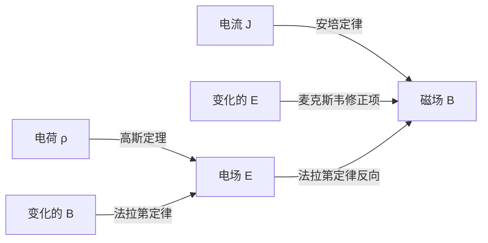
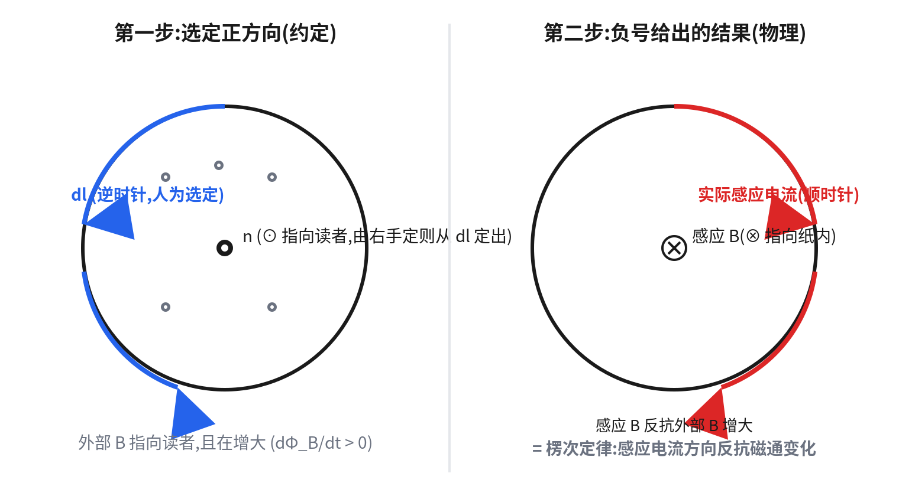
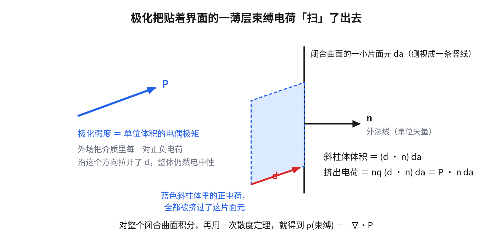
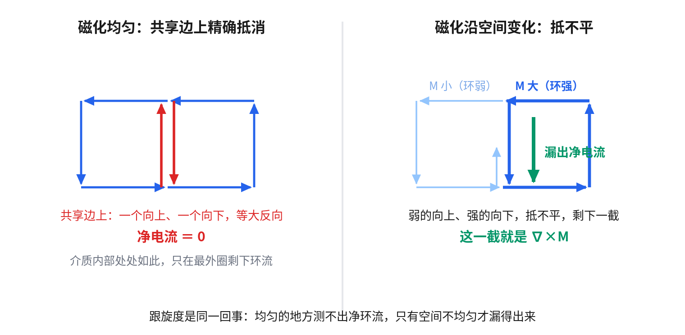
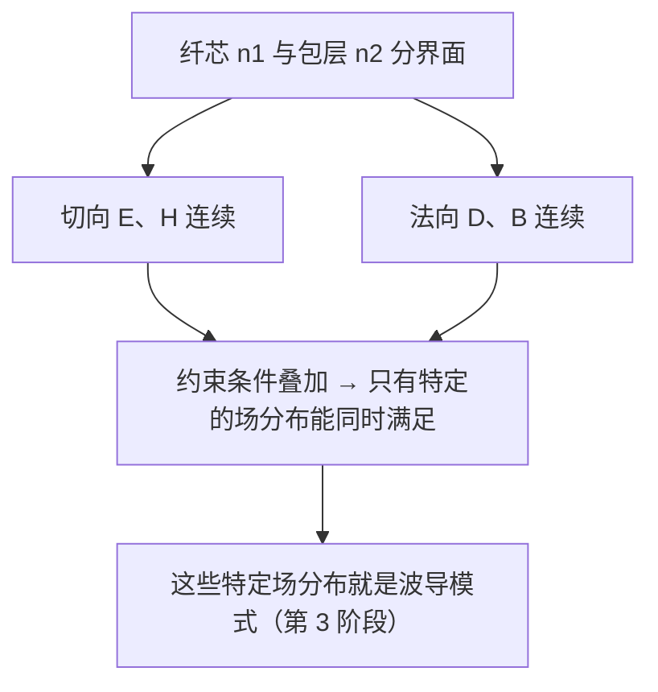
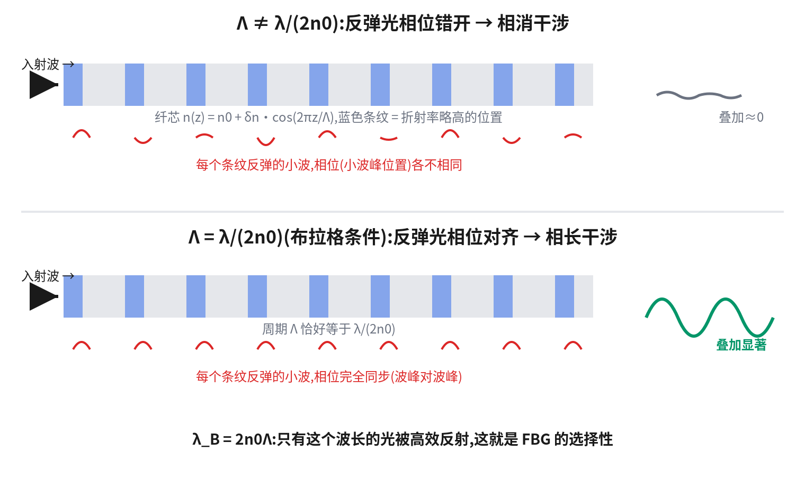

上一章准备好了工具：梯度、散度、旋度，两条积分定理，复指数，「设 $e^{\lambda t}$ 变代数方程」这个套路，以及波动方程和色散关系。这一章把这些工具用出去。

本章的目标不是没有重点地重学一遍大学物理电磁学，而是直奔一条主线：**介质中的麦克斯韦方程组 → 电磁波动方程 → 边界条件**。这三样是后面波导理论的地基。

### 本篇的验收标准

读完本篇，你应该能做到这四件事：

1. 合上笔记，从法拉第定律出发，把电磁波动方程完整推一遍——包括说清楚几个主要项的正负号分别从哪来、在哪一步抵消。
2. 回答「为什么光在介质里的速度是 $c/n$ 而不是 $c$」，用波动方程里波速的表达式回答，不是背结论。
3. **不靠记忆**，把四条边界条件重新推出来——包括说清楚为什么法向用 $\vec D$、切向用 $\vec E$ 和 $\vec H$。
4. 自己推出 $\lambda_B=2n_0\Lambda$，并且能说清楚这个推导用到了哪些前提。

阅读约定和上一篇相同：正文是主线，折叠块是追问（可跳过），文末「补充阅读」放的是更远的内容。

---

## 1.1 麦克斯韦方程组：把符号翻译成物理

真空中的麦克斯韦方程组：

$$
\nabla \cdot \vec{E} = \frac{\rho}{\varepsilon_0}
$$

$$
\nabla \cdot \vec{B} = 0
$$

$$
\nabla \times \vec{E} = -\frac{\partial \vec{B}}{\partial t}
$$

$$
\nabla \times \vec{B} = \mu_0 \vec{J} + \mu_0 \varepsilon_0 \frac{\partial \vec{E}}{\partial t}
$$

用上一章的语言逐条翻译：

- **第一条（高斯定理）**：电场的散度正比于电荷密度——电荷是电场的源头。这很符合直觉，静电场确实如此。
- **第二条**：磁场没有散度——不存在磁单极子，磁场线永远闭合。
- **第三条（法拉第定律）**：变化的磁场产生「打转」的电场。**注意这个负号。**
- **第四条（安培-麦克斯韦定律）**：电流和变化的电场都产生「打转」的磁场。**注意这里右边两项都是正号。**

**一负两正，不是随手写的。** 1.3 节会看到：光能不能传播，完全取决于这两个符号相反这件事。所以值得先花点篇幅，把它们各自的物理来源交代清楚——都不是数学上的选择，而是被守恒律钉死的。

[追问] 法拉第定律的负号从哪来：楞次定律与能量守恒

法拉第定律最初是从实验总结出来的定律，不是从别的方程推出来的。写成积分形式：

$$
\oint \vec{E}\cdot d\vec{l} = -\frac{d\Phi_B}{dt}
$$

负号的物理内容就是**楞次定律**：感应电动势的方向，总是反抗引起它的磁通变化。直觉图像是拿一根条形磁铁往线圈里推——线圈感应出的磁场会排斥磁铁，你得做功才能把它推进去，这份机械功转化成线圈里的电能。

**如果楞次定律不成立会怎样**（也就是负号变成正号）：一个初始的微小扰动会让线圈产生**吸引**磁铁的感应电动势，磁铁被加速吸进去，进一步强化这个正循环。于是磁铁加速冲进去的动能，加上线圈里凭空多出来的电能，全都是一个微小扰动凭空造出来的——直接违反能量守恒。所以这个负号不是约定，是能量守恒不允许它是正号。

**但光看积分公式，负号是怎么「翻译」成楞次定律要求的方向的？** 中间藏着**两次右手定则**：

1. 先选定闭合回路 $\oint$ 的绕行方向 $d\vec l$，再用右手定则（四指沿 $d\vec l$ 卷，大拇指指向）定出面积元的法线 $\hat n$。这一步只是数学约定，还没涉及物理。
2. 假设外部磁场沿 $\hat n$ 方向增大，代入公式，负号使 $\oint\vec E\cdot d\vec l<0$，说明**实际感应电流方向和一开始选的 $d\vec l$ 相反**。
3. 再用一次右手定则，反过来问「这个反方向的感应电流会产生什么磁场」——算出来的感应磁场，方向正好和外部那个正在增大的磁场相反。

三步串起来，负号的效果就是「感应磁场总是反抗外部磁场的变化」，这才是楞次定律在公式里的样子。

[追问] 安培-麦克斯韦定律的正号从哪来：位移电流与电荷守恒

$$
\nabla\times\vec B=\mu_0\vec J+\mu_0\varepsilon_0\frac{\partial\vec E}{\partial t}
$$

**先看 $\mu_0\vec J$ 这一项。** 麦克斯韦方程组第三条，也就是法拉第定律描述的是一个**闭合反馈回路**——变化的磁场感应出电场，电场驱动电流，电流又产生新磁场反过来影响原来的系统，所以才需要问「这个反馈是增强自己还是抑制自己」，楞次定律和能量守恒才有用武之地。

而 $\mu_0\vec J$ 是单向的生成关系：给定一根导线的电流，它周围的磁场方向由右手定则直接给出。这个方向本身是独立的实验事实——最直接的验证是两根平行导线，同向电流相吸、反向电流相斥，符号被实验测量钉死。从数值上看，电流越大磁场旋度越强，也符合直觉，不需要负号。

（顺带澄清一个容易理解偏的地方：说这一项「单向」，准确的意思是单看安培定律，也就是 $\nabla\times\vec B=\mu_0\vec J$ ，**这一个方程本身不含时间导数**——给定此刻的电流，此刻的磁场就唯一确定。不管电流是恒定直流还是交流，在任意瞬间代数关系都成立。但电流对自身确实存在反馈，那个反馈叫**自感**，是安培定律和法拉第定律**组合接力**拼出来的，不是安培定律自己**独立**给的。细节见[番外二：自感](/blog/self-inductance/)。）

**再看 $\mu_0\varepsilon_0\,\partial\vec E/\partial t$（位移电流）这一项。** 它是麦克斯韦本人修订加进去的，原始安培定律里没有。加它的物理动机，是一个给电容器充电的思想实验：拿一个安培环路 $C$ 套在正在充电的导线外面，然后给这**同一个环路**选不同的边界曲面。

- 选**平面 $S_1$**（这个环所包围的最小面积）：导线直接刺穿它，穿过的电流是 $I$。
- 选**鼓起的曲面 $S_2$**：边界还是同一条 $C$，但曲面像一个被吹大的气泡一样绕开导线鼓起来，泡泡壁延伸到电容器两极板之间。注意这个泡泡不是一个封闭的球面，它缺了 $S_1$ 那个面。没有导线穿过它，传导电流是 0，但两极板间**变化的电场**穿过了它。

$C$ 是同一个圈，$\oint\vec B\cdot d\vec l$ 沿着它算出的结果必须唯一，不能因为曲面选得不一样就得到 $\mu_0I$ 和 $0$ 两个不同答案——等号左边只出现了一条曲线，压根没提到曲面，所以就应该跟曲面无关。

麦克斯韦的解决办法：承认变化的电场也要贡献一个等效电流 $\mu_0\varepsilon_0\,\partial E/\partial t$，而且这一项在 $S_2$ 上算出来必须**正好等于** $\mu_0I$，两种曲面才能给出一致的结果。**这就要求位移电流项必须和传导电流项同号，取正号**——取负号只会让两个曲面的结果差得更远，不是抵消。

**先做一个电荷守恒的检验**：把 $S_1$ 和 $S_2$ 沿 $C$ 拼起来，正好构成一个**封闭曲面**（类似一个球面被中间一个平面切开，$S_1$ 是平的截面、$S_2$ 是鼓起的球冠，$C$ 是两者的截交线）。这个封闭曲面包住的体积里，恰好装着电容器正在积累电荷的那块极板。

只用真实电流 $\vec J$、完全不涉及位移电流地检验一遍：电流从 $S_1$ 那侧流进（导线穿过 $S_1$，流入 $I$），从 $S_2$ 那侧没有电流流出（没有导线穿过 $S_2$），净流出量是 $-I$（散度以净流出为正）；而封闭曲面里的电荷正以 $dQ/dt=I$ 的速率增长，$-dQ/dt=-I$。两边一致——**电荷守恒本身是成立的，这一步根本不需要位移电流。**

**但真正的矛盾恰恰在这里出现了。** 电荷守恒保证的是**电流通量**（沿曲面积分 $\vec J$）在物理上自洽；而安培定律要求的是**磁场环流**（沿边界 $C$ 积分 $\vec B$）在不同曲面选择下必须一致。**这是两件不同的事，前者成立不自动保证后者。**

如果方程右边只有 $\mu_0\vec J$ 这一项，那么电流通量在 $S_1$ 和 $S_2$ 上明明不一样（$I$ 和 $0$），等号左边那个只依赖曲线 $C$ 的量怎么可能相等？于是必须把 $S_2$ 缺的那部分补上——而缺口正好是 $I$，方向和大小都由刚才那个电荷守恒检验定死了。换句话说，从磁场效应的角度看，位移电流和真实电流是等效的，理应同号。

**换个角度做代数验证**：对安培-麦克斯韦方程两边取散度。左边 $\nabla\cdot(\nabla\times\vec B)\equiv0$ 是纯数学恒等式，代入右边并用高斯定律 $\nabla\cdot\vec E=\rho/\varepsilon_0$，整理得到：

$$
\nabla\cdot\vec J+\frac{\partial\rho}{\partial t}=0
$$

这正是电荷守恒的连续性方程。如果位移电流那一项取负号重做一遍，会得到 $\nabla\cdot\vec J=\partial\rho/\partial t$，意思变成「电流从区域里流出，区域里的电荷反而增加」——直接违反电荷守恒。

**小结**：楞次定律（负号）守护的是**能量守恒**，位移电流的正号守护的是**电荷守恒**。两者角色平行，只是法拉第定律里的反馈回路是物理上真实存在的（线圈、磁铁真的会互相作用），而安培-麦克斯韦方程里的「回路」是纯数学结构性的（旋度的散度恒为零、同一环路的曲面无关性），所以不容易一眼看出楞次定律那种直观的力学画面，但符号被钉死的严格程度是一样的。

### 位移电流到底是什么

这个概念下一节马上要用，所以放在主线里说清楚：

$$
\vec J_d \equiv \varepsilon_0\frac{\partial\vec E}{\partial t}
$$

**它不是电荷在流动，是一个类比量。** 真实电流 $\vec J$ 的物理图像是带电粒子在移动；但电容器两极板之间（哪怕是纯真空）没有任何电荷在移动，只有一个随时间变化的电场。麦克斯韦发现：这个变化的电场，**在产生磁场这件事上，表现得和一股真实电流完全一样**——在极板之间放一个探测器测磁场，测到的大小和方向，正好等于「假设这里有电流 $I$ 在流动」算出来的结果。

它被叫作「电流」，是因为它在安培定律里扮演的角色和真实电流一模一样，不是因为真的有电荷在跑。

**和电介质里真实的极化电流要分清楚**：如果电容器中间填的是电介质，束缚电荷确实会发生微小的真实位移，产生一份真正的极化电流，那部分是真实电荷在动。但**即使在纯真空里、一个电荷都没有**，只要 $\vec E$ 在变化，位移电流项依然存在、依然产生磁场——这部分和电荷移动完全无关，是「变化的场本身产生效应」这件事。这是整个概念里最不直观、但也相当重要的部分：它是**电磁波能够脱离电荷源、在真空里自我维持传播**的直接原因。

### 光纤这个具体场景

光纤是绝缘体，没有自由电荷、没有自由电流，所以在光纤内部：

$$
\rho = 0, \qquad \vec{J} = 0
$$

方程组简化为纯粹的「电场和磁场互相产生对方」的耦合系统——这正是电磁波能自我维持传播的原因。

但这里必须停下来问三个问题，它们构成了下一节的全部内容：**真空中的麦克斯韦方程组能直接搬到介质里吗？介质里多出来的东西（原子、极化）去哪了？纤芯和包层的分界面上会发生什么？**

### 一句话总结

- 四条方程的粗浅翻译：电荷生电场、磁场没源头、变化的磁场生打转的电场、电流和变化的电场生打转的磁场。
- 第三条的负号被**楞次定律与能量守恒**钉死，第四条的正号被**电荷守恒**钉死，都不是可以随手改的。
- 位移电流不是电荷在流，是变化的电场与真实的电流在产生磁场这件事上是等效的——它是电磁波能在真空里自我维持的原因。

### 自测

1. 用一句话说出第二条方程 $\nabla\cdot\vec B=0$ 的物理内容。
2. 位移电流在纯真空里还存在吗？为什么？
3. 如果法拉第定律的负号变成正号，会违反哪条守恒律？

参考答案

1. 磁场没有源和汇，不存在磁单极子，磁场线永远是闭合的。（对比第一条：电场有源头，就是电荷。）
2. **存在。** 位移电流只依赖 $\partial\vec E/\partial t$，跟有没有电荷、有没有介质都无关。真空里只要电场在变，它就在产生磁场。这一点是电磁波能脱离电荷源在真空传播的直接原因。
3. **能量守恒。** 感应效应会变成正反馈，一个微小扰动可以凭空放大出无穷的动能和电能。

---

## 1.2 介质中的麦克斯韦方程组

### 介质做了两件事，弄脏了两条方程

真空里，麦克斯韦方程组右边的源只有两样：电荷 $\rho$ 和电流 $\vec J$。

但介质是由原子组成的，原子核带正电、电子（云）带负电。外场一来，原子会做**两件事**：

- **极化**：电子云相对原子核发生微小偏移，介质内部冒出**束缚电荷**（整体电中性，但局部分布不均匀，在散度定理里会贡献非零的量）。
- **磁化**：原子尺度的环形电流被外场排齐，介质内部冒出**束缚电流**。

这两样都是**真实存在**的电荷和电流，都会老老实实出现在方程右边，把源项弄脏。麻烦在于：它们是介质对场的**响应**，不容易事先知道分布——你想解方程，而方程右边的源反过来依赖方程的解。

解决办法是**同一个套路用两次**：把束缚源精确地打包进一个新场量的定义里，让方程右边只剩你能控制的自由电荷、自由电流。电场这边打包出 $\vec D$，磁场这边打包出 $\vec H$。

（先说清楚，免得误会：$\vec D$ 和 $\vec H$ 里**没有任何新物理**，只是把已经存在的东西换了一种记账方式。下面会看到，两边的逻辑几乎是照镜子。）

### 极化 → 束缚电荷 → $\vec D$

**极化强度** $\vec P$ 的定义是「单位体积的电偶极矩」。可以这样想象：外场把介质里每一对正负电荷拉开了一个微小位移 $\vec d$，那么 $\vec P=nq\vec d$（$n$ 是电荷对的数密度，$q$ 是电荷量）。

这个「整体挪了一小段」的动作，会在闭合曲面上**扫出**净电荷。结论是：

$$
\rho_{\text{束缚}}=-\nabla\cdot\vec P
$$

[追问] 这个式子怎么来的——把散度定理用得实一点

考虑闭合曲面 $S$（包围体积 $V$）上的一小片面元 $da$，外法线 $\hat n$。

因为正电荷整体朝 $\vec P$ 的方向挪了 $\vec d$，原本贴在面内侧的一薄层正电荷会被**挤过**这片面元。挤出去多少？正好是那个以 $\vec d$ 为斜边的斜柱体的体积乘以电荷密度：

$$
dq_{\text{挤出}}=nq\,\vec d\cdot\hat n\,da=\vec P\cdot\hat n\,da
$$

对整个闭合曲面积分，再用**散度定理**（0.1 节的老朋友）：

$$
Q_{\text{挤出}}=\oint_S\vec P\cdot\hat n\,da=\int_V\nabla\cdot\vec P\,dV
$$

介质整体是电中性的，**挤出去多少正电荷，$V$ 里面就净剩多少负电荷**：

$$
\int_V \rho_{\text{束缚}}\,dV = -\int_V\nabla\cdot\vec P\,dV
\qquad\Longrightarrow\qquad
\rho_{\text{束缚}}=-\nabla\cdot\vec P
$$

所以这不是一个凭空的定义，是「电荷整体挪了一小段」这件事的直接后果。

把它代进真空高斯定律（注意那里的 $\rho$ 是**所有**电荷，自由的加束缚的）：

$$
\nabla\cdot\vec E=\frac{\rho_{\text{free}}+\rho_{\text{束缚}}}{\varepsilon_0}=\frac{\rho_{\text{free}}-\nabla\cdot\vec P}{\varepsilon_0}
$$

移项，把带 $\vec P$ 的那一项挪到左边：

$$
\nabla\cdot(\varepsilon_0\vec E+\vec P)=\rho_{\text{free}}
$$

括号里那一坨，就定义成**电位移矢量**：

$$
\vec D\equiv\varepsilon_0\vec E+\vec P
\qquad\Longrightarrow\qquad
\nabla\cdot\vec D=\rho_{\text{free}}
$$

**这一步是精确的**，跟极化强不强完全无关——它只用到了 $\rho_{\text{束缚}}=-\nabla\cdot\vec P$ 这个恒等式，一步近似都没做。

**下一步才是近似。** 如果介质是线性的（场不太强，极化正比于场），可以写 $\vec P=\varepsilon_0\chi_e\vec E$，代进定义：

$$
\vec D=\varepsilon_0(1+\chi_e)\vec E\equiv\varepsilon_0\varepsilon_r\vec E\equiv\varepsilon\vec E
$$

其中 $\varepsilon_r=1+\chi_e$ 就是相对介电常数。而**折射率**是：

$$
n = \sqrt{\varepsilon_r}
$$

这个式子现在先接受，1.3 节推完波动方程就能看到它是怎么冒出来的——它不是定义，是推出来的结果。

[追问] 两层关系，近似出现在不同的地方，千万别混

- $\vec D\equiv\varepsilon_0\vec E+\vec P$ 以及 $\nabla\cdot\vec D=\rho_{\text{free}}$：**精确成立**，跟极化强弱无关。这是 $\vec D$ 定义本身带来的精确抵消，不是近似。
- $\vec D=\varepsilon\vec E$（$\varepsilon$ 是常数）：**只在线性响应（场不太强）时成立**。这才是需要「极化不能太强」这个条件的地方。场很强时（比如强激光，强场物理），$\vec P$ 不再正比于 $\vec E$，会出现非线性光学效应（光纤克尔效应等），这个简化就不成立了。

顺带一提，$\nabla\cdot\vec D=\rho_{\text{free}}$ **不是一条新定理**，背后仍然是同一个高斯定理、同一套散度定理工具，只是换了一个把介质响应封装好的场量来表述。

### 磁化 → 束缚电流 → $\vec H$

现在做镜像的那一半。

**磁化强度** $\vec M$ 的定义是「单位体积的磁矩」。物理图像：介质里密铺着无数个原子尺度的**小电流环**，外场把它们的朝向排齐。

束缚电流有**两项**，来源完全不同：

$$
\vec J_{\text{束缚}}=\nabla\times\vec M+\frac{\partial\vec P}{\partial t}
$$

**第一项 $\nabla\times\vec M$：来自磁化的空间不均匀。** 相邻两个电流环共享的那条内部边上，一个环的电流向上、另一个向下。**磁化均匀时两者大小相同、精确抵消**；只有 $\vec M$ 沿空间变化的地方，一强一弱抵不平，才漏出净电流。

**这跟 0.1 节旋度的定义是同一回事**：小风车在均匀的流场里测不出净环流，只有空间不均匀才转得起来。所以漏出的净电流密度，就是 $\vec M$ 的旋度。用循环口诀展开一个分量看看：

$$
(\nabla\times\vec M)_x=\frac{\partial M_z}{\partial y}-\frac{\partial M_y}{\partial z}
$$

翻译：如果磁化强度的 $z$ 分量沿 $y$ 方向变化（一排电流环转得比隔壁那排强），那么 $y$ 方向上相邻的电流环在它们中间那条共享边上就抵消不干净，漏出一股沿 $x$ 方向的净电流。跟「风车测局部环流」是同一本账。

**第二项 $\partial\vec P/\partial t$：来自极化的时间变化。** 如果 $\vec P$ 本身随时间变化（外加场是交变的——光就是交变场），束缚电荷是**真的在移动**。移动的电荷就是电流，这一项通常叫**极化电流**。

[追问] 第二项不是随手加的，是电荷守恒逼出来的

把 $\rho_{\text{束缚}}=-\nabla\cdot\vec P$ 代进电荷守恒的连续性方程 $\dfrac{\partial\rho_{\text{束缚}}}{\partial t}+\nabla\cdot\vec J_{\text{束缚}}=0$：

$$
\nabla\cdot\vec J_{\text{束缚}}=-\frac{\partial\rho_{\text{束缚}}}{\partial t}=\nabla\cdot\frac{\partial\vec P}{\partial t}
$$

如果不加 $\partial\vec P/\partial t$ 这一项，束缚电荷就会凭空出现或凭空消失，直接违反电荷守恒。

**但这里有一个分寸值得点破**：上面这个式子只定死了 $\vec J_{\text{束缚}}$ 的**散度部分**，对**旋度部分**一无所知——你完全可以给 $\partial\vec P/\partial t$ 再加上任何一个散度为零的场，等式照样成立。

而 $\nabla\times\vec M$ 恰恰就是一个散度恒为零的场（旋度的散度永远是零，0.1 节的老结论）。

**所以两项的分工是干净且互补的**：$\partial\vec P/\partial t$ 由电荷守恒唯一确定（管散度那一半），$\nabla\times\vec M$ 是电荷守恒管不着、必须由磁化的物理另外提供的那一半（管旋度）。它们不是硬凑在一起的两项，而是把一个矢量场按「散度部分 ＋ 旋度部分」拆开后，各自被不同的物理定死的两半。

把这两项代进安培-麦克斯韦定律（那里的 $\vec J$ 同样是**所有**电流）：

$$
\nabla\times\vec B=\mu_0\left(\vec J_{\text{free}}+\nabla\times\vec M+\frac{\partial\vec P}{\partial t}\right)+\mu_0\varepsilon_0\frac{\partial\vec E}{\partial t}
$$

两边除以 $\mu_0$，把 $\nabla\times\vec M$ 挪到左边，再把两个时间导数项合并：

$$
\nabla\times\left(\frac{\vec B}{\mu_0}-\vec M\right)=\vec J_{\text{free}}+\frac{\partial}{\partial t}\left(\varepsilon_0\vec E+\vec P\right)=\vec J_{\text{free}}+\frac{\partial\vec D}{\partial t}
$$

括号里那一坨，就定义成**磁场强度**：

$$
\vec H\equiv\frac{\vec B}{\mu_0}-\vec M
\qquad\Longrightarrow\qquad
\nabla\times\vec H=\vec J_{\text{free}}+\frac{\partial\vec D}{\partial t}
$$

和 $\vec D$ 那边一样，**这一步也是精确的**。而对线性各向同性的磁介质，$\vec M=\chi_m\vec H$，于是

$$
\vec B=\mu_0(\vec H+\vec M)=\mu_0(1+\chi_m)\vec H=\mu_0\mu_r\vec H
$$

**这一步才是近似**，和 $\vec D=\varepsilon\vec E$ 完全对称。

### 一个术语坑：位移电流 ≠ 极化电流

这两个东西名字很像，都出现在 $\partial\vec D/\partial t$ 这一个记号里，但物理性质**完全不同**，值得单独记一下。

- **$\varepsilon_0\,\partial\vec E/\partial t$（真空位移电流）**：1.1 节讲过，它**不是任何电荷在移动**。哪怕在纯真空里、一个电荷都没有，只要 $\vec E$ 在变，它就存在、就产生磁场。它是麦克斯韦为了让安培定律和电荷守恒自洽而加的场论修正项。
- **$\partial\vec P/\partial t$（极化电流）**：是**真实的束缚电荷在动**，跟自由电流性质上是一类东西，只是移动范围被束缚在原子/分子尺度内。

两者物理上八竿子打不着，但合并写进安培定律时，数学上正好凑成同一个时间导数：

$$
\mu_0\varepsilon_0\frac{\partial\vec E}{\partial t}+\mu_0\frac{\partial\vec P}{\partial t}=\mu_0\frac{\partial}{\partial t}(\varepsilon_0\vec E+\vec P)=\mu_0\frac{\partial\vec D}{\partial t}
$$

**它们只是刚好能打包在一起，不是同一件事。** 再加上 $\vec D$ 叫「电位移矢量」、这一项也带「位移」两个字，非常容易连带混淆。

（还有一层麻烦：不同教材对「位移电流」这个词的所指并不统一——有的专指真空项 $\varepsilon_0\partial\vec E/\partial t$，有的用它指整个 $\partial\vec D/\partial t$，也就是把极化电流包含在内。看到这个词时，最好先确认作者指的是哪一个。）

### $\vec D$ 和 $\vec H$：同一个套路的两次应用

把两边并排放，逻辑几乎是照镜子：

|            | 电场这边                                                                           | 磁场这边                                                                                                                     |
| ---------- | ------------------------------------------------------------------------------ | ------------------------------------------------------------------------------------------------------------------------ |
| 原始方程（含束缚源） | $\nabla\cdot\vec E=\dfrac{\rho_{\text{free}}+\rho_{\text{束缚}}}{\varepsilon_0}$ | $\nabla\times\vec B=\mu_0(\vec J_{\text{free}}+\vec J_{\text{束缚}})+\mu_0\varepsilon_0\dfrac{\partial\vec E}{\partial t}$ |
| 束缚源从哪来     | $\rho_{\text{束缚}}=-\nabla\cdot\vec P$（散度）                                      | $\vec J_{\text{束缚}}=\nabla\times\vec M+\dfrac{\partial\vec P}{\partial t}$（旋度 ＋ 时间变化）                                    |
| 打包定义（精确）   | $\vec D\equiv\varepsilon_0\vec E+\vec P$                                       | $\vec H\equiv\dfrac{\vec B}{\mu_0}-\vec M$                                                                               |
| 打包后的干净方程   | $\nabla\cdot\vec D=\rho_{\text{free}}$                                         | $\nabla\times\vec H=\vec J_{\text{free}}+\dfrac{\partial\vec D}{\partial t}$                                             |
| 本构关系（近似）   | $\vec D=\varepsilon\vec E$                                                     | $\vec B=\mu_0\mu_r\vec H$                                                                                                |
| 方程类型       | **散度型**                                                                        | **旋度型**                                                                                                                  |
| 对应的边界条件    | 法向 $D_\perp$ 连续                                                                | 切向 $H_\parallel$ 连续                                                                                                      |

**两边的套路完全一致**：找出束缚响应污染了哪条方程的源项，把污染源精确打包进一个新场量的定义里，让原方程只剩自由源。这是同一个想法用了两次，不是巧合。

### 为什么偏偏是 $\vec E$ 配 $\vec D$、$\vec B$ 配 $\vec H$

这里有个很自然的疑问：为什么被打包的是**电场的散度方程**和**磁场的旋度方程**，而不是反过来？看起来像随手对调，其实是**一个物理事实精确决定的**——

> **电荷存在（自由的、束缚的都有），磁荷完全不存在（连束缚的都没有）。**

把四条方程按「右边的源是什么」排一排，一眼就清楚了：

| 方程                                              | 类型  | 右边的源 | 有没有束缚版本        | 脏不脏   | 结论             |
| ----------------------------------------------- | --- | ---- | -------------- | ----- | -------------- |
| $\nabla\cdot\vec E=\rho/\varepsilon_0$          | 散度  | 电荷   | **有**（极化）      | **脏** | 打包出 $\vec D$   |
| $\nabla\cdot\vec B=0$                           | 散度  | 磁荷   | 磁荷压根不存在        | 干净    | $\vec B$ 不需要伙伴 |
| $\nabla\times\vec B=\mu_0\vec J+\cdots$         | 旋度  | 电流   | **有**（磁化 ＋ 极化） | **脏** | 打包出 $\vec H$   |
| $\nabla\times\vec E=-\partial\vec B/\partial t$ | 旋度  | 磁流   | 磁流压根不存在        | 干净    | $\vec E$ 不需要伙伴 |

- 电荷无论自由还是束缚都真实存在，所以**电场的散度方程**天生是脏的，必须清理出 $\vec D$。
- 磁荷不存在，所以**磁场的散度方程**从一开始就是 $\nabla\cdot\vec B=0$，永远干净，$\vec B$ 保持原样。
- 电流无论自由还是束缚都真实存在，所以**磁场的旋度方程**是脏的，必须清理出 $\vec H$。
- 磁流不存在，所以**电场的旋度方程**右边只有 $-\partial\vec B/\partial t$，压根没有「束缚磁流」这种东西可以往里塞，$\vec E$ 保持原样。

**这就是「$\vec E$、$\vec B$ 和 $\vec D$、$\vec H$ 角色对调」这个别扭感的全部来源。** 它不是记号约定，是「电荷存在、磁荷不存在」这一条不对称事实的直接后果。

**记住这一条，1.5 节那四条边界条件就完全不用背了**——回头会看到，它们是被这张表唯一确定的。

[追问] 如果磁单极子真的存在，会怎样？

那么麦克斯韦方程组会变得完全对称，多出磁荷密度 $\rho_m$ 和磁流密度 $\vec J_m$：

$$
\nabla\cdot\vec B=\mu_0\rho_m,\qquad
\nabla\times\vec E=-\frac{\partial\vec B}{\partial t}-\mu_0\vec J_m
$$

这时候上面那张表的后两行也变脏了：磁荷会有束缚版本（「磁极化」），磁流也会有，于是 $\vec B$ 和 $\vec E$ 各自也需要一个打包出来的伙伴，四条方程全都要清理，边界条件也会多出对应的项。

换句话说：**现在这套 $\vec E,\vec B,\vec D,\vec H$ 的不对称长相，是磁单极子不存在留下的印记。** 迄今为止，实验从未观测到磁单极子。

### 光纤这个特例：$\vec M\approx 0$

上面那一大套，落到光纤上意味着什么？

光纤是**熔融石英**，非磁性材料，在光频段几乎完全不磁化，$\vec M\approx0$，也就是 $\chi_m\approx0$、$\mu_r\approx1$。于是：

$$
\vec H=\frac{\vec B}{\mu_0}-\vec M\approx\frac{\vec B}{\mu_0}
\qquad\Longrightarrow\qquad
\vec B\approx\mu_0\vec H
$$

$\vec H$ 和 $\vec B$ 只差一个常数因子，可以随时互换。

**而 $\vec P$ 完全不能忽略**——石英的 $\varepsilon_r\approx2.1$，也就是极化贡献了一多半。这个不对称（磁化可忽略、极化不可忽略）是本章后面所有推导的实际前提，也是为什么这一章几乎只操心 $\vec D$、很少操心 $\vec H$。

### 通用形式，和本章实际要用的简化形式

把刚才打包出来的两条，和另外两条本来就干净、原样不动的两条并在一起，就是不带任何简化的**通用**介质中麦克斯韦方程组：

$$
\begin{aligned}
\nabla\cdot\vec D&=\rho_{\text{free}} \\
\nabla\cdot\vec B&=0 \\
\nabla\times\vec E&=-\frac{\partial\vec B}{\partial t} \\
\nabla\times\vec H&=\vec J_{\text{free}}+\frac{\partial\vec D}{\partial t}
\end{aligned}
$$

**这四条是精确的**，对任何介质、任何场强都成立——极化和磁化的全部效应，都已经藏进 $\vec D$ 和 $\vec H$ 的定义里了。近似只出现在本构关系（$\vec D=\varepsilon\vec E$、$\vec B=\mu_0\mu_r\vec H$）那一层。

在光纤内部，代入三个前提——**无自由电荷电流**、**均匀介质**（$\varepsilon$ 不随位置变化）、**$\mu_r\approx1$**——可以简化成本章后面一直要用的形式：

$$
\nabla \cdot \vec{E} = 0
$$

$$
\nabla \cdot \vec{B} = 0
$$

$$
\nabla \times \vec{E} = -\frac{\partial \vec{B}}{\partial t}
$$

$$
\nabla \times \vec{B} = \mu_0 \varepsilon \frac{\partial \vec{E}}{\partial t}
$$

逐条对照一下简化是怎么发生的：

**第一条（$D\to E$）**：光纤没有自由电荷，$\rho_{\text{free}}=0$。在一块均匀介质**内部**，$\varepsilon$ 是常数，可以从散度里提出来：$\nabla\cdot\vec D=\nabla\cdot(\varepsilon\vec E)=\varepsilon\,\nabla\cdot\vec E$，所以 $\nabla\cdot\vec D=0$ 和 $\nabla\cdot\vec E=0$ 等价。

**第四条（$H\to B$）**：绝缘体 $\vec J_{\text{free}}=0$，代入 $\vec H=\vec B/\mu_0$：

$$
\nabla\times\frac{\vec B}{\mu_0}=\frac{\partial\vec D}{\partial t}=\varepsilon\frac{\partial\vec E}{\partial t}\quad\Longrightarrow\quad\nabla\times\vec B=\mu_0\varepsilon\frac{\partial\vec E}{\partial t}
$$

**第三条（法拉第定律）不受任何影响**：$\nabla\times\vec E=-\partial\vec B/\partial t$ 永远、精确地写成 $\vec B$，不管什么介质都不用换。它是少数几个不需要任何简化就成立的方程之一。

### 必须记住的适用范围

**上面这四条的默认场景是「纤芯内部或包层内部这样的单一均匀介质」，不是跨越分界面。**

原因就在第一条：它的简化完全依赖「$\varepsilon$ 是常数、可以从散度里提出来」。而纤芯-包层分界面上，$\varepsilon$ 恰恰是**不连续**的，这一步就不合法了。

这不是吹毛求疵，是后面两节的分水岭：

- **1.3 节**推波动方程，用的就是这四条，所以那个推导只在**一块均匀区域内部**成立。
- **1.5 节**处理分界面，必须退回 $\vec D,\vec H$ 的通用形式——这就是为什么边界条件表里法向那条写的是「$D_\perp$ 连续」而不是「$E_\perp$ 连续」。

**顺带回答一个自然的疑问：为什么折射率 $n$ 会出现在几乎所有光学公式里？** 因为它本质上就是介质对麦克斯韦方程组的一个「缩放因子」——介质做的全部事情，就是把 $\varepsilon_0$ 换成 $\varepsilon=\varepsilon_0\varepsilon_r$，而 $n=\sqrt{\varepsilon_r}$ 正好是这个替换在光速上的体现。下一节就能看到这句话是怎么算出来的。

### 一句话总结

- 介质做两件事：**极化**产生束缚电荷，**磁化**产生束缚电流。前者弄脏高斯定律，后者弄脏安培定律。
- 同一个套路用两次：$\vec D\equiv\varepsilon_0\vec E+\vec P$ 打包掉束缚电荷，$\vec H\equiv\vec B/\mu_0-\vec M$ 打包掉束缚电流。**打包这一步是精确的**，近似只出现在本构关系 $\vec D=\varepsilon\vec E$、$\vec B=\mu_0\mu_r\vec H$ 上。
- **为什么是 $\vec E$ 配 $\vec D$、$\vec B$ 配 $\vec H$**：因为电荷存在（有束缚版本）、磁荷不存在（连束缚的都没有）。这一条不对称，同时决定了 1.5 节那四条边界条件。
- **位移电流 ≠ 极化电流**：前者是真空里变化的电场，不含任何电荷；后者是真实束缚电荷在动。只是数学上能打包成同一个 $\partial\vec D/\partial t$。
- 本章后面用的那四条简化方程 = 通用形式在「无自由电荷电流 ＋ 均匀介质 ＋ $\mu_r\approx1$」三个前提下的产物（时刻警惕物理公式的前提约定与简化假设是否成立）。三个前提里，「均匀介质」在分界面上会被破坏——这是 1.5 节整节存在的理由。

### 自测

1. 为什么在纤芯**内部**，$\nabla\cdot\vec E=0$ 和 $\nabla\cdot\vec D=0$ 是等价的？这个等价在什么地方会失效？
2. 下面四条，哪些精确、哪些近似？$\ \nabla\cdot\vec D=\rho_{\text{free}}$、$\ \vec D=\varepsilon\vec E$、$\ \vec H\equiv\vec B/\mu_0-\vec M$、$\ \vec B=\mu_0\mu_r\vec H$。
3. 束缚电流为什么是两项之和？这两项分别被什么定死？
4. 用一句话说清楚：为什么 $\vec B$ 不需要一个「打包后的伙伴」，而 $\vec E$ 需要？

参考答案

1. 因为均匀介质内部 $\varepsilon$ 是常数，可以从散度算符里提出来，$\nabla\cdot(\varepsilon\vec E)=\varepsilon\nabla\cdot\vec E$，两者只差一个非零常数因子。在**纤芯-包层分界面**上失效，因为那里 $\varepsilon$ 不连续、不是常数，提不出来。
2. **精确**：$\nabla\cdot\vec D=\rho_{\text{free}}$（$\vec D$ 定义带来的）、$\vec H\equiv\vec B/\mu_0-\vec M$（这就是定义本身）。**近似**：$\vec D=\varepsilon\vec E$ 和 $\vec B=\mu_0\mu_r\vec H$，都依赖线性响应。强激光下前者失效，出现非线性光学效应。
3. $\vec J_{\text{束缚}}=\nabla\times\vec M+\partial\vec P/\partial t$。$\partial\vec P/\partial t$ 由**电荷守恒**唯一定死（它管矢量场的散度部分）；$\nabla\times\vec M$ 散度恒为零，电荷守恒管不着，由**磁化的物理**定死（它管旋度部分）。两者按「散度 ＋ 旋度」互补分工。
4. 因为 $\vec B$ 的散度方程右边的源是**磁荷**，而磁荷根本不存在（连束缚的都没有），$\nabla\cdot\vec B=0$ 天生就是干净的；而 $\vec E$ 的散度方程右边是**电荷**，电荷有束缚版本，会把源项弄脏，所以必须打包出 $\vec D$。

---

## 1.3 推电磁波动方程

**这一节是整章的核心，建议跟着手推一遍，不要只看结论。**

对法拉第定律两边取旋度：

$$
\nabla \times (\nabla \times \vec{E}) = -\frac{\partial}{\partial t} (\nabla \times \vec{B}) \qquad (\star)
$$

（空间求导 $\nabla\times$ 和时间求导 $\partial/\partial t$ 可以交换顺序，因为空间和时间是独立变量，混合偏导数对称。这一步默认场足够光滑——这个前提在均匀介质内部没问题，但在 1.5 节的分界面上恰恰会失效，到时候会专门处理。）

### 右边：第一个负号

代入上一节的第四条 $\nabla\times\vec B=\mu_0\varepsilon\,\partial\vec E/\partial t$：

$$
(\star)\ \text{右边}=-\mu_0\varepsilon\frac{\partial^2\vec E}{\partial t^2}
$$

**这是第一个负号，来自法拉第定律本身。**

### 左边：第二个负号

用矢量恒等式（BAC-CAB 公式的算子版本，来自 $\vec a\times(\vec b\times\vec c)=\vec b(\vec a\cdot\vec c)-\vec c(\vec a\cdot\vec b)$；使用时 $\nabla$ 必须作用在右边的场上，不能像普通矢量那样随便挪位置）：

$$
\nabla\times(\nabla\times\vec E)=\nabla(\nabla\cdot\vec E)-\nabla^2\vec E
$$

上一节第一条告诉我们介质内部 $\nabla\cdot\vec E=0$，第一项为零：

$$
\nabla\times(\nabla\times\vec E)=-\nabla^2\vec E
$$

**这是第二个负号，来自恒等式本身的代数结构，和法拉第定律那个负号是两个完全独立的来源。**

### 拼起来

$$
-\nabla^2\vec E=-\mu_0\varepsilon\frac{\partial^2\vec E}{\partial t^2}
$$

两边都有负号，同乘 $-1$ 一起抵消：

$$
\nabla^2 \vec{E} = \mu_0 \varepsilon \frac{\partial^2 \vec{E}}{\partial t^2}
$$

**$\nabla^2$ 是什么**：$\nabla^2\equiv\nabla\cdot\nabla$，是 $\nabla$ 和自己做**点乘**（不是叉乘，所以没有 $\times$ 符号），叫拉普拉斯算子。直角坐标下 $\nabla^2f=\partial^2f/\partial x^2+\partial^2f/\partial y^2+\partial^2f/\partial z^2$，正是一维波动方程里 $\partial^2u/\partial x^2$ 的三维推广。

### 读出波速

**这正是上一章 0.5 节的波动方程。** 对比标准形式 $\nabla^2u=(1/v^2)\,\partial^2u/\partial t^2$——上一章说过，「只要方程长成这个样子，直接从系数的位置就能读出波速」：

$$
\frac{1}{v^2}\ \longleftrightarrow\ \mu_0\varepsilon \qquad\Longrightarrow\qquad v=\frac{1}{\sqrt{\mu_0\varepsilon}}
$$

代入 $\varepsilon=\varepsilon_0\varepsilon_r$ 和真空光速 $c=1/\sqrt{\mu_0\varepsilon_0}$：

$$
v=\frac{1}{\sqrt{\mu_0\varepsilon_0\varepsilon_r}}=\frac{c}{\sqrt{\varepsilon_r}}=\frac{c}{n}
$$

**光在折射率为 $n$ 的介质中，传播速度是真空光速的 $1/n$。这不是一个假设，是从麦克斯韦方程组严格推出来的结果。**

而且这一步顺带还上了上一节欠的账：**$n=\sqrt{\varepsilon_r}$ 不是一个凭空的定义。** 折射率本来的物理含义就是「光在这个介质里慢多少倍」，上面这个推导正好给出 $c/v=\sqrt{\varepsilon_r}$——麦克斯韦在这里把几何光学里一个纯唯象的参数，和材料的电学性质 $\varepsilon_r$ 接上了。这是整套理论里最漂亮的桥之一。

### 为什么两条方程符号相反不是巧合

假设法拉第定律和安培-麦克斯韦定律的符号**相同**，把上面重推一遍，会得到：

$$
\nabla^2\vec E=-\mu_0\varepsilon\frac{\partial^2\vec E}{\partial t^2}
$$

代入平面波解会得到 $k^2<0$，也就是 $k$ 是虚数。按上一章 0.3 节那条判据（看二阶导前面系数的符号），这对应的是**指数增长/衰减型**的解——场根本不会传播，只会原地数值爆炸或者原地衰减消失。

**现实中两条方程符号相反，恰好保证 $k^2>0$。这就是「光能够传播」这件事在数学上的全部来源。**

而这两个符号本身，一个被能量守恒钉死（楞次定律），一个被电荷守恒钉死（位移电流）。所以往回追一层：**光之所以能传播，根子上是因为能量守恒和电荷守恒这两条守恒律给它们定了相反的符号。**

[追问] 波动方程的系数为什么偏偏是 $1/v^2$

上一章 0.5 节已经从行波解反推过一遍，这里复述一下，因为这一节正好用到了它的结论。

设 $u(x,t)=f(x-vt)$（形状不变、以速度 $v$ 整体平移的行波，$f$ 任意）。令 $s=x-vt$：

对 $x$ 求导（$\partial s/\partial x=1$）：$\dfrac{\partial u}{\partial x}=f'(s)$，再求一次 $\dfrac{\partial^2u}{\partial x^2}=f''(s)$。

对 $t$ 求导（$\partial s/\partial t=-v$）：$\dfrac{\partial u}{\partial t}=-vf'(s)$，再求一次 $\dfrac{\partial^2u}{\partial t^2}=v^2f''(s)$。

两个二阶导数都能用同一个 $f''(s)$ 表示，联立：

$$
\frac{\partial^2u}{\partial x^2}=f''(s)=\frac{1}{v^2}\cdot v^2f''(s)=\frac{1}{v^2}\frac{\partial^2u}{\partial t^2}
$$

**系数 $1/v^2$ 不是规定出来的，是「要求解具有 $f(x-vt)$ 这种以速度 $v$ 平移的形状」反过来逼出来的。** 所以从系数位置读波速，是完全合法的，不是套公式。

### 一句话带走

- 推导路径：法拉第取旋度 → 右边代安培-麦克斯韦（第一个负号）→ 左边用矢量恒等式加 $\nabla\cdot\vec E=0$（第二个负号）→ 两负相消，得波动方程。
- 从系数位置直接读出 $v=1/\sqrt{\mu_0\varepsilon}=c/n$，顺带证明了 $n=\sqrt{\varepsilon_r}$。
- 两条方程符号相反 ⟹ $k^2>0$ ⟹ 光能传播。这是本篇最核心的一句话。

### 自测

1. 合上笔记，从法拉第定律出发把整个推导写一遍，标出两个负号各自的来源。
2. 为什么光纤中光速是 $c/n$ 而不是 $c$？用波动方程里波速的表达式回答。
3. 推导过程中在哪一步用到了「$\nabla\cdot\vec E=0$」？如果这一步不成立（比如在纤芯-包层分界面上），推导还能进行下去吗？

参考答案

1. 见正文。关键是两个负号来源完全独立：一个来自法拉第定律的物理（楞次定律），一个来自矢量恒等式的代数。
2. 波动方程系数位置给出 $v=1/\sqrt{\mu_0\varepsilon}$，介质里 $\varepsilon=\varepsilon_0\varepsilon_r>\varepsilon_0$，分母变大，速度变小，比值正好是 $\sqrt{\varepsilon_r}=n$。
3. 用在**左边化简矢量恒等式**那一步，用来干掉 $\nabla(\nabla\cdot\vec E)$ 这一项。**不能。** 分界面上 $\varepsilon$ 不连续，$\nabla\cdot\vec E\ne0$，那一项不能扔；更根本的是，那里导数本身就没定义，微分形式整个失效。这正是 1.5 节要退回积分形式的原因。

---

## 1.4 平面波解与色散关系

上一章 0.5 节已经把平面波、波前、波矢 $k$ 这些概念全部建立好了。这一节只做一件事：**把平面波解代进刚推出来的电磁波动方程，看它逼出什么条件。**

为什么用平面波做尝试解，套路和 0.3 节解 ODE、0.5 节解一维波动方程完全一样——先设一个尝试解，代入方程，看它需要满足什么代数条件。平面波是这个套路里最简单、求导最省事的形状。

代入平面波尝试解：

$$
\vec{E}(z,t) = \vec{E}_0\, e^{i(kz - \omega t)}
$$

$$
\frac{\partial^2\vec E}{\partial z^2}=(ik)^2\vec E=-k^2\vec E,\qquad \frac{\partial^2\vec E}{\partial t^2}=(-i\omega)^2\vec E=-\omega^2\vec E
$$

代入 $\nabla^2\vec E=\mu_0\varepsilon\,\partial^2\vec E/\partial t^2$，约掉 $\vec E$ 和负号：

$$
k^2=\mu_0\varepsilon\,\omega^2\quad\Longrightarrow\quad k=\omega\sqrt{\mu_0\varepsilon}
$$

代入 $\varepsilon=\varepsilon_0n^2$ 和 $c=1/\sqrt{\mu_0\varepsilon_0}$：

$$
k = \frac{n\omega}{c}
$$

这就是**介质中的色散关系**。它不是新物理，只是「$\vec E_0e^{i(kz-\omega t)}$ 必须满足波动方程」这个要求，转化成的 $k$ 和 $\omega$ 之间的代数约束。

反解一下：$v_p=\omega/k=c/n$，正是相速度（追踪波峰移动的速度），和 1.3 节从系数位置读出的波速完全对上——**两条路殊途同归，这是个很好的自检。**

### 这个 $k$ 后面会改名叫 $\beta$

在光纤模式理论里，因为光被约束在纤芯里传播，情况比自由空间的平面波复杂，同一个位置上的量习惯记作**传播常数 $\beta$**，但根源就是这里的色散关系。第 3 阶段会看到它长这样：

$$
\beta = \frac{n_{\text{eff}}\,\omega}{c}
$$

结构一模一样，只是 $n$ 换成了有效折射率 $n_{\text{eff}}$——上一章 0.4 节提过的那个替换，就是这个。

另外提醒一句上一章末尾的结论：光纤里只有轴向一个方向，波矢退化成带符号的标量，**方向信息完全靠 $k$ 的正负号承载**（$e^{ikz}$ 正向、$e^{-ikz}$ 反向）。这个正负号在下面 1.6 节推布拉格条件时是关键，值得提前放在手边。

### 一句话带走

- 平面波代入波动方程，逼出色散关系 $k=n\omega/c$。这是全部内容。
- 反解得 $v_p=c/n$，和 1.3 节的结果对上，互为验算。
- 这个 $k$ 就是第 3 阶段传播常数 $\beta$ 的原型，正负号承载传播方向。

### 自测

1. 亲手代一遍，确认 $k=n\omega/c$。
2. 真空中（$n=1$）色散关系是什么？相速度是多少？
3. 一个沿 $-z$ 方向传播的平面波，指数应该怎么写？

参考答案

1. 见正文。要点是 $\partial^2/\partial z^2\to-k^2$、$\partial^2/\partial t^2\to-\omega^2$，两边的负号约掉。
2. $k=\omega/c$，$v_p=\omega/k=c$。真空里相速度就是光速，而且跟频率无关——真空无色散。
3. $e^{i(-kz-\omega t)}$，等价于 $e^{-i(kz+\omega t)}$。把 $k$ 换成 $-k$ 即可，不需要写成三分量矢量。

---

## 1.5 边界条件：光为什么被关在纤芯里

光纤由纤芯（折射率 $n_1$）和包层（$n_2<n_1$）组成。光被「约束」在纤芯里传播，靠的就是两种介质分界面上电磁场必须满足的**边界条件**。

### 先说结论：这四条不用背

很多人（包括我）第一次看边界条件时最难受的地方不是推导，是**记不住哪个量对应哪个方向**——切向是 $E$ 和 $H$，法向是 $D$ 和 $B$，为什么不是别的组合？

其实它们完全不用背，是被两句话唯一确定的：

**第一句：方程的类型决定方向。**

- **散度型**方程（$\nabla\cdot\,\square$）→ 用**散度定理** → 手法是「压扁的盒子」→ 给出**法向**条件。
- **旋度型**方程（$\nabla\times\,\square$）→ 用**斯托克斯定理** → 手法是「压扁的环」→ 给出**切向**条件。

麦克斯韦方程组正好两条散度型、两条旋度型，于是必然是**两条法向条件 ＋ 两条切向条件**，一个不多一个不少。

**第二句：1.2 节末尾那张表决定用哪个场量。**

哪条方程被束缚源弄脏、需要打包，就用打包后的场量；哪条天生干净，就用原来的场量。直接查表：

| 方程                                                                  | 类型  | 脏不脏   | 用哪个场量    | 得到的边界条件             |
| ------------------------------------------------------------------- | --- | ----- | -------- | ------------------- |
| $\nabla\cdot\vec D=\rho_{\text{free}}$                              | 散度  | 脏（极化） | $\vec D$ | 法向 $D_\perp$ 连续     |
| $\nabla\cdot\vec B=0$                                               | 散度  | 干净    | $\vec B$ | 法向 $B_\perp$ 连续     |
| $\nabla\times\vec E=-\partial\vec B/\partial t$                     | 旋度  | 干净    | $\vec E$ | 切向 $E_\parallel$ 连续 |
| $\nabla\times\vec H=\vec J_{\text{free}}+\partial\vec D/\partial t$ | 旋度  | 脏（磁化） | $\vec H$ | 切向 $H_\parallel$ 连续 |

**四条边界条件，就是四条方程各用一次对应的积分定理，一一对应出来的结果。** 它们不是四条独立的规则，也不需要记忆——记住「散度型给法向、旋度型给切向」加上「电荷存在、磁荷不存在」，四条随时能重新推出来。

下面把推导过程走一遍。

### 为什么必须退回积分形式

麦克斯韦方程组的微分形式默认场处处光滑。但纤芯和包层的交界处介质性质**突变**，导数在这里根本没定义，微分形式在这条界面上失效。（回想 1.3 节交换求导顺序时用的正是「场足够光滑」这个前提，那一步只在均匀介质内部合法。）

解决办法是退回**积分形式**，用上一章的散度定理和斯托克斯定理。手法和 0.1 节「小方块内部两两抵消、只剩边界」是同一个套路，这次换成「扁盒子和扁环卡在分界面上」。

**法向分量（用散度定理）**：想象一个像月饼一样扁的圆柱盒子跨在分界面上，让高度趋于 0。侧面积跟着趋于零，只剩上下两个底面贡献通量——上底 $D_{\perp,1}$ 往外、下底 $D_{\perp,2}$ 往里。光纤无自由电荷，右边也为零，于是 $D_{\perp,1}=D_{\perp,2}$，即 $\varepsilon_1E_{\perp,1}=\varepsilon_2E_{\perp,2}$。同一个盒子套在 $\nabla\cdot\vec B=0$ 上，直接得到 $B_{\perp,1}=B_{\perp,2}$。

**切向分量（用斯托克斯定理）**：想象一个扁平的小矩形环，长边贴着分界面两侧、短边垂直穿过分界面，让短边长度趋于 0。短边贡献的环流趋于零，只剩两条长边——一条给 $E_{\parallel,1}$，另一条给 $-E_{\parallel,2}$（绕行方向相反）。环的面积也跟着趋于零，右边（磁通量变化率）也为零，于是 $E_{\parallel,1}=E_{\parallel,2}$。同样的扁环套在安培-麦克斯韦定律上（无自由面电流），得到 $H_{\parallel,1}=H_{\parallel,2}$。

四条规则汇总：

| 场分量                    | 边界条件                                                            |
| ---------------------- | --------------------------------------------------------------- |
| 电场切向分量 $E_{\parallel}$ | 连续：$E_{\parallel,1}=E_{\parallel,2}$                            |
| 磁场切向分量 $H_{\parallel}$ | 连续（无自由面电流时）：$H_{\parallel,1}=H_{\parallel,2}$                   |
| 电位移法向分量 $D_{\perp}$    | 连续（无自由面电荷时）：$\varepsilon_1E_{\perp,1}=\varepsilon_2E_{\perp,2}$ |
| 磁感应法向分量 $B_{\perp}$    | 连续：$B_{\perp,1}=B_{\perp,2}$                                    |

**注意法向那条写的是 $D_\perp$ 连续，不是 $E_\perp$ 连续。** 这正是 1.2 节反复强调的那个前提在起作用：$\varepsilon$ 在分界面上不连续，提不出来，所以只能用 $\vec D$ 表述。反过来说，**$\vec E$ 的法向分量在界面两侧是不相等的**：

$$
\frac{E_{\perp,1}}{E_{\perp,2}}=\frac{\varepsilon_2}{\varepsilon_1}
$$

这个「必须不相等」，就是光被界面「顶回去」的物理根源。

**这就是第 3 阶段「模式」概念的物理起点**：不是任意形状的电磁场都能在光纤里稳定传播，只有**同时**满足波动方程（1.3 节）和纤芯-包层边界条件（本节）的那些特定场分布才行——这些特定解就叫**模式**。

### 这一层还推不出全反射

必须把话说死，免得后面自己给自己挖坑：**边界条件表只说明「$n_1\ne n_2$ 导致 $E_\perp$ 两侧必须不一样大」，这是原材料，不是结论。**

真正要推出「入射角超过临界角就发生全反射」，还需要两样东西：

- **斯涅尔定律**——由「相位沿界面处处匹配」这个要求逼出来；
- **菲涅尔公式**——把边界条件应用在斜入射的几何上，解出反射波和折射波的振幅比例。

这两样都属于第 2 阶段光学。本章的边界条件只负责打地基，**这里还没有任何一步能算出「反射了多少」。**

[追问] 法向的跳变，会不会「传染」给切向、产生额外的旋度？

不会。散度定理管法向、斯托克斯定理管切向，是两件互相独立、正交的事。切向连续是斯托克斯定理**单独**给出的结论，不会因为法向 $E_\perp$ 由于 $\varepsilon_1\ne\varepsilon_2$ 而跳变就受到影响。

另外还有一个容易混的点：这里 $E_\perp$ 的跳变是**空间跳变**（同一时刻跨过分界面数值突变），不是「变化的场产生场」那种**时间变化**（$\partial\vec E/\partial t$）。两者是完全不同的「变化」，法拉第定律和位移电流讲的都是后者，跟这里的空间跳变没有关系。

### 一句话带走

- 分界面上微分形式失效，必须退回积分形式，靠散度定理和斯托克斯定理，手法是「把盒子和环压扁」。
- **四条边界条件不用背**：散度型方程给法向条件、旋度型方程给切向条件；哪条方程脏就用打包后的场量。$D_\perp$、$B_\perp$、$E_\parallel$、$H_\parallel$ 就这样一一对应出来了。
- 法向用 $D$ 不用 $E$，是因为 $\varepsilon$ 在界面上不连续——而 $\vec E$ 的法向分量**必须不相等**，这正是光被界面顶回去的物理根源。
- 「波动方程 ＋ 边界条件」这个组合，就是第 3 阶段「模式」概念的完整定义。
- 全反射、反射率这些还推不出来，要等第 2 阶段。

### 自测

1. 不查表，只用「散度型给法向、旋度型给切向」加上「哪条方程脏」，把四条边界条件重新推一遍。
2. 为什么法向条件写的是 $D_\perp$ 连续而不是 $E_\perp$ 连续？
3. 一根光纤纤芯 $n_1=1.45$、包层 $n_2=1.44$。定性说明：为什么这个微小的折射率差就足够把光「关」在纤芯里？
4. 推导里为什么要让盒子的高度、环的短边趋于零？

参考答案

1. 两条散度型方程 $\nabla\cdot\vec D=\rho_{\text{free}}$（脏，用 $\vec D$）和 $\nabla\cdot\vec B=0$（干净，用 $\vec B$）→ 法向 $D_\perp$、$B_\perp$ 连续。两条旋度型方程 $\nabla\times\vec E=-\partial\vec B/\partial t$（干净，用 $\vec E$）和 $\nabla\times\vec H=\vec J_{\text{free}}+\partial\vec D/\partial t$（脏，用 $\vec H$）→ 切向 $E_\parallel$、$H_\parallel$ 连续。
2. 因为法向条件来自散度定理作用在 $\nabla\cdot\vec D=\rho_{\text{free}}$ 上，$\vec D$ 才是那个方程里的场量。想换成 $\vec E$ 就要把 $\varepsilon$ 提出来，而分界面上 $\varepsilon$ 不连续，提不出来。
3. 因为 $\varepsilon_1\ne\varepsilon_2$ 强制 $E_\perp$ 在两侧不相等（$E_{\perp,1}/E_{\perp,2}=\varepsilon_2/\varepsilon_1$），场无法平滑穿过界面。这个约束叠加在波动方程上，会筛掉绝大多数场分布，只留下少数几个能同时满足两边的解，它们的能量被局限在纤芯里。**注意这只是定性图像**，「超过临界角全反射」的定量结论要等第 2 阶段。
4. 为了让「不想要的贡献」自动消失：盒子高度趋零则侧面通量趋零，环短边趋零则短边环流趋零、同时环面积趋零使右边的磁通变化率也趋零。剩下的才是干净的两侧对比关系。

---

## 1.6 折射率微扰：布拉格条件的第一次正规推导

FBG 的物理机制，是纤芯折射率沿传播方向发生周期性微小变化：

$$
n(z) = n_0 + \delta n \cos\left(\frac{2\pi z}{\Lambda}\right)
$$

从 1.3 节可以看到，折射率 $n$ 直接决定波动方程里的传播速度，进而决定色散关系 $k=n\omega/c$。当 $n$ 本身随位置 $z$ 变化时，波动方程不再有干净的平面波解——原本沿 $+z$ 传播的波，会因为这个周期性微扰，持续地把一部分能量「泵浦」到沿 $-z$ 传播的波里。

上一章 0.4 节已经用「相干叠加」的图像推出过 $\lambda_B=2n_0\Lambda$。这一节换一条路：**直接从波的数学形式出发，用「相位匹配」的语言推一遍。** 结论完全一样，但这条路可以直接延伸到第 4 阶段的耦合模理论。

### 物理图像

把 $n(z)$ 看成无穷多个无穷小的微型交界面串起来，每一处折射率的起伏都对正向传播的波产生一丁点反射。

（这里要诚实一句：1.5 节的边界条件表只处理了「折射率突变」这一种情形，并**没有**给出反射的振幅——能定量算出「反弹多少」要等第 2 阶段的菲涅尔公式。下面的推导只需要「每一处都反弹了一点点」这个定性事实，不需要知道具体反弹多少。）

关键问题是：这些从不同 $z$ 位置反弹回来的波，汇合的时候是相长还是相消？

### 相位匹配推导

设正向波 $E_f(z,t)=Ae^{i(kz-\omega t)}$，$k=n_0\omega/c$。反弹源正比于 $\delta n\cos(2\pi z/\Lambda)\cdot E_f(z,t)$（严格推导属于第 4 阶段耦合模理论，这里先直接用这个正比关系）。用欧拉公式把余弦拆开：

$$
\delta n\cos\!\left(\frac{2\pi z}{\Lambda}\right)Ae^{i(kz-\omega t)}=\frac{\delta n\,A}{2}e^{-i\omega t}\left[e^{i(k+2\pi/\Lambda)z}+e^{i(k-2\pi/\Lambda)z}\right]
$$

第一项的空间频率更大，不对应反向波，不管它。第二项 $e^{i(k-2\pi/\Lambda)z}$ 才是关键：一个真正的反向波长成 $e^{-ikz}$（就是 1.4 节说的「方向信息全靠 $k$ 的正负号承载」）。所以当

$$
k-\frac{2\pi}{\Lambda}=-k \qquad\Longrightarrow\qquad \Lambda=\frac{\pi}{k}
$$

这一项的相位随 $z$ 变化的方式和反向波**完全同步**——光纤上每个位置反弹回来的光，相位都对得上，相长干涉，叠加成显著的反射光。如果 $\Lambda\ne\pi/k$，不同位置反弹的光相位错开，光纤够长时几乎完全抵消，净反射可以忽略。

### 换成常见形式

代入 $k=2\pi n_0/\lambda$，得 $\Lambda=\pi/k=\lambda/(2n_0)$，也就是：

$$
\boxed{\lambda_B=2n_0\Lambda}
$$

和上一章用相干叠加推出来的结果完全一致——两条完全不同的路走到同一个地方，这是个很强的自检。

只有波长恰好等于 $2n_0\Lambda$ 的光才被高效反射。这正是 FBG 用极微弱的周期性折射率起伏、实现对特定波长近乎完全反射的原理——**靠的是相长干涉，不是强反射材料。**

**数值验证**：取 $\lambda_B=1550$ nm、$n_0=1.45$：

$$
\Lambda=\frac{1550}{2\times1.45}\approx534.5\ \text{nm}
$$

亚微米量级。这说明光栅周期需要极精细的加工才能选中特定波长——也间接说明了为什么 FBG 的制造门槛在紫外相位掩模、飞秒激光这类工艺上。

### 还欠着两笔账

- **$n_0$ 要换成 $n_{\text{eff}}$**：光在光纤里以模式的形式传播，实际感受到的折射率介于纤芯和包层之间。这要等第 3 阶段。
- **反射率是多少**：这一节只回答了「哪个波长被反射」，没有回答「反射了百分之多少」「反射峰有多宽」。把定性的相位匹配论证严格化，精确算出反射率随波长变化的完整曲线（也就是 FBG 的「光谱」），是第 4 阶段耦合模理论的任务。

### 一句话带走

- 周期性微扰把正向波的能量持续泵到反向波里，能不能泵得动，取决于相位对不对得上。
- 相位匹配条件 $k-2\pi/\Lambda=-k$，翻译过来就是 $\lambda_B=2n_0\Lambda$。
- 光栅周期在亚微米量级，这是 FBG 制造工艺门槛的来源。

### 自测

1. 相位匹配条件 $k-2\pi/\Lambda=-k$ 里，等号右边为什么是 $-k$ 而不是 $+k$？
2. 如果要做一个反射 1310 nm 的 FBG（同样 $n_0=1.45$），光栅周期应该是多少？
3. 这个推导用到了哪些前提？（提示：至少有两个。）

参考答案

1. 因为我们要找的是**反向**传播的波。1.4 节说过，光纤里方向信息全靠 $k$ 的正负号承载，正向波是 $e^{ikz}$，反向波就是 $e^{-ikz}$，对应的空间频率是 $-k$。
2. $\Lambda=1310/(2\times1.45)\approx451.7$ nm。（顺带印证正比关系：波长短了，周期也跟着短。）
3. 至少两个：**（一）弱调制**，$\delta n\ll n_0$，每次反射都极微弱，可以忽略多次来回反射；**（二）光栅足够长**，不匹配的波长才能真正互相抵消干净——光栅很短的话，相消不彻底，反射峰会变宽。另外还借用了「反弹源正比于 $\delta n\cos(\cdot)E_f$」这个未加证明的关系，那是第 4 阶段的事。

---

## 本篇小结

| 概念                                   | 后续用途                         |
| ------------------------------------ | ---------------------------- |
| 束缚电荷、束缚电流，以及 $\vec D$、$\vec H$ 的打包逻辑 | 理解介质里的方程为什么长这样，以及边界条件为什么是那四条 |
| 介质中麦克斯韦方程组（及其适用范围）                   | 波导理论、耦合模理论的方程出发点             |
| 电磁波动方程推导                             | 理解「光速为何是 $c/n$」，以及模式方程的来源    |
| 平面波解、色散关系 $k=n\omega/c$              | 光纤中传播常数 $\beta$ 的原型          |
| 边界条件（切向/法向连续性）                       | 光纤模式为何被「约束」存在的物理根源           |
| 折射率微扰 $n(z)$ 与相位匹配                   | 直接对应 FBG 的物理机制，第 4 阶段的出发点    |

回头对一下开头的**验收标准**：三条都能做到吗？做不到的那一条，回去看对应的小节。

本篇欠下、后面要还的账：$n_{\text{eff}}$ 的定义（第 3 阶段）、反射率曲线（第 4 阶段）、全反射与菲涅尔公式（第 2 阶段）。

下一站：**第 2 阶段，光学基础**。

---

## 补充阅读

下面这些内容，这个系列的主线后面用不上，但当时追问出来了，扔掉可惜。不看完全不影响主线。

其中一块已经展开成了独立的番外篇：

- **[番外二：自感——电感元件的全部行为，都从一个负号长出来](/blog/self-inductance/)**　接着 1.1 节。安培定律和法拉第定律怎么接力拼出反馈回路，以及电感为什么会「阻碍电流突变」「电压超前电流 90 度」。

B1　总电流处处散度为零：「一进一出」的精确版本

正文的折叠块里用「电荷守恒 + 缺口正好是 $I$」论证过位移电流的大小。这里给一个更结构化的版本。

定义**总电流密度**：

$$
\vec J_{\text{总}}\equiv\vec J+\varepsilon\frac{\partial\vec E}{\partial t}
$$

对它取散度，用高斯定律 $\nabla\cdot(\varepsilon\vec E)=\rho$ 和电荷守恒的连续性方程 $\nabla\cdot\vec J=-\partial\rho/\partial t$：

$$
\nabla\cdot\vec J_{\text{总}}=\nabla\cdot\vec J+\frac{\partial\rho}{\partial t}=-\frac{\partial\rho}{\partial t}+\frac{\partial\rho}{\partial t}=0
$$

**处处精确为零，不是近似。** 真实电流的电荷守恒和位移电流的定义，结构上天生互补，合在一起必然抵消。

把 $S_1,S_2$ 拼成的封闭曲面 $\Sigma$ 代入散度定理：

$$
\oint_\Sigma \vec J_{\text{总}}\cdot d\vec A=\int_V(\nabla\cdot\vec J_{\text{总}})\,dV=0
$$

$S_1$ 上是真实电流 $I$ 流入，$S_2$ 上全是位移电流 $I_d$ 流出，两者相加为零，直接要求 $I_d=I$——**这就是「一进一出、大小相等」的精确版本**，不是巧合，是散度恒为零必然导出的代数结果。

**具体数字验证（平行板电容器）**：设极板面积 $A$、极板上电荷 $Q(t)$，场 $E=Q/(\varepsilon A)$。$S_2$ 上的位移电流：

$$
I_d=\varepsilon\frac{d\Phi_E}{dt}=\varepsilon\frac{d(EA)}{dt}=\varepsilon\frac{d}{dt}\left(\frac{Q}{\varepsilon A}\cdot A\right)=\frac{dQ}{dt}
$$

而给电容器充电的真实电流满足 $I=dQ/dt$，所以 $I_d=I$，精确相等。

**一个措辞上的分寸**：「位移电流从 $S_2$ 流出」说的是**通量意义上的流出**，不是真的有电荷穿过极板中间的真空跑出去了。物理学家常说「位移电流接续了电路」（*displacement current completes the circuit*）——电路看起来在电容器这里断了（变成电荷堆积），但从磁场效应的角度看没有断，只是接力棒从「真实电荷移动」换成了「变化的电场」，总电流 $\vec J_{\text{总}}$ 全程连续、无源无汇。

