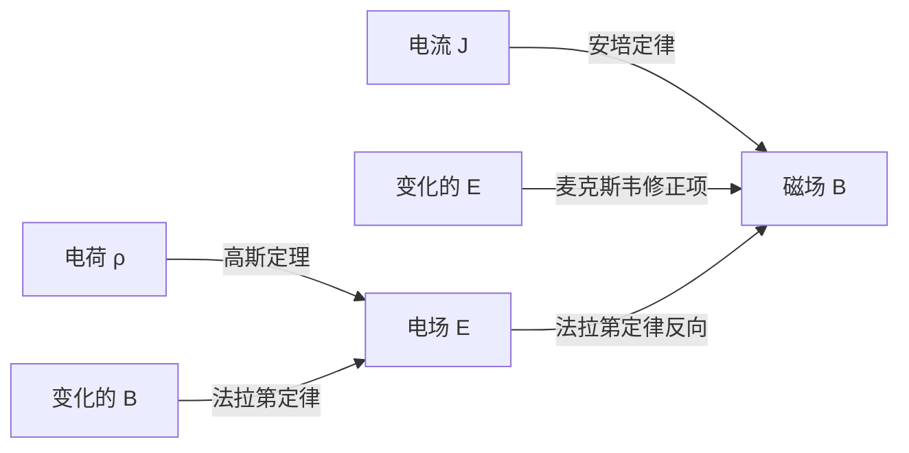
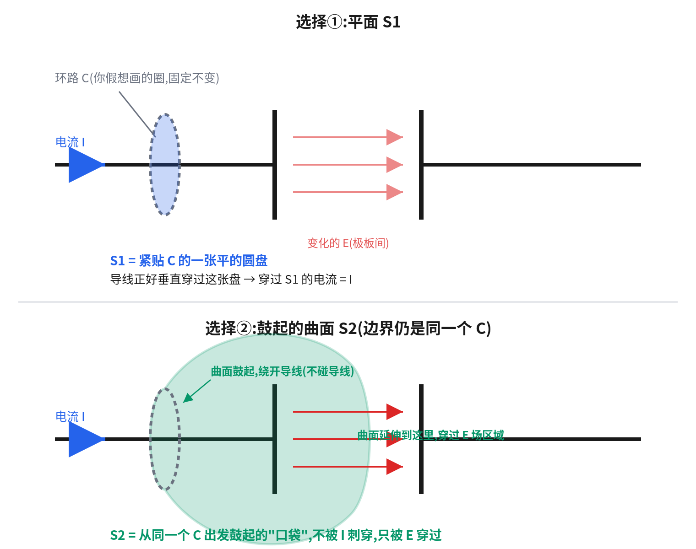
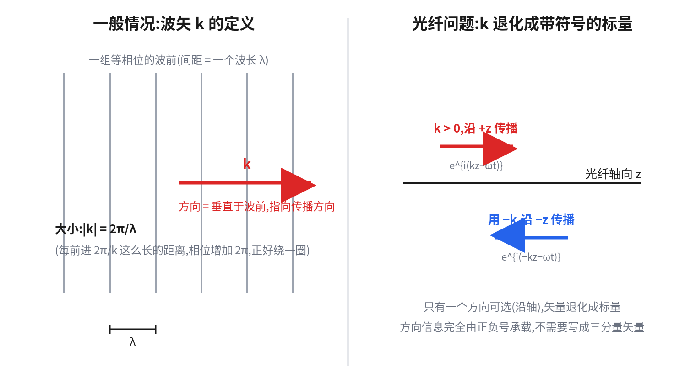
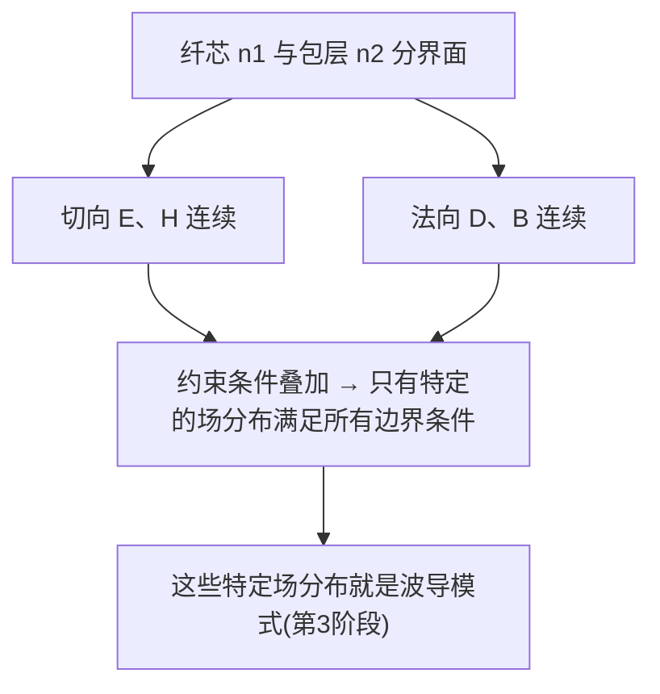
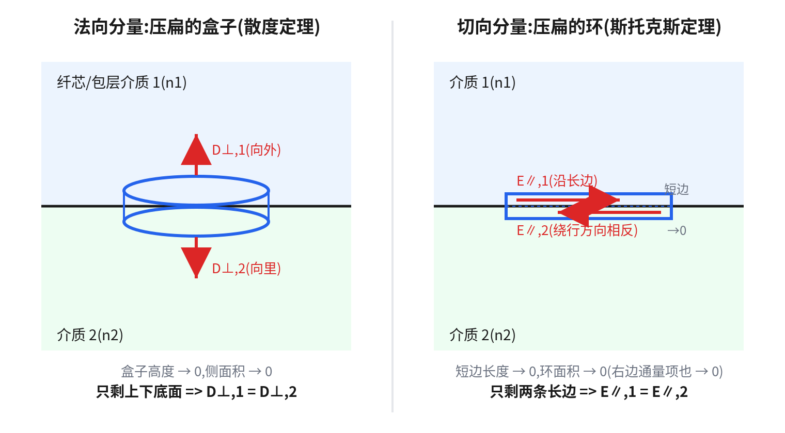

# 第 1 阶段:电磁学——从麦克斯韦方程组到电磁波

本章目标:不是没有重点地重新学一遍大学物理电磁学,而是直奔"介质中的麦克斯韦方程组 → 电磁波动方程 → 边界条件",这三样是波导理论的地基。不是单纯地背公式再推公式，而是建立物理直觉。

---

## 1.1 麦克斯韦方程组(微分形式)

真空中的麦克斯韦方程组:

$$
\nabla \cdot \vec{E} = \frac{\rho}{\varepsilon_0}
$$

$$
\nabla \cdot \vec{B} = 0
$$

$$
\nabla \times \vec{E} = -\frac{\partial \vec{B}}{\partial t}
$$

$$
\nabla \times \vec{B} = \mu_0 \vec{J} + \mu_0 \varepsilon_0 \frac{\partial \vec{E}}{\partial t}
$$

四个方程,用上一章的语言直接翻译:

- 第一条(高斯定理):电场的散度正比于电荷密度——电荷是电场的源头。这很符合物理直觉，静电场确实如此。
- 第二条:磁场没有散度——不存在磁单极子,磁场线永远闭合。
- 第三条(法拉第定律):变化的磁场产生"打转"的电场。但是从公式看，负号很突兀。
- 第四条(安培-麦克斯韦定律):电流和变化的电场都产生"打转"的磁场。对比第三条，为什么这里的右边两项前面又不是负号？

**具体到光纤这种介质中最重要的一点**:光纤是绝缘体,没有自由电荷、没有自由电流,所以在光纤内部:

$$
\rho = 0, \qquad \vec{J} = 0
$$

方程组简化为纯粹的"电场和磁场互相产生对方"的耦合系统——这正是电磁波能自我维持传播的原因。——但是这个结论很显然么？或许可以数学上推到出来，但是物理上呢？

### 补充一:麦克斯韦公式第三条为什么是负号、第四条为什么是正号(物理来源,不是数学选择)

后面的1.3 节会看到,波动方程能不能推出"光会传播"取决于第三条(法拉第)和第四条(安培-麦克斯韦)符号相反这件事。这里先回答一个更根本的问题:**这两个符号本身是哪来的?能不能孤立地、不靠"凑出 $k^2>0$"这种事后论证,直接从物理直觉或者大家公认的粗浅的高中物理知识上（至少定性地）看出来?**

**第三条的负号:楞次定律,能量守恒不允许"自己无限强化自己"**

法拉第定律最初是实验定律,不是从别的方程推出来的，写成积分形式如下:

$$
\oint \vec{E}\cdot d\vec{l} = -\frac{d\Phi_B}{dt}
$$

负号的物理内容就是**楞次定律**:感应电动势的方向,总是反抗引起它的磁通变化。直觉图像是拿一根条形磁铁往线圈里推——线圈感应出的磁场会"排斥"磁铁,你得做功才能把它推进去,这份机械功转化成线圈里的电能。如果负号变成正号,一个初始的简单扰动会导致线圈会反过来"吸"磁铁,磁铁自己加速，进一步强化这个运动。于是磁铁加速冲进去的动能、加上线圈里凭空多出来的电能,就是一台永动机,直接违反能量守恒。——所以违背楞次定律，也就是违背了能量守恒的事情是不可能发生的。

但光看积分公式本身,负号是怎么"翻译"成楞次定律要求的方向的?中间藏着**两次右手定则**:

1. 先选定闭合回路 $\oint$ 的绕行方向 $d\vec l$,再用右手定则(四指沿 $d\vec l$ 卷,大拇指指向)定出面积元的法线 $\hat n$——这一步只是数学上的约定,还没涉及物理。
2. 假设外部磁场沿 $\hat n$ 方向增大,代入公式,负号会使 $\oint\vec E\cdot d\vec l<0$,说明**实际感应电流方向和一开始选的 $d\vec l$ 方向相反**。
3. 再用一次右手定则,反过来问"这个反方向的感应电流会产生什么磁场"——算出来的感应磁场,方向正好和外部那个正在增大的磁场相反。

三步串起来,负号的效果就是"感应磁场总是反抗外部磁场的变化",这才是楞次定律在公式里的样子:

**第四条右边两项为什么没有负号:这里没有反馈回路,所以不需要"楞次定律"式的负号,但符号仍然被别的物理规律钉死**

$$
\nabla\times\vec B=\mu_0\vec J+\mu_0\varepsilon\frac{\partial\vec E}{\partial t}
$$

**$\mu_0\vec J$ 这一项**:法拉第定律描述的是一个**闭合反馈回路**——变化的磁场感应出电场,电场驱动电流,电流又产生新磁场反过来影响原来的系统,所以才需要问"这个反馈是增强自己还是抑制自己",楞次定律、能量守恒才有用武之地。而 $\mu_0\vec J$ 是单向的"生成"关系:给定一根导线的电流,它周围的磁场方向由右手定则直接给出,不存在"磁场倒过来改变电流方向"这种回路。这个方向本身是独立的实验事实——最直接的验证是两根平行导线,同向电流相吸、反向电流相斥,符号被实验测量钉死,没有"失控"的问题需要担心,所以不需要负号。从数值上看，电流越大，磁场的旋度也越强，也很符合直觉。

**$\mu_0\varepsilon\,\partial\vec E/\partial t$(位移电流)这一项**:这一项是麦克斯韦自己加进去的,原始安培定律里没有。加它的物理动机,是一个给电容器充电的思想实验——安培环路(可以简单理解为一个忽略粗细的环)套在正在充电的导线外面。给这同一个环路 $C$ 选不同的边界曲面:

- 选**平面 $S_1$**:也就是这个环所包围的最小面积，此时导线直接刺穿它,穿过的电流是 $I$。
- 选**鼓起的曲面 $S_2$**:边界还是同一个 $C$,但曲面像一个正在背吹大的气泡一样绕开导线、鼓起来像一个泡泡一样兜住了电容器的一块板，泡泡壁延伸在电容器两极板之间，但是注意到这个泡泡不是一个封闭的拓扑上的球体，它缺了$S_1$这个面——所以没有导线穿过它,传导电流是 $0$,但两极板间**变化的电场**穿过了$S_2$这个面。

$C$ 是同一个圈,$\oint\vec B\cdot d\vec l$ 沿着它算出的结果必须唯一,不能因为曲面选得不一样就得到 $\mu_0 I$ 和 $0$ 两个不同答案——这个数学问题我们物理不管的哈，简单说左边只有一个曲线，压根没提到曲面，所以就应该和曲面无关。麦克斯韦的解决办法:承认变化的电场也要贡献一个等效电流 $\mu_0\varepsilon\,\partial E/\partial t$,而且这一项在 $S_2$ 上算出来必须**正好等于** $\mu_0 I$,两种曲面选择才能给出一致的结果——这就要求位移电流项必须和传导电流项**同号**,取正号,不能是负号(负号只会让两个曲面的结果差得更远,不是抵消)。

再进一步地分析，把 $S_1$ 和 $S_2$ 沿 $C$ 拼接起来,正好构成一个**封闭曲面**(类似一个不那么球的球面被中间一个平面切开,$S_1$ 是平的截面、$S_2$ 是鼓起的球冠,$C$ 就是两者的截交线/某个纬线)。这个封闭曲面包住的体积里,恰好装着电容器正在积累电荷的那块极板。用最朴素的电荷守恒检验一下(只用真实电流 $\vec J$,不涉及位移电流):电流从 $S_1$ 那侧流进(导线穿过 $S_1$,流入 $I$),从 $S_2$ 那侧没有电流流出(没有导线穿过 $S_2$),净流出量是 $-I$;而封闭曲面里的电荷正以 $dQ/dt=I$ 的速率增长,$-dQ_{enc}/dt=-I$。两边一致——这一步不需要位移电流,只是验证电荷守恒本身成立。

真正的矛盾出在另一个量上:电荷守恒保证的是**电流通量**(沿曲面积分 $\vec J$)在物理上自洽,但安培定律要求的是**磁场环流**(沿边界 $C$ 积分 $\vec B$)在不同曲面选择下必须一致——这是两件不同的事。通量在 $S_1$、$S_2$ 上不一样($I$ 和 $0$),但环流必须一样,于是必须把 $S_2$ 缺的那部分电流(缺口正好是 $I$)用位移电流补上。补的方向由电荷守恒的方向决定,这也是为什么这一项的正号最终还是电荷守恒逼出来的。

更硬的代数验证:对安培-麦克斯韦方程两边取散度,左边 $\nabla\cdot(\nabla\times\vec B)\equiv0$ 是纯数学恒等式,代入右边并用高斯定律 $\nabla\cdot\vec E=\rho/\varepsilon$,整理得到:

$$
\nabla\cdot\vec J+\frac{\partial\rho}{\partial t}=0
$$

这正是电荷守恒的连续性方程。如果位移电流那一项取负号重做一遍,会得到 $\nabla\cdot\vec J=\partial\rho/\partial t$,意思变成"电流从区域里流出,区域里的电荷反而增加"——直接违反电荷守恒。

### 补充二:位移电流到底是什么

$$
\vec J_d\equiv\varepsilon\frac{\partial\vec E}{\partial t}
$$

**它不是电荷在流动,是一个类比量**。真实电流 $\vec J$ 的物理图像是带电粒子移动;但电容器两极板之间(哪怕是真空)没有任何电荷移动,只有一个随时间变化的电场 $\vec E(t)$。麦克斯韦发现:这个变化的电场,在产生磁场这件事上,表现得和一股真实电流完全一样——如果在极板之间放一个探测器测磁场,测到的磁场大小、方向,正好等于"假设这里有电流 $I$ 在流动"算出来的结果。它被叫作"电流",是因为它在安培定律里扮演的角色和真实电流一模一样,不是因为真的有电荷在跑。

**和电介质里真实的极化电流要分清楚**:如果电容器中间是电介质,束缚电荷确实会发生微小的真实位移,产生一份真正的极化电流,这部分是真实电荷在动。但**即使在纯真空里,没有任何电荷**,只要 $\vec E$ 在变化,位移电流项 $\varepsilon_0\,\partial\vec E/\partial t$ 依然存在、依然产生磁场——这部分和电荷移动完全无关,是"变化的场本身产生效应"这件事,是这个概念里最不直观、也最重要的部分。

### 补充三:真实电流 + 位移电流,合起来处处散度为零——把"一进一出"变成精确证明

定义"总电流密度":

$$
\vec J_{总}\equiv\vec J+\varepsilon\frac{\partial\vec E}{\partial t}
$$

对它取散度,用高斯定律 $\nabla\cdot(\varepsilon\vec E)=\rho$ 和电荷守恒的连续性方程 $\nabla\cdot\vec J=-\partial\rho/\partial t$:

$$
\nabla\cdot\vec J_{总}=\nabla\cdot\vec J+\frac{\partial\rho}{\partial t}=-\frac{\partial\rho}{\partial t}+\frac{\partial\rho}{\partial t}=0
$$

**处处精确为零,不是近似。** 真实电流的电荷守恒和位移电流的定义,结构上天生互补,合在一起必然抵消。

把 $S_1,S_2$ 拼成的封闭曲面 $\Sigma$ 代入散度定理:

$$
\oiint_\Sigma \vec J_{总}\cdot d\vec A=\iiint_V(\nabla\cdot\vec J_{总})\,dV=0
$$

$S_1$ 上是真实电流 $I$ 流入,$S_2$ 上全是位移电流 $I_d$ 流出,两者相加为零,直接要求 $I_d=I$——**这就是"一进一出、大小相等"的精确版本**,不是巧合,是散度恒为零逼出来的代数结果。

**具体数字验证(平行板电容器)**:设极板面积 $A$、极板上电荷 $Q(t)$,场 $E=Q/(\varepsilon A)$。$S_2$ 上的位移电流:

$$
I_d=\varepsilon\frac{d\Phi_E}{dt}=\varepsilon\frac{d(EA)}{dt}=\varepsilon\frac{d}{dt}\left(\frac{Q}{\varepsilon A}\cdot A\right)=\frac{dQ}{dt}
$$

而给电容器充电的真实电流满足 $I=dQ/dt$,所以 $I_d=I$,精确相等。

**一个措辞上的分寸**:"位移电流从 $S_2$ 流出"说的是**通量意义上的流出**,不是真的有电荷穿过极板中间的真空跑出去了。物理学家常说"位移电流接续了电路"(*displacement current completes the circuit*)——电路看起来在电容器这里"断"了(变成电荷堆积),但从磁场效应的角度看没有断,只是接力棒从"真实电荷移动"换成了"变化的电场",总电流 $\vec J_{总}$ 全程连续、无源无汇。这正是整套论证最终指向的结构性事实:**真实电荷守恒和位移电流的定义,是被设计成天生互补的两半,合起来才是一个处处散度为零、真正自洽的"总电流"概念。

**小结**:楞次定律(负号)守护的是**能量守恒**,位移电流的正号守护的是**电荷守恒**,两者角色是平行的,只是法拉第定律里的反馈回路是物理上真实存在的(线圈、磁铁真的会相互作用),而安培-麦克斯韦方程里的"回路"是纯数学结构性的(旋度的散度恒为零/同一环路的曲面无关性),所以不容易一眼看出"楞次定律"那种直观的力学画面,但符号被钉死的严格程度是一样的。

---

## 1.2 介质中的修正:引入折射率

光纤是介质,不是真空,需要引入介质中的电位移矢量 $\vec{D}$ 和磁场强度 $\vec{H}$:

$$
\vec{D} = \varepsilon_0 \varepsilon_r \vec{E} = \varepsilon \vec{E}
$$

$$
\vec{B} = \mu_0 \mu_r \vec{H} \approx \mu_0 \vec{H}
$$

其中 $\varepsilon_r$ 是相对介电常数(光纤材料在光频段 $\mu_r \approx 1$,磁效应可忽略)。折射率的定义:

$$
n = \sqrt{\varepsilon_r}
$$

可以把这个突然冒出来的折射率公式先记下即可，是麦克斯韦在几何光学和材料性质之间建立了一个桥梁，到后面可以看到推导的过程。

于是，在光纤这种介质中麦克斯韦方程组(无自由电荷电流，但是第四条右边第二项，也就是电场变化引发的位移电流还是有的)变为:

$$
\nabla \cdot \vec{E} = 0
$$

$$
\nabla \cdot \vec{B} = 0
$$

$$
\nabla \times \vec{E} = -\frac{\partial \vec{B}}{\partial t}
$$

$$
\nabla \times \vec{B} = \mu_0 \varepsilon \frac{\partial \vec{E}}{\partial t}
$$

**这就是为什么折射率 $n$ 会出现在几乎所有光学公式里**——它本质上是介质对麦克斯韦方程组的一个"缩放因子"。

### 补充:上面这四条公式是"通用形式"的简化版,不是随手换的符号

如果把上面四条和真正**通用**(不带任何简化)的介质中麦克斯韦方程组放在一起比较,会发现符号不完全一样——通用形式永远应该写成:

$$
\nabla\cdot\vec D=\rho_{free} \\
\nabla\cdot\vec B=0 \\
\nabla\times\vec E=-\frac{\partial\vec B}{\partial t} \\
\nabla\times\vec H=\vec J_{free}+\frac{\partial\vec D}{\partial t}
$$

这四条里的 $\vec D,\vec H$ 部分代替了 $\vec E,\vec B$ 不是笔误,而是代入了本节已经用过的两个前提之后的结果,拆开看:

**第一条($D\to E$)**:光纤没有自由电荷,$\rho_{free}=0$。在**一块均匀介质内部**($\varepsilon$ 是常数,不随位置变化),$\nabla\cdot\vec D=\nabla\cdot(\varepsilon\vec E)=\varepsilon\,\nabla\cdot\vec E$,$\varepsilon$ 常数可以从散度里提出来,所以 $\nabla\cdot\vec D=0$ 和 $\nabla\cdot\vec E=0$ 在这个前提下等价。**但这个等价依赖"$\varepsilon$ 是常数"**——下面"补充:为什么需要引入 $\vec D$"那段已经提醒过,纤芯-包层分界面 $\varepsilon$ 不连续,不能这样简化,1.5 节边界条件表里法向条件因此写的是 $D_\perp$ 连续而不是 $E_\perp$ 连续。**所以这四条公式默认的场景是"纤芯内部或包层内部这样的单一均匀介质",不是跨越分界面**——1.3 节推波动方程,也正是在这样一块均匀区域里做的。

**第四条($H\to B$)**:$\vec J_{free}=0$,且本节开头已经写过 $\vec B=\mu_0\mu_r\vec H\approx\mu_0\vec H$(光纤材料在光频段 $\mu_r\approx1$)。代入 $\vec H=\vec B/\mu_0$:

$$
\nabla\times\frac{\vec B}{\mu_0}=\frac{\partial\vec D}{\partial t}=\varepsilon\frac{\partial\vec E}{\partial t}\quad\Longrightarrow\quad\nabla\times\vec B=\mu_0\varepsilon\frac{\partial\vec E}{\partial t}
$$

正好是上面写的那一条——是"用 $\vec H$ 写的安培-麦克斯韦定律,再用 $\mu_r\approx1$ 换回 $\vec B$"的结果。

**第三条(法拉第定律)不受影响**:$\nabla\times\vec E=-\partial\vec B/\partial t$ 永远、精确地写成 $\vec B$,不管什么介质都不用换,是少数几个不需要任何简化就成立的方程之一。

**一句话记住**:这四条公式 = 通用形式($D,H$)在"无自由电荷电流 + 均匀介质 $\varepsilon$ 常数 + $\mu_r\approx1$"这三个前提下的简化版,适用于纤芯或包层**内部,不适用于跨越分界面的情形**——那种情形要用回 $\vec D,\vec H$(1.5 节边界条件正是这样处理的)。~~~~

### 补充:为什么需要引入 $\vec D$(物理动机)

真空中的高斯定理 $\nabla\cdot\vec E=\rho/\varepsilon_0$,这里 $\rho$ 是**所有**电荷密度。但介质是原子组成的,原子核带正电、电子云带负电。外加电场会让电子云相对原子核发生微小偏移——这叫**极化**,会在介质内部感应出局部不均匀的**束缚电荷**(整体电中性,但局部分布不均匀,在散度定理里会贡献非零的量)。

问题是:束缚电荷是介质对外加场的**响应**,不容易事先知道具体分布。于是定义一个新场量 $\vec D$,把束缚电荷的效应"打包"进定义里,使得:

$$
\nabla\cdot\vec D=\rho_{free}
$$

只用**自由电荷**(你主动放进去、能自由移动的电荷),不用管束缚电荷长什么样。

对线性介质(场不太强,极化正比于场,即 $\vec P\propto\vec E$),这个"打包"关系化简成 $\vec D=\varepsilon_0\varepsilon_r\vec E=\varepsilon\vec E$。

**两层关系,近似出现在不同地方,不要混:**

- $\nabla\cdot\vec D=\rho_{free}$:**精确成立**,跟极化强弱无关(这是 $\vec D$ 定义本身带来的精确抵消)。
- $\vec D=\varepsilon\vec E$($\varepsilon$ 是常数):**只在线性响应(场不太强)时成立**,这才是需要"极化不能太强"这个条件的地方。场很强时(比如强激光),会出现非线性光学效应(光纤克尔效应等),这个简化就不成立了。

$\nabla\cdot\vec D=\rho_{free}$**不是新定理**,是同一个高斯定理(背后仍是散度定理这套工具),只是换了个把介质响应封装好的场量。光纤材料是绝缘体,处处 $\rho_{free}=0$;在均匀介质内部 $\varepsilon$ 是常数可以从散度里提出来,所以 $\nabla\cdot\vec E=0$ 和 $\nabla\cdot\vec D=0$ 等价——但在**纤芯-包层分界面**,$\varepsilon$ 本身不连续,不能随便提出来,这是 1.5 节边界条件表里法向条件写的是 "$D_\perp$ 连续" 而不是 "$E_\perp$ 连续" 的原因。

---

## 1.3 推导电磁波动方程(重点)

这一步是整章的核心,建议跟着推一遍,不要只看结论。

对法拉第定律两边取旋度:

$$
\nabla \times (\nabla \times \vec{E}) = -\frac{\partial}{\partial t} (\nabla \times \vec{B})
$$

利用矢量恒等式 $\nabla \times (\nabla \times \vec{E}) = \nabla(\nabla \cdot \vec{E}) - \nabla^2 \vec{E}$,而介质中 $\nabla \cdot \vec{E} = 0$,所以左边化简为 $-\nabla^2 \vec{E}$。

右边代入安培-麦克斯韦定律 $\nabla \times \vec{B} = \mu_0 \varepsilon\, \partial \vec{E}/\partial t$:

$$
-\nabla^2 \vec{E} = -\mu_0 \varepsilon \frac{\partial^2 \vec{E}}{\partial t^2}
$$

整理得到:

$$
\nabla^2 \vec{E} = \mu_0 \varepsilon \frac{\partial^2 \vec{E}}{\partial t^2}
$$

**这正是上一章学的波动方程**,对比标准形式 $\nabla^2 u = (1/v^2)\, \partial^2 u/\partial t^2$,可以读出波速:

$$
v = \frac{1}{\sqrt{\mu_0 \varepsilon}} = \frac{c}{n}
$$

也就是说:**光在折射率为 $n$ 的介质中,传播速度是真空光速的 $1/n$**。这不是一个假设,是从麦克斯韦方程组严格推出来的结果。

### 补充:完整推导——负号到底在哪里抵消的

对法拉第定律 $\nabla\times\vec E=-\partial\vec B/\partial t$ 两边取旋度:

$$
\nabla\times(\nabla\times\vec E)=-\frac{\partial}{\partial t}(\nabla\times\vec B)\quad(\star)
$$

(空间求导 $\nabla\times$ 和时间求导 $\partial/\partial t$ 可以交换顺序,因为空间、时间是独立变量,混合偏导数对称。)

右边代入 $\nabla\times\vec B=\mu_0\varepsilon\,\partial\vec E/\partial t$:

$$
(\star)\text{右边}=-\mu_0\varepsilon\frac{\partial^2\vec E}{\partial t^2}
$$

**这是第一个负号,来自法拉第定律本身,目前还稳稳待在右边。**

左边用矢量恒等式(BAC-CAB 公式,$\nabla\times(\nabla\times\vec A)=\nabla(\nabla\cdot\vec A)-\nabla^2\vec A$,来自 $\vec a\times(\vec b\times\vec c)=\vec b(\vec a\cdot\vec c)-\vec c(\vec a\cdot\vec b)$ 的算子版本,使用时 $\nabla$ 必须作用在右边的场上,不能像普通矢量一样挪位置):

$$
\nabla\times(\nabla\times\vec E)=\nabla(\nabla\cdot\vec E)-\nabla^2\vec E
$$

介质中 $\nabla\cdot\vec E=0$,第一项为零:

$$
\nabla\times(\nabla\times\vec E)=-\nabla^2\vec E
$$

**这是第二个负号,来自恒等式本身的代数结构,跟法拉第定律那个负号是两个独立来源。**

拼回 $(\star)$:

$$
-\nabla^2\vec E=-\mu_0\varepsilon\frac{\partial^2\vec E}{\partial t^2}
$$

两边都有负号,同乘 $-1$,两个负号一起抵消:

$$
\nabla^2\vec E=\mu_0\varepsilon\frac{\partial^2\vec E}{\partial t^2}
$$

**$\nabla^2$ 是什么**:$\nabla^2\equiv\nabla\cdot\nabla$,$\nabla$ 和自己做**点乘**(不是叉乘,所以没有 $\times$ 符号),叫拉普拉斯算子。直角坐标下 $\nabla^2 f=\partial^2f/\partial x^2+\partial^2f/\partial y^2+\partial^2f/\partial z^2$,是一维波动方程里 $\partial^2u/\partial x^2$ 的三维推广。

**为什么符号相反(法拉第 $-$、安培-麦克斯韦 $+$)不是巧合**:如果两条方程符号相同,重新推一遍会得到 $\nabla^2\vec E=-\mu_0\varepsilon\,\partial^2\vec E/\partial t^2$,代入平面波解会得到 $k^2<0$(虚数 $k$),对应 ODE 阶段学的 $y''-\omega_0^2y=0$ 那种指数增长/衰减解,场不会传播只会原地爆炸或消失。**现实中两条方程符号相反,恰好保证 $k^2>0$,这正是"光能够传播"这件事在数学上的来源。**

### 补充:波动方程系数为什么是 $1/v^2$(从行波解反推)

设 $u(x,t)=f(x-vt)$(形状不变、以速度 $v$ 整体平移的行波,$f$ 任意)。令 $s=x-vt$:

对 $x$ 求导($\partial s/\partial x=1$):$\dfrac{\partial u}{\partial x}=f'(s)$,再求一次 $\dfrac{\partial^2u}{\partial x^2}=f''(s)$。

对 $t$ 求导($\partial s/\partial t=-v$):$\dfrac{\partial u}{\partial t}=-vf'(s)$,再求一次 $\dfrac{\partial^2u}{\partial t^2}=v^2f''(s)$。

两个二阶导数都能用同一个 $f''(s)$ 表示,联立:

$$
\frac{\partial^2u}{\partial x^2}=f''(s)=\frac{1}{v^2}\cdot v^2f''(s)=\frac{1}{v^2}\frac{\partial^2u}{\partial t^2}
$$

**系数 $1/v^2$ 不是规定的,是"要求解具有 $f(x-vt)$ 这种以速度 $v$ 平移的形状"反过来逼出来的**——**只要方程长这个样子,直接从系数位置读出 $v$**。

对比 $\nabla^2\vec E=\mu_0\varepsilon\,\partial^2\vec E/\partial t^2$,系数位置 $1/v^2\leftrightarrow\mu_0\varepsilon$,读出 $v=1/\sqrt{\mu_0\varepsilon}$。

---

## 1.4 平面波解与色散关系

代入平面波尝试解:

$$
\vec{E}(z,t) = \vec{E}_0\, e^{i(kz - \omega t)}
$$

代入波动方程,和上一章一样,得到色散关系:

$$
k = \frac{n\omega}{c}
$$

这个 $k$ 叫**波矢**(或传播常数),后面在光纤模式理论中会反复出现,只是那时候会被记作 $\beta$(传播常数),因为光纤中光被约束传播,情况比自由空间平面波复杂,但**根源是同一个色散关系**。

### 补充:什么是"平面波"——几何定义、和球面波的区别、电磁波是不是平面波

**波前的定义**:某一时刻,波场里"相位相同的点"连成的曲面,叫**波前**(wavefront)。如果这个波前是一个**无限大的平面**,而且波沿着这个平面移动时振幅、相位都不变(只在垂直于这个平面的方向上变化),就叫**平面波**。

**平面波不是唯一的形状**:最常见的对比是**球面波**——一个点光源向四面八方发光,某时刻相位相同的点连起来是一圈圈以点源为中心的同心球面(手电筒、灯泡这类点光源发出的光,严格来说都是球面波)。除此之外还有柱面波、高斯光束等等,形状可以有无穷多种,平面波只是其中最简单的一种。

**电磁波是平面波吗——不是,是一种有用的理想化近似**:平面波要求波前无限大、振幅处处一样,意味着携带无穷大能量、充满整个空间,现实中不存在这样的波源,真实的光波幅本没有精确的平面波。但球面波离点源足够远时,一小片波前弧线会看起来越来越平(就像地球是球形的,但站在地面上局部看是平的)——太阳光传到地球,波前理论上是以太阳为中心的巨大球面,但太阳离地球足够远,这里截取的一小片波前曲率小到可以当平面处理,这就是"平面波近似"的来源。在光纤里,后面(第3阶段"模式"理论)会看到,真实的光场可以写成若干个平面波分量按特定角度叠加/反复反射的结果——平面波不是光纤里光的真实形状,而是拿来**构造**真实解的"基本积木",这个角色跟 0.4 节"任意周期函数都能拆成正弦波叠加"里正弦波的角色完全一样,只是从一维时间换成了三维空间。

**为什么 $E_0e^{i(kz-\omega t)}$ 这个表达式就代表平面波**:这个式子里只出现了 $z$,完全没有出现 $x,y$。固定某一时刻 $t_0$,相位 $kz-\omega t_0$ 只由 $z$ 决定,跟 $x,y$ 无关——只要 $z$ 相同,不管 $x,y$ 取多少,相位都一样,这正是"垂直于 $z$ 轴的整张平面(所有 $x,y$)相位处处相同"的数学表达,这张平面就是波前。对比球面波的表达式 $E_0e^{i(kr-\omega t)}/r$($r=\sqrt{x^2+y^2+z^2}$),相位由 $r$ 决定,相位相同的点是以原点为球心的球面,不是平面——这就是两者在方程形式上的直接区别。

**为什么突然引入平面波尝试解**:1.3 节推出的波动方程是偏微分方程,需要具体的解。跟 0.3 节解常微分方程、0.5 节解一维波动方程的套路完全一样——先设一个尝试解,代入方程,看它需要满足什么代数条件。平面波是这个套路里最简单、求导最省事的尝试解形状,不是凭空冒出来的,而是延续了"设试探解 → 代入变成代数方程 → 解出参数关系"这条贯穿全书的骨架。

### 补充:平面波解完整推导(从 $f(x-vt)$ 到复指数到色散关系)

**为什么专门讨论"平面波"这一种特殊形状**:$f(x-vt)$ 里 $f$ 可以是任意形状,但不好具体计算。傅里叶级数告诉我们,任意周期形状都能拆成一堆正弦波叠加;波动方程是线性的(解可以叠加),所以只要搞清楚"一个纯正弦形状怎么传播",任意复杂形状的传播就自动清楚了。平面波就是选一个最简单的形状——正弦/余弦——当"基本积木"。

**把正弦形状代入 $f(x-vt)$**:取 $f(s)=\cos(ks)$($k$ 是常数,叫波数,决定波纹"多密")。代入 $s=z-vt$(光纤里传播方向习惯叫 $z$):

$$
E(z,t)=E_0\cos(k(z-vt))=E_0\cos(kz-kvt)
$$

令 $\omega\equiv kv$(角频率的定义),得到最基础的平面波形式:

$$
E(z,t)=E_0\cos(kz-\omega t)
$$

**为什么写成复指数** $e^{i(kz-\omega t)}$:欧拉公式 $\cos(kz-\omega t)=\mathrm{Re}[e^{i(kz-\omega t)}]$。真正物理场是取实部之后的余弦,但中间计算全程用复指数(求导简单,乘一个常数因子就行),只在最后一步取实部——跟之前 $E(t)=\mathrm{Re}[E_0e^{i\omega t}]$ 是同一套技巧。

**代入波动方程推出色散关系**:一维波动方程 $\partial^2E/\partial z^2=\mu_0\varepsilon\,\partial^2E/\partial t^2$,设 $E=E_0e^{i(kz-\omega t)}$:

$$
\frac{\partial^2E}{\partial z^2}=(ik)^2E=-k^2E,\qquad\frac{\partial^2E}{\partial t^2}=(-i\omega)^2E=-\omega^2E
$$

代入:$-k^2E=\mu_0\varepsilon(-\omega^2)E$,约掉 $E$ 和负号:$k^2=\mu_0\varepsilon\omega^2$,即 $k=\omega\sqrt{\mu_0\varepsilon}$。代入 $\varepsilon=\varepsilon_0n^2$、$c=1/\sqrt{\mu_0\varepsilon_0}$:

$$
k=\frac{n\omega}{c}
$$

这正是色散关系,不是新物理,是"$E_0e^{i(kz-\omega t)}$ 必须满足波动方程"这个要求转化成的 $k,\omega$ 代数约束。反解 $v=\omega/k=c/n$,正是相速度(追踪波峰移动速度),跟 1.3 节推出的波速完全对上。

**关于 $k$ 是标量还是矢量**:一般三维问题里"波矢" $\vec k=(k_x,k_y,k_z)$ 确实是矢量。但光纤问题只有一个方向(沿轴向 $z$),矢量退化成带符号的标量——正向传播 $k>0$、反向传播换成 $-k$(比如 $e^{-ikz}$),方向信息完全靠正负号承载,不需要真的写成三分量矢量。"波矢"这个名字是一般说法的惯性用词,这里本质上一直是标量。

### 补充:波矢 $k$ 图解——方向和大小分别是什么

**方向**:波矢的方向,定义为**垂直于波前、指向波传播的方向**——想象把一支箭垂直插在上面那组平行平面上,箭头指向波跑的方向,这支箭就是 $\vec k$。

**大小**:波矢的大小 $|k|=2\pi/\lambda$($\lambda$ 是波长,相邻两个相位相同的波前之间的距离)。直觉上理解这个 $2\pi$:相位 $kz$ 每前进一个波长 $\lambda$,就应该绕完一整圈相位(增加 $2\pi$),代入验证 $k\cdot\lambda=2\pi$,即 $k=2\pi/\lambda$——这跟 0.4 节"$\cos(2\pi z/\Lambda)$ 为什么这样构造"里"用 $2\pi/\Lambda$ 把周期换算成弧度"的道理完全一样,$k$ 本质上就是"空间角频率"(单位长度里包含多少弧度的相位),角色和时间角频率 $\omega=2\pi/T$ 完全对应,只是把"周期 $T$"换成了"波长 $\lambda$"。

光纤问题里(上图右侧),因为只有沿轴向这一个方向可选,矢量退化成标量:$k>0$ 代表沿 $+z$ 传播(写成 $e^{i(kz-\omega t)}$),要表示反方向传播,就直接把 $k$ 换成 $-k$(写成 $e^{i(-kz-\omega t)}=e^{-i(kz+\omega t)}$)——方向信息完全靠这一个正负号承载,不需要写成三分量矢量,这也是上一段结论的直接图像版。

---

## 1.5 边界条件(FBG 物理图像的直接来源)

光纤由纤芯(折射率 $n_1$)和包层(折射率 $n_2 < n_1$)组成,光被"约束"在纤芯里传播,靠的就是**两种介质分界面上电磁场满足的边界条件**。这是从积分形式的麦克斯韦方程组(用上一章的散度定理、斯托克斯定理转换得到)推出的四条规则:

| 场分量                    | 边界条件                                                                |
| ---------------------- | ------------------------------------------------------------------- |
| 电场切向分量 $E_{\parallel}$ | 连续:$E_{\parallel,1} = E_{\parallel,2}$                              |
| 磁场切向分量 $H_{\parallel}$ | 连续(无自由面电流时):$H_{\parallel,1} = H_{\parallel,2}$                     |
| 电位移法向分量 $D_{\perp}$    | 连续(无自由面电荷时):$\varepsilon_1 E_{\perp,1} = \varepsilon_2 E_{\perp,2}$ |
| 磁感应法向分量 $B_{\perp}$    | 连续:$B_{\perp,1} = B_{\perp,2}$                                      |

**这就是第 3 阶段"模式"概念的物理起点**:不是任意形状的电磁场都能在光纤里稳定传播,只有同时满足波动方程、又满足纤芯-包层边界条件的那些特定场分布才行——这些特定解就叫"**模式**"。

### 补充:边界条件完整推导(为什么要用"压扁"的技巧)

麦克斯韦方程组是微分形式,默认场处处光滑。但纤芯 $n_1$、包层 $n_2$ 交界处介质性质突变,导数在这里没定义,微分形式"失效",要回到积分形式处理——这跟 0.1 阶段"小方块内部抵消只剩边界"是同一个套路,这次换成"扁盒子/扁环卡在分界面上"。

**法向分量(散度定理)——处理 $D_\perp,B_\perp$**:想象一个像月饼一样扁的圆柱盒子跨在分界面上,让高度趋于 $0$。侧面积跟着趋于零,只剩上下两个底面贡献通量——上底 $D_{\perp,1}$ 往外、下底 $D_{\perp,2}$ 往里。光纤无自由电荷,右边积分也为零,于是 $D_{\perp,1}=D_{\perp,2}$,即 $\varepsilon_1E_{\perp,1}=\varepsilon_2E_{\perp,2}$。同样的盒子套在 $\nabla\cdot\vec B=0$ 上,直接得到 $B_{\perp,1}=B_{\perp,2}$。

**切向分量(斯托克斯定理)——处理 $E_\parallel,H_\parallel$**:想象一个扁平小矩形环,长边贴着分界面两侧、短边垂直穿过分界面,让短边长度趋于 $0$。短边贡献的环流趋于零,只剩两条长边——一条给 $E_{\parallel,1}$,另一条给 $-E_{\parallel,2}$(绕行方向相反)。环的面积也跟着趋于零,右边(磁通量变化率)也为零,于是 $E_{\parallel,1}=E_{\parallel,2}$。同样的扁环套在安培-麦克斯韦定律上(无自由面电流),得到 $H_{\parallel,1}=H_{\parallel,2}$。

**关键澄清:法向跳变不会"传染"给切向、不会产生额外旋度**。散度定理管法向、斯托克斯定理管切向,是两件互相独立、正交的事——切向连续是斯托克斯定理单独给出的结论,不会因为法向 $E_\perp$ 因为 $\varepsilon_1\ne\varepsilon_2$ 而跳变就受影响。另外,这里 $E_\perp$ 的跳变是**空间跳变**(同一时刻跨过分界面数值突变),不是"变化的场产生场"那种**时间变化**($\partial\vec E/\partial t$),两者是不同的"变化",不要混。

**这一层还推不出全反射**:边界条件表只说明"$n_1\ne n_2$ 导致 $E_\perp$ 两侧必须不一样大",这是后续推导的原材料,但真正推出"入射角超过临界角发生全反射",还需要斯涅尔定律(相位沿界面处处匹配逼出来)和菲涅尔公式(把边界条件应用在斜入射几何上,解出反射/折射振幅比例),这些属于第 2 阶段光学,这一章的边界条件只负责打地基。

---

## 1.6 折射率发生微扰时会发生什么(承接第 4 阶段的伏笔)

FBG 的物理机制,是纤芯折射率沿传播方向发生周期性微小变化:

$$
n(z) = n_0 + \delta n \cos\left(\frac{2\pi z}{\Lambda}\right)
$$

从 1.3 节的推导可以看到,折射率 $n$ 直接决定了波动方程里的传播速度、进而决定色散关系 $k = n\omega/c$。当 $n$ 本身随位置 $z$ 变化时,波动方程不再有干净的平面波解,而是需要用"微扰"的方法处理——原本沿 $+z$ 方向传播的波,会因为这个周期性微扰,持续地把一部分能量"泵浦"到沿 $-z$ 方向传播的波里。

这正是第 4 阶段耦合模理论要处理的问题,而它的数学工具,正是这一章推出的波动方程,加上上一章学的傅里叶级数思想。

### 补充:布拉格条件完整推导(定量预览第 4 阶段)

**符号提醒**:大写 $\Lambda$(光栅周期,长度单位)和小写 $\lambda$(波长)是两个不同的量,字母长得像但不是一回事,以后见到大写 $\Lambda$ 先默念"这是光栅周期"。

**$\cos(2\pi z/\Lambda)$ 为什么这样构造**:$\cos(x)$ 天生以 $2\pi$(弧度)为周期。想要一个以 $\Lambda$(米)为周期的余弦,就在自变量前乘换算因子 $2\pi/\Lambda$:当 $z\to z+\Lambda$,自变量 $\to 2\pi z/\Lambda+2\pi$,余弦绕回原值,周期正是 $\Lambda$。验证:取 $\Lambda=2$,$z=0,1,2$ 时 $\cos(\pi z)=1,-1,1$,每 $2$ 重复一次,对。

**物理图像**:1.5 节已经知道,折射率变化的地方场会跳变、正向光会被"弹"一小部分回去。把 $n(z)$ 看成无穷多个无穷小的微型交界面串起来,每一处都贡献一丁点反射。关键问题:这些从不同 $z$ 位置反弹回来的光,汇合时是相长还是相消?

**相位匹配推导**:设正向波 $E_f(z,t)=Ae^{i(kz-\omega t)}$,$k=n_0\omega/c$。反弹源正比于 $\delta n\cos(2\pi z/\Lambda)\cdot E_f(z,t)$(严格推导属于第 4 阶段耦合模理论,这里先直接用这个正比关系)。用欧拉公式拆开余弦:

$$
\delta n\cos\!\left(\frac{2\pi z}{\Lambda}\right)Ae^{i(kz-\omega t)}=\frac{\delta n\,A}{2}e^{-i\omega t}\left[e^{i(k+2\pi/\Lambda)z}+e^{i(k-2\pi/\Lambda)z}\right]
$$

第一项空间频率更大,不对应反向波,不管它。第二项 $e^{i(k-2\pi/\Lambda)z}$ 才是关键:一个真正的反向波长成 $e^{-ikz}$,当 $k-2\pi/\Lambda=-k$,即 $\Lambda=\pi/k$ 时,这一项的相位随 $z$ 变化的方式跟反向波**完全同步**——光纤上每个位置反弹回来的光,相位都对得上,相长干涉,叠加成显著的反射光(这是布拉格条件)。如果 $\Lambda\ne\pi/k$,不同位置反弹的光相位错开,光纤够长时几乎完全抵消,相消干涉,净反射可忽略。

**换成常见形式**:代入 $k=2\pi n_0/\lambda$,得 $\Lambda=\pi/k=\lambda/(2n_0)$,即:

$$
\boxed{\lambda_B=2n_0\Lambda}
$$

只有波长恰好等于 $2n_0\Lambda$ 的光才被高效反射,这正是 FBG 用极微弱的周期性折射率起伏,实现对特定波长近乎完全反射的原理——靠相长干涉,不靠强反射材料。

**数值验证**:$\lambda_B=1550\text{ nm}$,$n_0=1.45$ $\Rightarrow$ $\Lambda=1550/(2\times1.45)\approx534.5\text{ nm}$,亚微米量级,说明光栅周期需要极精细的加工才能选中特定波长。

第 4 阶段耦合模理论要做的,就是把这里的定性相位匹配论证严格化,精确算出反射率随波长变化的完整曲线(FBG 的"光谱")。

---

## 自测

1. 从法拉第定律出发,重新推一遍电磁波动方程的每一步(合上笔记,自己写)。
2. 为什么光纤中光速是 $c/n$ 而不是 $c$?用波动方程里波速的表达式回答,不要只背结论。
3. 一根光纤纤芯折射率 $n_1 = 1.45$,包层 $n_2 = 1.44$。定性说明:为什么这个微小的折射率差就足够把光"关"在纤芯里?(提示:想想边界条件里哪个量必须连续,而折射率不同会导致哪个量发生突变)

---

## 本章小结

| 概念                      | 后续用途                    |
| ----------------------- | ----------------------- |
| 介质中麦克斯韦方程组              | 波导理论、耦合模理论的方程出发点        |
| 电磁波动方程推导                | 理解"光速为何是 c/n",以及模式方程的来源 |
| 平面波解、色散关系 $k=n\omega/c$ | 光纤中传播常数 β 的原型           |
| 边界条件(切向/法向连续性)          | 光纤模式为何被"约束"存在的物理根源      |
| 折射率微扰 $n(z)$            | 直接对应 FBG 的物理机制,第4阶段的出发点 |

都学完之后就可以进入**第 2 阶段:光学基础**。
